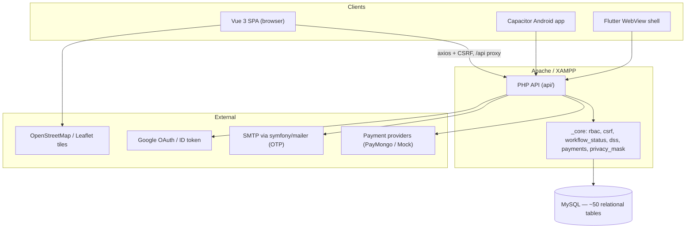
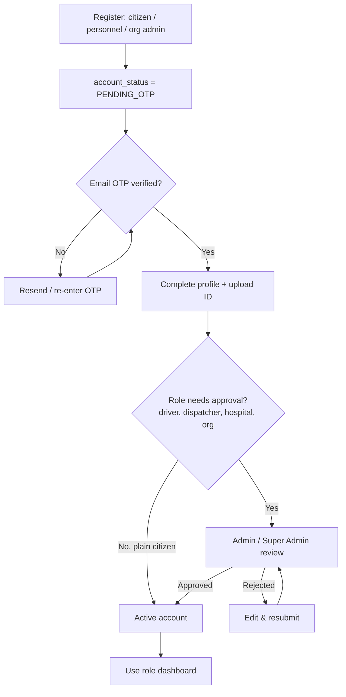
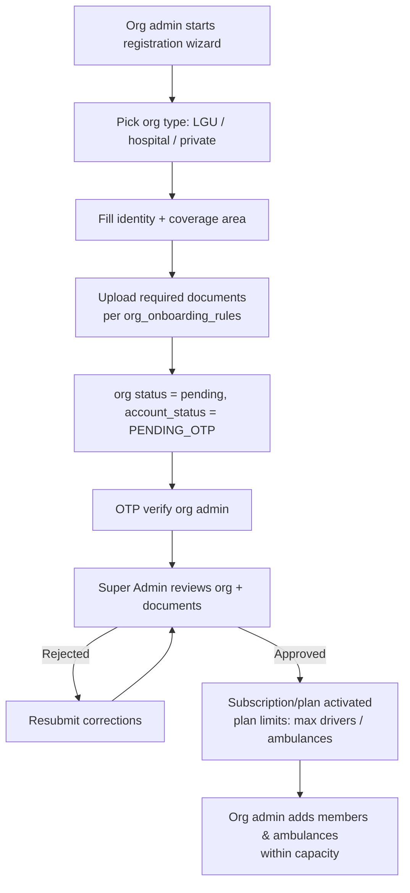
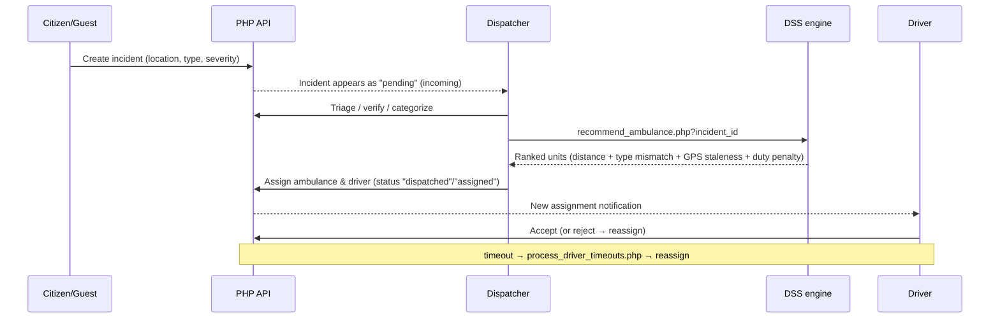
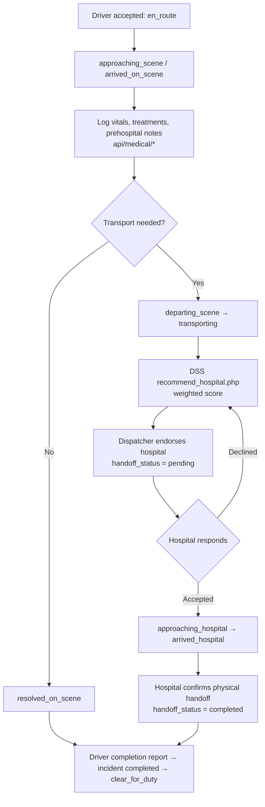
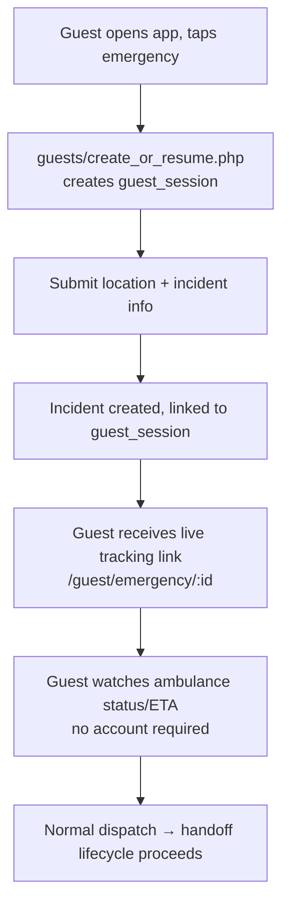
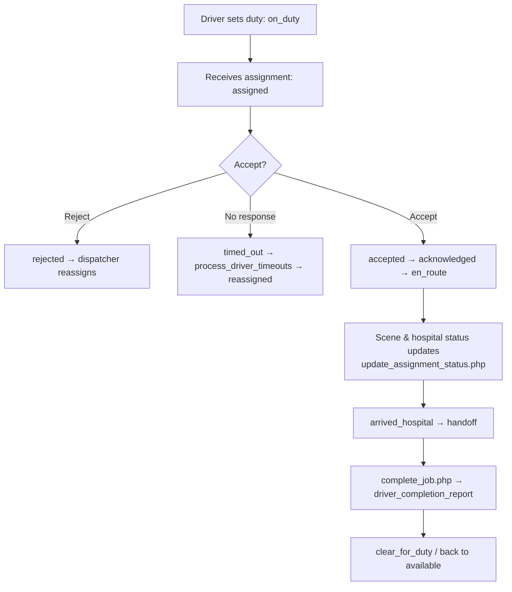
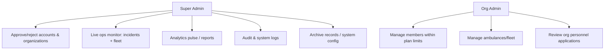
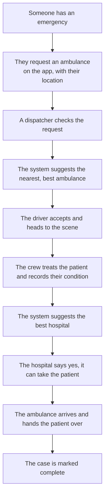
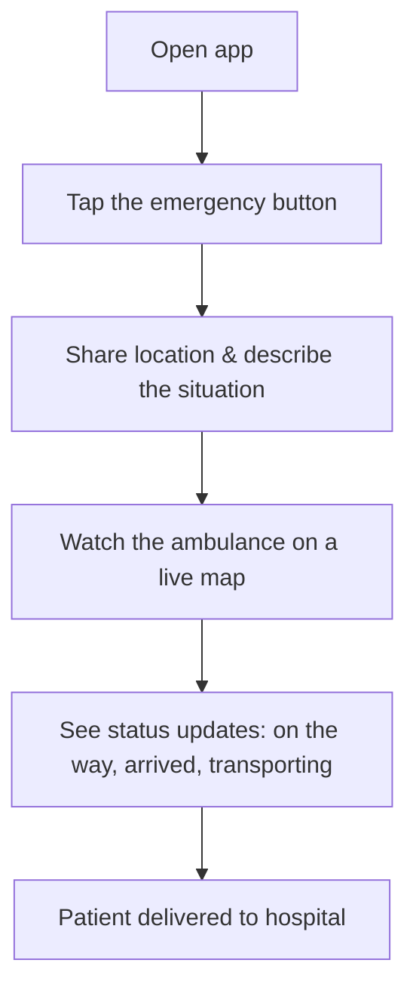

# Ambulance Rescue Platform — System Analysis Report

*Analysis-only document. No code was modified. Generated 2026-06-25.*
*Scope: full codebase scan of `ambulance_system_dev` — tech stack, architecture, processes, flows, and content.*

---

## Table of Contents

- [Part A — Technical Analysis](#part-a--technical-analysis)
  - [A1. System Overview & Purpose](#a1-system-overview--purpose)
  - [A2. Tech Stack](#a2-tech-stack)
  - [A3. System Architecture](#a3-system-architecture)
  - [A4. Directory & Module Map](#a4-directory--module-map)
  - [A5. Data Model (relational, ~50 tables)](#a5-data-model-relational-50-tables)
  - [A6. Auth & Security Model](#a6-auth--security-model)
  - [A7. Process Flowcharts](#a7-process-flowcharts)
  - [A8. Decision Support System (DSS)](#a8-decision-support-system-dss)
  - [A9. Realtime, Testing & Ops](#a9-realtime-testing--ops)
  - [A10. Known Gaps](#a10-known-gaps)
- [Part B — Non-Technical Analysis](#part-b--non-technical-analysis)
  - [B1. What This System Is](#b1-what-this-system-is)
  - [B2. Who Uses It](#b2-who-uses-it)
  - [B3. What It Does, Start to Finish](#b3-what-it-does-start-to-finish)
  - [B4. The Citizen's Experience](#b4-the-citizens-experience)
  - [B5. What Makes It Trustworthy](#b5-what-makes-it-trustworthy)
  - [B6. What's Working vs. Planned](#b6-whats-working-vs-planned)

---
---

# Part A — Technical Analysis

## A1. System Overview & Purpose

The **Ambulance Rescue Platform** is a city-scoped emergency medical dispatch system
for **Dasmariñas, Cavite, Philippines**. It connects four worlds in one workflow:

- **Citizens / guests** who need an ambulance,
- **Dispatchers** who triage and route incidents,
- **Ambulance crews (drivers/personnel)** who respond, treat, and transport,
- **Hospitals** who receive and accept patient handoffs,

under the **oversight** of organization admins (LGUs, hospitals, private providers)
and a platform **super admin**. It covers the full chain: request → triage →
dispatch → on-scene care → hospital endorsement → handoff → completion, with a
**Decision Support System (DSS)** recommending the best ambulance and hospital.

---

## A2. Tech Stack

| Layer | Technology | Role |
|-------|-----------|------|
| **Frontend SPA** | Vue 3 (Composition API), Vite 7 | Single-page web app, all role dashboards |
| State | Pinia (12 stores) | Auth, incidents, fleet, map, polling, etc. |
| Routing | Vue Router | Role-aware routes & guards |
| UI/Styling | Tailwind CSS v4 + DaisyUI | Component styling |
| Maps | Leaflet + OpenStreetMap | In-app live maps; Google Maps/Waze as external nav links |
| Charts | Chart.js + vue-chartjs | Analytics dashboards |
| UX | SweetAlert2, vue-toastification | Dialogs & notifications |
| HTTP | axios | API calls (CSRF-aware) |
| **Backend API** | **PHP** (procedural, no framework) | ~120 REST-style endpoints under `api/` |
| API core | `api/_core/` | db, rbac, helpers, workflow_status, dss_router, payments, privacy_mask |
| Email | symfony/mailer (Composer) | OTP & notification email |
| Identity | google/apiclient (Composer) | Google OAuth login + ID token validation |
| **Database** | **MySQL — relational** | ~50 tables, foreign keys, enums, migrations |
| **Mobile** | Flutter WebView shell (`mobile_webview_shell/`) + Capacitor (Android) | Both wrap the same Vue SPA (`webDir: dist`) |
| Realtime | HTTP **polling** (`stores/polling.js` + `api/changes/heartbeat.php`) | No websockets |
| Web server | Apache / XAMPP | Serves SPA + PHP API |
| Testing | Playwright E2E (`tests/e2e/`) | Incl. live emergency simulation |

**Database confirmation:** The system uses a **relational MySQL database**. Base
schema: `api/_sql/rescue_platform_clean_copy.sql` (~50 tables) plus ordered
migrations in `api/_sql/migrations/`. Relational integrity is enforced via foreign
keys and `enum`/`varchar` status columns.

---

## A3. System Architecture

Classic **3-tier**: a thin polling SPA client, a stateless-per-request PHP API with
shared core helpers, and a relational MySQL store. The mobile apps are thin shells
around the same SPA build — **one codebase, three delivery channels**.



---

## A4. Directory & Module Map

```
api/
  _core/        db, rbac, helpers, workflow_status, dss_router/headless,
                geo_validation, id_validator, google_id_token, privacy_mask,
                payments + payment_providers/, org_capacity, org_onboarding_rules
  _sql/         base schema + migrations/ (15+ ordered)
  auth/         login, register, register_minor, register_personnel, verify_otp,
                resend_otp, google_login/register, csrf, me, forgot/reset_password, upload_id
  users/        profile, complete_profile, medical_history, review_account
  organizations/ register, create, members, invite_member, review_personnel,
                onboarding_public_config, update_settings, capacity_usage
  incidents/    create, mine, incoming, respond, assign, update_status, cancel, flag_invalid
  emergency_requests/ create, mine, incoming, respond, assign, update_status
  dispatch/         assign_hospital, process_driver_timeouts
  dispatch_assignments/ assign, accept, reject, acknowledge, reassign, unassign,
                        mine, dss_recommend, proximity_tick
  dss/          recommend_ambulance, recommend_hospital
  ambulances/   create, list, available, locations, update_location, set/update_status, location_history
  fleet/        fuel_*, maintenance_*, stats
  driver/       duty_status, update_assignment_status, care_status_update,
                unit_readiness_*, complete_job
  hospitals/    list, create, update, capacity_update, endorse, endorsement_respond,
                endorsements_incoming, handoff_action, my_hospital
  medical/      patient_upsert, vitals_*, treatment_*, note_*, handoff_upsert, summary
  admin/        pending_*, approve/reject_account, approve_organization,
                audit_logs, live_ops, analytics_pulse, system_health/config, archive_*
  guests/       create_or_resume, me
  notifications/ list, mark_read, mark_all_read, unread_count
  changes/      heartbeat (polling)

src/
  views/        Welcome, AuthView, AdminLogin, dashboard/{admin,dispatcher,driver,...}, guest/
  components/    auth, dashboard, requests, guest, layout, ui, userProfileManagement, welcome
  stores/       auth, driver, emergencyRequests, fleet, guest, guestEmergencySession,
                incidents, map, organizations, polling, profile, theme
  router/       routes + nav.config (MODULE_FLAGS)
  lib/api, services, composables, constants, utils

mobile_webview_shell/   Flutter app wrapping the SPA (android/ios/web/desktop targets)
android/                Capacitor Android project
tests/e2e/              Playwright tests incl. live-simulation.spec.js
```

---

## A5. Data Model (relational, ~50 tables)

| Domain | Key tables |
|--------|-----------|
| **Identity & access** | `users`, `roles`, `permissions`, `role_permissions`, `user_roles`, `user_extra_permissions`, `user_sessions`, `user_google_identities` |
| **Citizen profile** | `citizen_profiles`, `user_identity_documents`, `user_medical_history`, `guardian_links`, `patients` |
| **Verification/auth** | `email_verification_codes`, `password_reset_codes`, `account_flags`, `terms_acceptance_logs` |
| **Organizations** | `organizations`, `organization_coverage_areas`, `organization_documents`, `org_subscriptions`, `plans`, `subscription_payments`, `geo_aor_layers` |
| **Incidents/requests** | `incidents`, `incident_updates`, `request_outcome_logs`, `guest_sessions` |
| **Dispatch** | `dispatch_assignments`, `driver_duty_states`, `driver_completion_reports` |
| **Fleet** | `ambulances`, `ambulance_location_history`, `ambulance_status_logs`, `fuel_logs`, `maintenance_logs`, `unit_readiness_checks` |
| **Hospital/medical** | `hospitals`, `hospital_endorsements`, `handoff_summaries`, `prehospital_notes`, `vitals_entries`, `treatment_records` |
| **Approvals & audit** | `approval_records`, `archival_logs`, `audit_logs`, `system_logs`, `system_configurations`, `system_settings`, `notifications` |

Relational integrity is enforced with foreign keys (see migration
`20260402220000_operational_integrity_fks_enum_hospitals.sql`) and canonical status
enums (`api/_core/workflow_status.php`).

**Canonical status vocabularies (from `workflow_status.php`):**

- **Incident:** `pending → dispatched → ongoing → on_scene → transporting →
  arrived_at_hospital → completed`; terminal alternatives `cancelled`,
  `resolved_on_scene`.
- **Dispatch assignment:** `assigned → accepted → acknowledged → en_route →
  approaching_scene → arrived_on_scene → departing_scene → approaching_hospital →
  arrived_hospital → clear_for_duty → completed`; exceptions `timed_out`,
  `rejected`, `reassigned`, `cancelled`, `unassigned`.
- **Hospital handoff:** `handoff_status` = `pending → accepted/declined → completed`.
- **Dispatch routing:** `pending_dss`, `routed_to_org`, `escalated_to_dss`,
  `reassign_within_org`.

---

## A6. Auth & Security Model

- **Sessions:** PHP session-based auth (`api/session.php`, `auth/login.php`, `auth/me.php`).
- **CSRF:** all state-changing endpoints call `require_csrf()` after a token issued by `auth/csrf.php`.
- **RBAC** (`api/_core/rbac.php`): roles classified by scope —
  - **Platform:** `super_admin` (sees all orgs).
  - **Org-scoped:** `org_admin`, `dispatcher`, `dispatcher_headless`, `ambulance_driver`, `hospital_staff` (data fenced to their `organization_id`; cross-org access returns `ORG_SCOPE_VIOLATION`).
  - **Citizen:** `user` (no org). Plus **guest** (no login).
  - Enforced via `require_role()` / `require_role_scoped()`; gates also check `EMAIL_NOT_VERIFIED` and `ACCOUNT_NOT_ACTIVE`.
- **PII masking:** `privacy_mask.php` hides internal IDs / sensitive fields.
- **Identity verification:** email **OTP** (symfony/mailer), **Google OAuth**, uploaded **ID documents** validated (`id_validator.php`, `philippine-id-validator`), geo validation (`geo_validation.php`).
- **Auditing:** `audit_logs`, `system_logs`, `archival_logs`.

---

## A7. Process Flowcharts

### A7.1 User & Account Lifecycle



### A7.2 Organization Onboarding



### A7.3 Emergency Request → Dispatch (with DSS)



### A7.4 On-Scene → Transport → Hospital Handoff



### A7.5 Guest (No-Login) Emergency Flow



### A7.6 Driver Assignment Lifecycle



### A7.7 Admin & Organizational Oversight



---

## A8. Decision Support System (DSS)

- **Ambulance recommendation** (`api/dss/recommend_ambulance.php`): score
  (lower = better) =
  `distance_km + severity/type mismatch penalty + GPS staleness penalty + duty-state penalty`.
  Returns a ranked list with score breakdown and a human-readable reason.
- **Hospital recommendation** (`api/dss/recommend_hospital.php`): weighted scoring
  (capacity, ER open, proximity).
- **Current limitation** (per `MODULE_AUDIT.md`): scoring **weights are hardcoded**
  in the PHP endpoints; there is no admin UI to tune them, and routing is **not** yet
  traffic-aware. Severity is dispatcher/user-selected, not auto-derived from vitals.

---

## A9. Realtime, Testing & Ops

- **Realtime:** polling model — `src/stores/polling.js` drives periodic refresh;
  `api/changes/heartbeat.php` is the lightweight change/heartbeat endpoint. No websockets/SSE.
- **Testing:** Playwright E2E in `tests/e2e/`, including an end-to-end live emergency
  simulation (`npm run live:sim`).
- **Build/deploy:** Vite builds to `dist/`; `vite.config.js` proxies `/api` to the
  Apache docroot; Capacitor `cap sync` packages `dist/` into the Android app.

---

## A10. Known Gaps

*(verified against `MODULE_AUDIT.md`)*

| Area | Status |
|------|--------|
| Shift scheduling, certification records, attendance | Pending |
| Traffic-aware routing | Pending |
| Auto priority scoring from vitals | Pending |
| DSS rule configuration UI | Pending (weights hardcoded) |
| Advanced analytics (utilization, turnover) | Pending (data exists) |
| Core emergency, dispatch, fleet, medical, handoff, RBAC, audit | Implemented |

---
---

# Part B — Non-Technical Analysis

## B1. What This System Is

It is an **online emergency ambulance service** for **Dasmariñas, Cavite**. Think of
it as a "ride-hailing app, but for ambulances" — combined with a control room and a
hospital coordination tool. When someone has a medical emergency, the system helps
get the **right ambulance** to them quickly and the **right hospital** ready to
receive them.

It works as a **website and a mobile app** (the mobile app shows the same thing as
the website, just packaged for phones).

---

## B2. Who Uses It

| Person | What they do |
|--------|--------------|
| **Citizen** | Requests an ambulance and tracks it live on a map. |
| **Guest** | Can request help **without an account** in a real emergency, and still track it via a link. |
| **Dispatcher** | The "control room" operator — checks the request, decides which ambulance to send. |
| **Ambulance Driver / Crew** | Receives the job, drives to the scene, records the patient's condition, and delivers them to a hospital. |
| **Hospital Staff** | Confirms they have room and accepts the incoming patient. |
| **Organization Admin** | Manages their own team of drivers and ambulances (e.g., an LGU or hospital). |
| **Super Admin** | Oversees the whole platform and approves new organizations and staff. |

---

## B3. What It Does, Start to Finish



**In short:** Ask for help → control room routes it → ambulance responds and cares
for the patient → hospital is prepared → patient is safely handed over.

---

## B4. The Citizen's Experience



A citizen never has to phone around or guess where the ambulance is — they see it
moving on the map with status updates. Behind the scenes, the dispatcher gets a
**smart suggestion** (the Decision Support System) for which ambulance is closest and
ready, and the hospital is asked in advance whether it can take the patient — so the
ambulance never arrives at a hospital with no room.

---

## B5. What Makes It Trustworthy

- **Verified people:** New users confirm their email with a one-time code, and staff
  must upload an ID. Drivers, dispatchers, hospital staff, and organizations are
  **approved by an admin** before they can act.
- **Privacy:** Sensitive personal details are hidden from people who don't need them.
- **Right access only:** Each role sees only what it should — a driver can't see
  another organization's data, for example.
- **Full record-keeping:** Every important action is logged, so there's always an
  audit trail.

---

## B6. What's Working vs. Planned

**Already working:**
- Emergency requests (with or without an account)
- Smart ambulance and hospital recommendations
- Live tracking on a map
- On-scene patient care records and hospital handoff
- Fleet management (ambulances, fuel, maintenance)
- Admin oversight, approvals, and audit logs

**Planned / not yet built:**
- Staff shift scheduling and attendance
- Traffic-aware routing (using live traffic data)
- Automatic urgency scoring from patient vital signs
- A settings screen for admins to fine-tune the recommendation rules
- Advanced performance reports (e.g., ambulance utilization)

---

*This is a snapshot of the system as it currently exists. It is an analysis only —
no part of the system was modified to produce this report.*