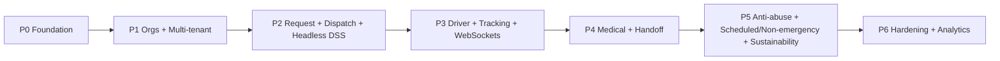

# 01 — Laravel MVC Migration Plan

*Planning document only. No system was built. Derived solely from the provided
project documentation. Generated 2026-06-25.*

**Project:** Web-Based Ambulance Rescue Platform with DSS and Mobile App — Dasmariñas City, Cavite
**Decision:** Rebuild on **Laravel MVC**, targeting the **post-defense revised spec**, with the
current Vue 3 / procedural-PHP / MySQL system as the reference baseline.

---

## 1. Purpose, Scope & Constraints

- **Purpose:** Define how the existing system transitions to a Laravel MVC architecture
  that implements the panel-revised specification.
- **Scope:** Planning artifacts only — roadmap, mappings, data migration approach, risks.
  **No implementation** of the Laravel system in this phase.
- **Basis constraint:** Everything here is traceable to the six provided source documents.
  Where the sources leave a decision open, it is flagged **[OPEN]** and deferred to
  `03_RECOMMENDATIONS.md` — not silently invented.

### Source documents
| # | Source | What it provides |
|---|--------|------------------|
| 1 | `SYSTEM ANALYSIS REPORT.md` | Current built system (stack, ~50 tables, roles, DSS, polling) |
| 2 | `DOCUMENT ARCHITECTURE.md` | Original manuscript + panel revisions + consolidated spec + open items |
| 3 | `INFORMATION CONTEXT.md` | Request types, minors/guardian, dynamic roles, org-owns-ambulance rule |
| 4 | `DOCS CHAP 1-3.docx` | Original capstone manuscript (Ch. 1–3) |
| 5 | `additional context and revisions.docx` | Raw panel notes + elaborated revisions |
| 6 | `MAJOR TASKS.md` | The instruction set for this deliverable |

---

## 2. Why Laravel MVC (traceable rationale)

The current backend is **procedural PHP on MySQL** (Source 1). Laravel is the structured
evolution of that same language and database, so the relational schema and PHP knowledge
carry over while the revised spec's harder requirements gain first-class framework support:

| Revised-spec requirement (Source 2/3/5) | Laravel MVC capability |
|------------------------------------------|------------------------|
| Dynamic roles & permissions per organization | Policies/Gates + a permission package (dynamic RBAC) |
| Headless DSS + "Automatic Throw" 30–90s countdown | Queued Jobs + Scheduler + Events |
| Scheduled / non-emergency dispatch | Scheduler + queued jobs |
| Real-time tracking / silent WebSocket push (replaces current polling) | Broadcasting (WebSockets) |
| Multi-tenant org isolation | Global query scopes keyed on `organization_id` |
| Google OAuth login | First-party social-auth |
| Mobile + web API auth | Token-based API auth |
| Existing ~50-table relational schema | Eloquent ORM + migrations |

---

## 3. Current State → Target State

> *Planning-level summary. The detailed, feature-by-feature current→target comparison
> (with rationale per feature) is canonical in `ROADMAP/EXISTING FEATURES + NEW FEATURES.md`.*

### 3.1 What carries over (baseline already proven in Source 1)
- Relational **MySQL** schema (~50 tables across identity, incidents, dispatch, fleet,
  hospital/medical, audit).
- Domain workflow vocabularies (incident / assignment / handoff status lifecycles).
- DSS scoring concept (distance + suitability factors).
- Role-scoped access (org isolation, platform vs org vs citizen).
- Email OTP, Google OAuth, ID-document upload, audit logging.
- External-navigation deep-links (Waze / Google Maps) and map-based tracking.

### 3.2 What changes or is newly required (Sources 2, 3, 5)
| Area | Current (Source 1) | Target (revised spec) |
|------|--------------------|------------------------|
| Admin model | 7 separate role dashboards | **4-tier hierarchy** (Super Admin → Platform Executive/LGU → Org Admin → Field users) |
| Roles | Static role enums | **Org-defined dynamic roles** with atomized permissions (`accept-incident`, `manage-fleet`) |
| Request types | Emergency request (+ guest) | **One-Tap, Detailed, Non-Emergency, Scheduled** (Source 3) |
| Incident intake | One request → one incident | **Heatmap aggregation** of reports within 50–150m → one **Master Incident Ticket** |
| Dispatch | Dispatcher manually assigns (DSS suggests) | **Headless DSS** auto-scores Idle units + **Automatic Throw** with 30–90s accept window, auto-reassign on timeout |
| Realtime | HTTP polling | **WebSocket** push to driver/citizen |
| Maps | Leaflet + OSM | **Mapbox** route geometry + deep-link nav (per Source 5) |
| Org onboarding | Org register + doc upload + super-admin approval | Same, but **LGU/Platform Executive** approves; **org classification** + **ambulance tiers** (BLS/ALS + equipment checklist) |
| Anti-abuse | (not specified) | **Device-UUID strike tracking**, cancellation = Pending until field-verified |
| Sustainability | Payment providers present | **Non-obstructive ads** + optional donation/government funding |
| Registration geo | lat/lng captured | **lat/lng removed from registration** — replacement method **[OPEN]** |

---

## 4. Concept → Laravel MVC Mapping

| Domain concept | Models (Eloquent) | Controllers | Supporting Laravel pieces |
|----------------|-------------------|-------------|---------------------------|
| Identity & access | `User`, `Role`, `Permission`, `Organization` | `Auth\*`, `ProfileController` | Social auth, API tokens, Policies, OTP notifications |
| 4-tier hierarchy + dynamic RBAC | `Role`, `Permission`, pivot tables | `Org\RoleController` | Gates/Policies; org-defined roles UI |
| Multi-tenant orgs | `Organization`, `OrganizationDocument`, `OrgSubscription`, `Plan` | `Org\OnboardingController`, `Admin\OrgApprovalController` | Global scope on `organization_id`; file storage for docs |
| Fleet | `Ambulance` (tier, equipment flags), `AmbulanceLocation`, `MaintenanceLog`, `FuelLog`, `UnitReadinessCheck` | `Fleet\*` | Tier/equipment as casts/enums |
| Requests & incidents | `EmergencyRequest`, `Incident` (Master Ticket), `IncidentUpdate`, `GuestSession` | `Incident\*`, `Guest\*` | Heatmap aggregation service; request-type enum |
| Dispatch + DSS | `DispatchAssignment`, `DriverDutyState` | `Dispatch\*`, `Dss\*` | **DSS service class**; **AutomaticThrowJob** (queue + countdown); reassignment job; broadcast events |
| Driver/tracking | `DispatchAssignment`, `AmbulanceLocation` | `Driver\*` | Broadcasting channels; Mapbox route payload |
| Hospital/medical | `Hospital`, `HospitalEndorsement`, `HandoffSummary`, `Vitals`, `TreatmentRecord`, `PrehospitalNote` | `Hospital\*`, `Medical\*` | Endorsement/handoff state machine |
| Anti-abuse | `DeviceToken`, `AccountFlag` | `Safety\*` | Strike-counting service; cancellation-review flow |
| Audit/admin | `AuditLog`, `SystemLog`, `Notification`, `ArchivalLog` | `Admin\*` | Audit via model events |
| Sustainability | `AdPlacement` (new), payment models | `Ads\*` | Config-driven ad slots gated off emergency UI |

> Presentation layer: the four web consoles (Super Admin, Platform Executive/LGU, Org
> Admin, Field) are **server-rendered Blade views** (classic Laravel MVC — no Inertia/Vue).
> The citizen and driver mobile apps consume the Laravel JSON API. The current Vue SPA is
> **not** carried over; its screens are re-expressed as Blade templates + controllers.

---

## 5. Phased Roadmap

> Phases, not calendar dates — **the sources specify no timeline**. Each phase ends in a
> reviewable, testable slice.

| Phase | Goal | Includes | Blocked by [OPEN] items |
|-------|------|----------|--------------------------|
| **P0 Foundation** | Laravel skeleton + data layer + auth | Project scaffold, Eloquent models + migrations from existing schema, base auth (credentials + Google), email OTP, audit logging | Terminology fixes (naming pass) |
| **P1 Orgs + Multi-tenant** | Tenants, 4-tier hierarchy, dynamic RBAC | Org onboarding, document verification, LGU/Platform-Executive approval, org classification, ambulance tiers + equipment, dynamic role/permission panel, org_id scoping | DILG role; org↔field role remapping |
| **P2 Request + Dispatch + DSS** | Core mission loop | 4 request types intake, heatmap aggregation → Master Incident Ticket, headless DSS scoring, Automatic Throw countdown + timeout reassignment | Scheduled/non-emergency workflow detail; "remove conditions" |
| **P3 Driver + Tracking** | Realtime + navigation | WebSocket push, driver mobilization, Mapbox route, deep-link nav, unified citizen/guest tracking, native dialer | lat/lng registration replacement |
| **P4 Medical + Handoff** | Pre-hospital care + hospital coordination | Vitals/treatment/notes, hospital endorsement + handoff state machine | — |
| **P5 Anti-abuse + Scheduling + Sustainability** | Trust + extra services + revenue | Device-UUID strikes, cancellation-review, scheduled/non-emergency dispatch, non-obstructive ads + donation hooks | Scheduled-service rules; "remove conditions" |
| **P6 Hardening + Analytics** | Production readiness | Performance metrics for LGU, archival, monitoring, security review | — |

---

## 6. Data Migration Approach

- The existing **relational MySQL schema is the starting point** (Source 1). Re-express it
  as **Laravel migrations** so the schema is version-controlled and reproducible.
- Add new tables required by the revised spec: dynamic-role/permission pivots, ambulance
  tier/equipment fields, `device_tokens`, Master-Incident-Ticket grouping on `incidents`,
  request-type column, ad-placement config.
- Preserve existing status vocabularies (incident / assignment / handoff lifecycles) as
  Eloquent enum casts to keep behavioral parity with the baseline.
- Migration of existing live data is **out of scope of these documents** (sources do not
  describe a production dataset to preserve); plan assumes a fresh schema build.

---

## 7. Risks & Dependencies

| Risk / dependency | Source | Mitigation |
|-------------------|--------|------------|
| **Pending field interviews** (org verification criteria; driver transport protocol) | Source 3 §7 | Treat onboarding doc list and transport steps as provisional; confirm before P1/P4 finalize |
| **Unresolved panel items** | Source 2 §6 | Tracked as [OPEN] in §5; do not hard-code until confirmed |
| WebSocket infra (new vs current polling) | Sources 1, 5 | Introduce in P3; keep tracking degradable |
| Mapbox dependency (vs current Leaflet/OSM) | Sources 1, 5 | Confirm licensing/budget in P3 (see recommendations) |
| Headless DSS correctness (auto-throw, reassignment) | Source 5 | Build DSS as isolated, testable service in P2 |
| Internet-dependency limitation | Sources 2, 4 | Explicit non-offline constraint; document for stakeholders |

---

## 8. Explicit Open Items (carried, not resolved)

> **Canonical list.** This is the single source of truth for the project's open/TBD items
> (origin: `DOCUMENT ARCHITECTURE.md` §6). Other docs reference this list rather than
> redefining it — update it here only.

From `DOCUMENT ARCHITECTURE.md` §6 — must be confirmed with client/panel:
1. **"Remove conditions"** — meaning undefined.
2. **Lat/long removal** — replacement input method not specified.
3. **Scheduled / non-emergency dispatch** — workflow not designed.
4. **DILG role** — stakeholder vs verification authority unclear.
5. **"Fix of terminologies"** — specific terms not listed.
6. **Org↔field role remapping** — inference only; verify.

Recommended handling of each is in `03_RECOMMENDATIONS.md`.

---

*See also: `02_PROCESS_AND_FLOW.md` (flows), `03_RECOMMENDATIONS.md` (decisions &
packages), `04_SYSTEM_ARCHITECTURE.md` (target architecture).*
