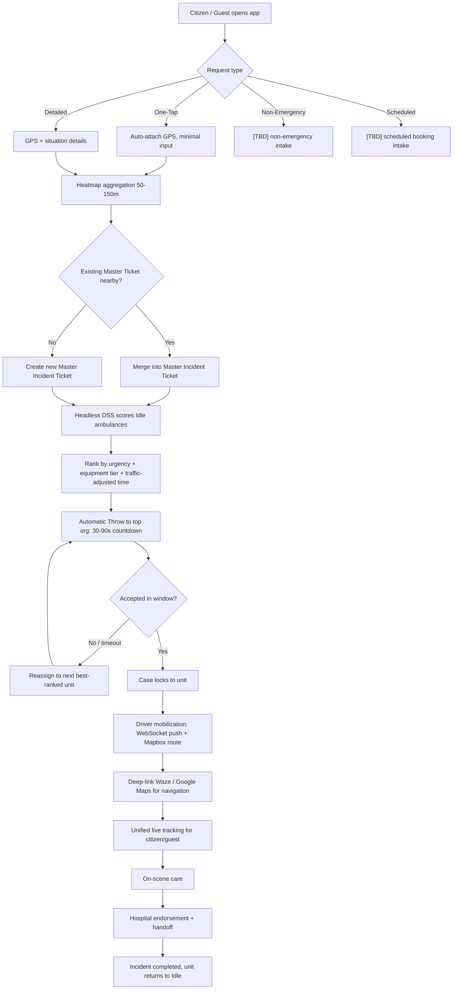
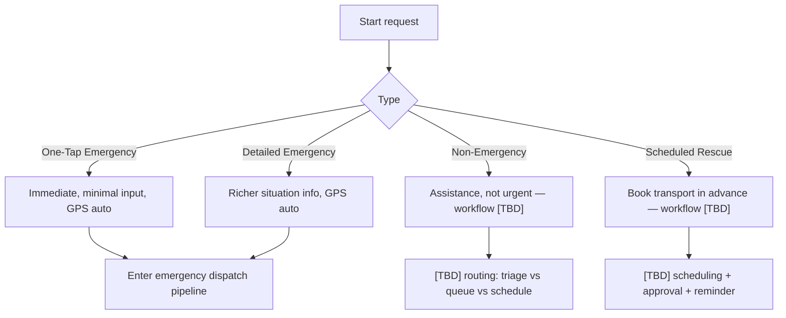
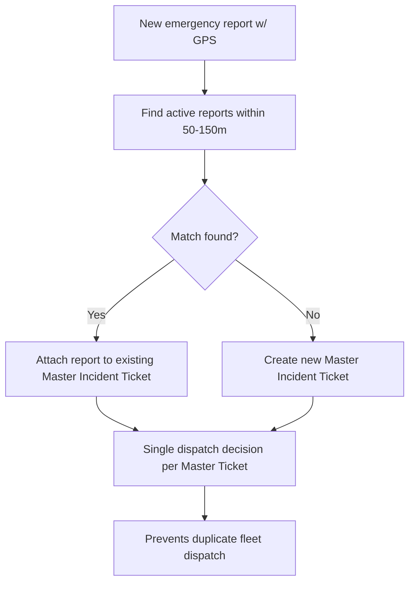
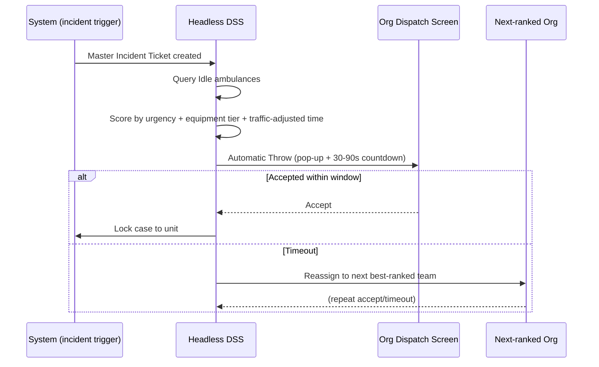
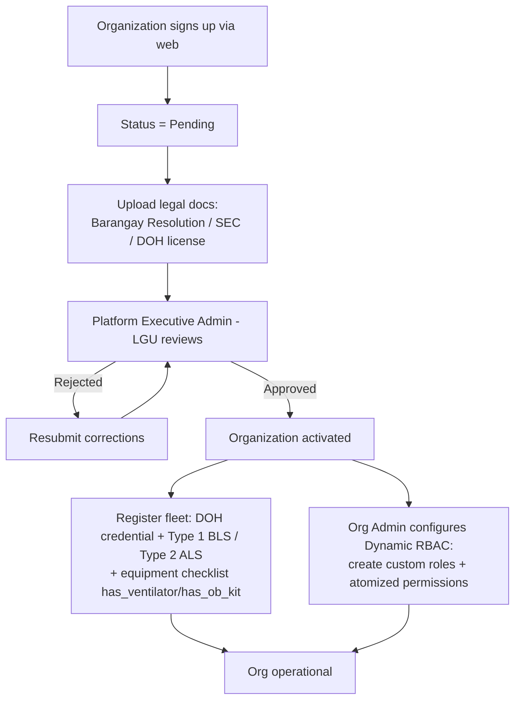
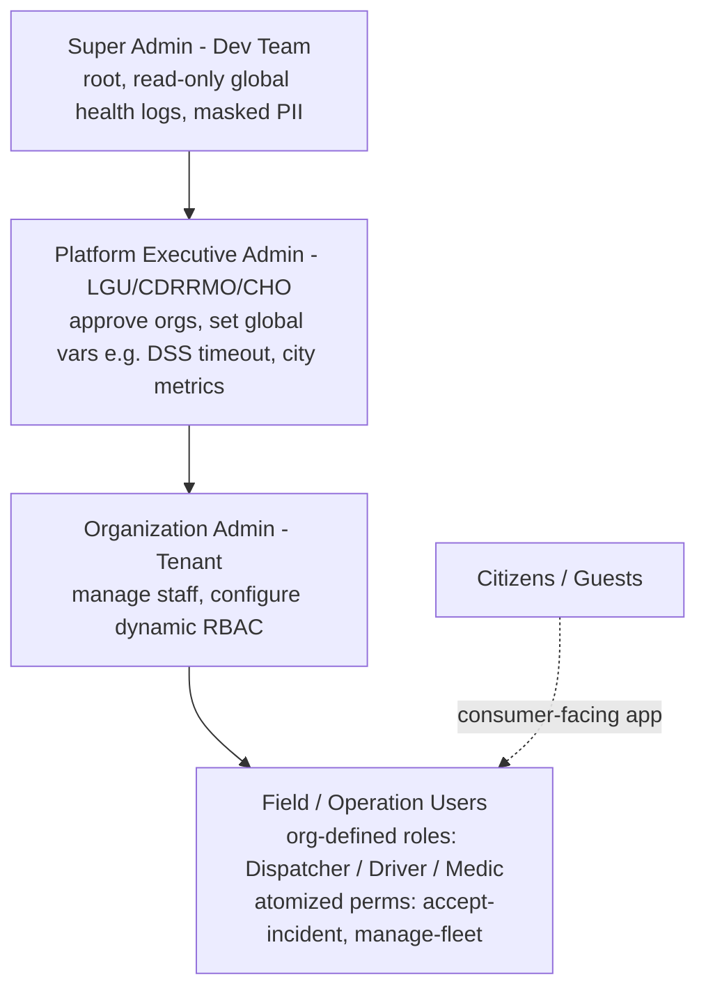
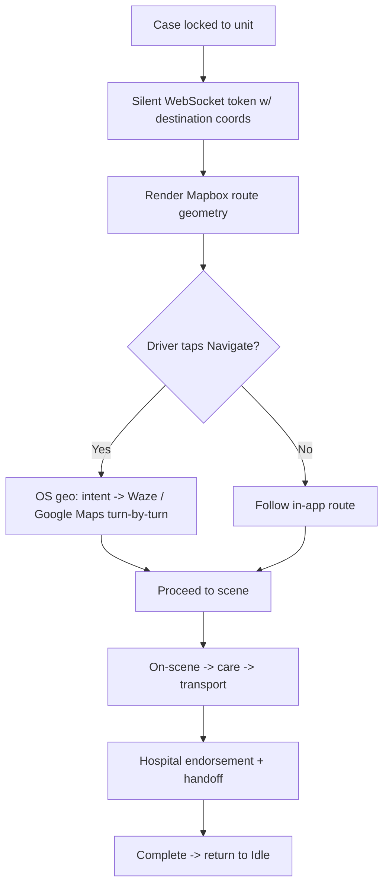
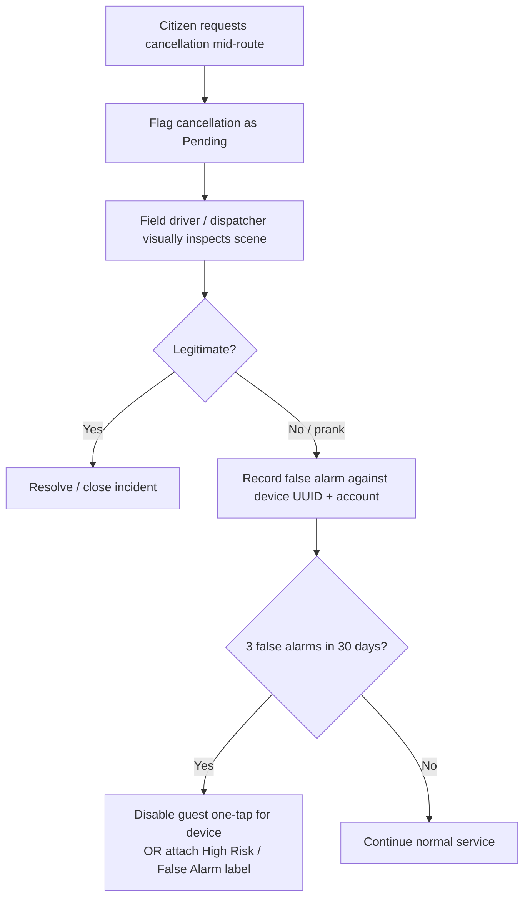

# 02 — Updated Process & Flow (Revised Spec)

*Planning document only. Flows reflect the **post-defense revised specification**.
Derived solely from the provided documentation. Branches the sources leave undefined are
marked **[TBD]**. Generated 2026-06-25.*

---

## 1. End-to-End Process (Narrative, Start → End)

1. **Request intake.** A citizen (registered or guest) submits one of four request types
   (Source 3): **One-Tap Emergency**, **Detailed Emergency**, **Non-Emergency**, or
   **Scheduled Rescue**. GPS is auto-attached for emergencies.
2. **Heatmap aggregation.** Overlapping reports within a **50–150m** radius merge into a
   single **Master Incident Ticket** to prevent duplicate dispatch (Source 5).
3. **Headless DSS scoring.** The backend queries all **Idle** ambulances and scores them by
   **case urgency, equipment tier match, and traffic-adjusted travel time** (Source 5).
4. **Automatic Throw.** The top-ranked organization's dispatch screen gets a pop-up with a
   **30–90s countdown**. Accept → case locks to that unit. Timeout → DSS auto-passes the
   ticket to the next best-ranked team (Source 5).
5. **Driver mobilization.** On accept, the driver app receives a silent **WebSocket** push
   with destination coordinates and a **Mapbox** route; the "Navigate" button **deep-links**
   to Waze/Google Maps for turn-by-turn (Source 5).
6. **Unified tracking.** Registered and guest citizens see the same live tracking UI (ETA,
   plate number, crew, tier badge) and can **call the driver via native `tel:`** (Source 5).
7. **On-scene & handoff.** Crew provides care; patient is endorsed to and accepted by a
   hospital, then physically handed off (baseline lifecycle, Source 1).
8. **Completion.** Incident closes; unit returns to Idle/available.
   *Cancellation is not instant:* requests are flagged **Pending** until field-verified
   (Source 5).

---

## 2. Master Flow — Emergency Request to Completion

---

## 3. Request-Type Intake (4 types)

> **[TBD] (Source 2 §6):** Non-emergency and scheduled flows are named in the sources but
> their detailed workflow, approval steps, and scheduling UI are **not yet designed**.

---

## 4. Heatmap Aggregation → Master Incident Ticket

---

## 5. Headless DSS + Automatic Throw

---

## 6. Organization Onboarding (Revised — LGU-approved, multi-tenant)

> **Pre-req (Source 3):** an organization must own/operate **at least one ambulance** to
> register. **[TBD]** exact verification criteria/documents pending facility interviews.

---

## 7. 4-Tier Administrative Hierarchy (Access Flow)

> **[TBD] (Source 2 §6):** mapping of original Dispatcher/Hospital-Staff/Org-Admin roles
> onto the new Org-Admin + Field-User tiers, and **DILG's** specific touchpoint, require
> client confirmation.

---

## 8. Driver & Navigation Flow

---

## 9. Anti-Abuse & Cancellation Flow

---

## 10. Flows Pending Definition (TBD register)

> *Flow-specific view of the open items. Canonical list: `01_MIGRATION_PLAN.md` §8.*

| Flow | Status | Source |
|------|--------|--------|
| Non-emergency request handling | Named, not designed | Source 2 §6, Source 3 |
| Scheduled rescue (booking, approval, reminders) | Named, not designed | Source 2 §6, Source 3 |
| lat/lng registration replacement (pin-drop vs geocode) | Removal confirmed; replacement open | Source 2 §6 |
| "Remove conditions" | Meaning undefined | Source 2 §6 |
| DILG touchpoint | Stakeholder role unclear | Source 2 §6 |

---

*See also: `01_MIGRATION_PLAN.md`, `03_RECOMMENDATIONS.md`, `04_SYSTEM_ARCHITECTURE.md`.*
