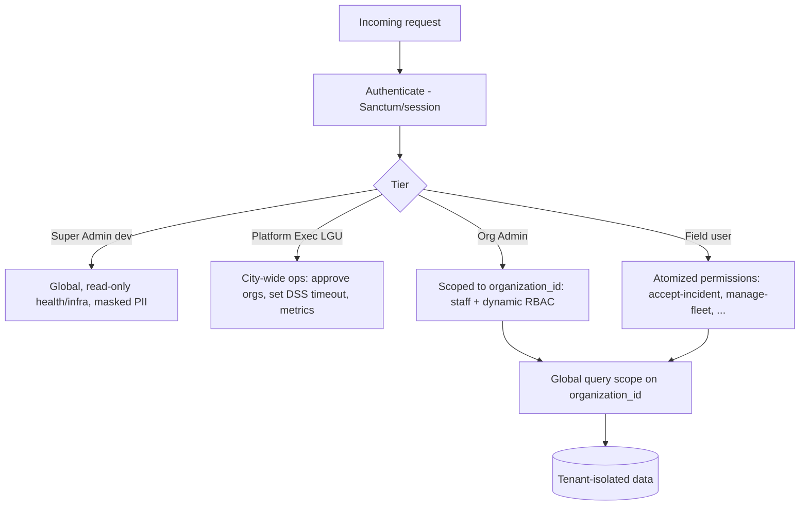
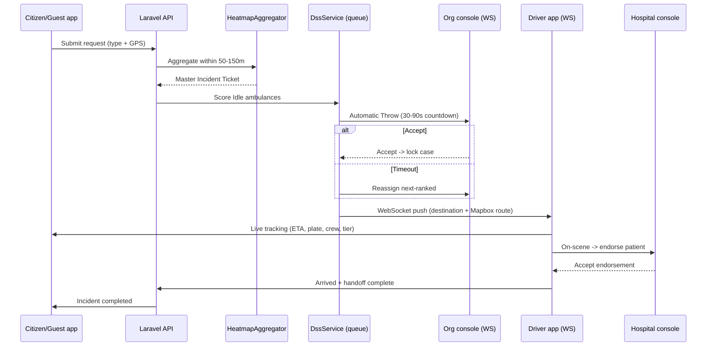
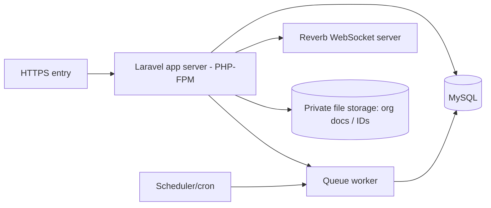

# 04 — Whole System Architecture (Target, Laravel MVC)

*Planning document only. Describes the **target** architecture for the revised spec on
Laravel MVC, start to end. Derived solely from the provided documentation. Generated
2026-06-25.*

---

## 1. Architecture Overview

A **multi-tenant Laravel MVC application** is the single backend for all clients. It
serves four web consoles as **server-rendered Blade views** (classic MVC — no Inertia/Vue)
and a JSON API (via Sanctum) for the citizen and driver mobile apps. A **headless DSS**
runs inside the app on queues; realtime updates are pushed over **WebSockets** (replacing
the current polling). MySQL remains the relational store.

```mermaid
flowchart TB
    subgraph Clients
        CIT["Citizen mobile app (One-Tap/Detailed/Non-Emerg/Scheduled)"]
        DRV["Driver mobile app (Mapbox + deep-link nav)"]
        WEB["Web consoles (Blade): Super Admin / Platform Exec (LGU) / Org Admin / Field"]
    end

    subgraph Laravel["Laravel MVC Application"]
        RT["Routing (web + api)"]
        MW["Middleware: auth (Sanctum), tenancy scope, RBAC policies"]
        CTRL["Controllers"]
        SVC["Services: DssService, HeatmapAggregator, OnboardingService, StrikeService"]
        JOBS["Queues + Jobs: AutomaticThrowJob, ReassignJob, ScheduledDispatchJob"]
        EVT["Events + Broadcasting (Reverb / WebSockets)"]
        MOD["Models (Eloquent)"]
        SCHED["Scheduler (cron) — timeouts, scheduled rescues"]
    end

    DB[("MySQL — relational (~50 tables + revised additions)")]

    subgraph External
        MB["Mapbox (route geometry)"]
        NAV["Waze / Google Maps (geo: deep-link)"]
        GA["Google OAuth (Socialite)"]
        MAIL["SMTP (OTP / notifications)"]
        ADS["Ads / donation / gov funding (non-obstructive)"]
    end

    CIT -->|REST + WS| RT
    DRV -->|REST + WS| RT
    WEB -->|HTTP (Blade) + WS| RT
    RT --> MW --> CTRL --> SVC
    CTRL --> MOD
    SVC --> JOBS
    SVC --> MOD
    JOBS --> EVT
    SCHED --> JOBS
    MOD --> DB
    EVT -->|push| CIT
    EVT -->|push| DRV
    EVT -->|push| WEB
    DRV --> MB
    DRV --> NAV
    CTRL --> GA
    CTRL --> MAIL
    WEB --> ADS
```

---

## 2. Layered MVC Responsibilities

| Layer | Responsibility | Key contents |
|-------|----------------|--------------|
| **Routing** | `routes/web.php` (Blade consoles), `routes/api.php` (mobile) | Tenancy + auth groups |
| **Middleware** | Auth (Sanctum), org-tenancy scope, RBAC policy gates, email-verified/account-active checks | Mirrors current `require_role_scoped` behavior (Source 1) |
| **Controllers** | Thin HTTP handlers per domain | `Incident*`, `Dispatch*`, `Dss*`, `Org*`, `Fleet*`, `Hospital*`, `Medical*`, `Admin*`, `Safety*` |
| **Services** | Business logic | `DssService` (scoring), `HeatmapAggregator` (50–150m merge), `AutomaticThrow` orchestration, `OnboardingService`, `StrikeService` |
| **Jobs / Scheduler** | Async + time-based | Auto-throw countdown, timeout reassignment, scheduled-rescue activation |
| **Events / Broadcasting** | Realtime fan-out | Assignment offered, accepted, location updated, status changed |
| **Models (Eloquent)** | Data + relations + casts | See §4 |
| **Views** | Blade templates (web), JSON (api) | Server-rendered MVC; minimal JS (e.g. Alpine.js) + broadcasting for realtime |

---

## 3. Tenancy & 4-Tier RBAC Layer



Dynamic roles are **data, not code**: each organization defines its own roles and assigns
atomized permissions (Sources 2, 3, 5), enforced through Laravel Policies/Gates.

---

## 4. Domain → Eloquent Model Map

| Domain | Models | Notes |
|--------|--------|-------|
| Identity & access | `User`, `Role`, `Permission`, role/permission pivots | Dynamic per-org roles |
| Tenancy | `Organization`, `OrganizationDocument`, `OrgSubscription`, `Plan` | Onboarding + classification |
| Fleet | `Ambulance` (tier BLS/ALS + equipment flags), `AmbulanceLocation`, `MaintenanceLog`, `FuelLog`, `UnitReadinessCheck` | DOH credential ref |
| Requests/incidents | `EmergencyRequest` (4 types), `Incident` (Master Ticket), `IncidentUpdate`, `GuestSession` | Heatmap grouping |
| Dispatch + DSS | `DispatchAssignment`, `DriverDutyState` | Auto-throw / reassignment state |
| Hospital/medical | `Hospital`, `HospitalEndorsement`, `HandoffSummary`, `Vitals`, `TreatmentRecord`, `PrehospitalNote` | Endorsement/handoff lifecycle |
| Safety | `DeviceToken`, `AccountFlag` | UUID strike tracking |
| Audit/admin | `AuditLog`, `SystemLog`, `Notification`, `ArchivalLog` | Via model observers |
| Sustainability | `AdPlacement` (new), payment models | Non-obstructive, gated off emergency UI |

Status vocabularies (incident / assignment / handoff) carry over from the baseline
(Source 1) as Eloquent enum casts.

---

## 5. Realtime & Navigation Path

- **Realtime:** Laravel broadcasting (Reverb / WebSockets) pushes assignment offers,
  acceptance, live location, and status to citizen/driver/console clients — replacing the
  current polling/heartbeat model (Sources 1, 5).
- **Navigation:** driver app renders a **Mapbox** route from the WebSocket payload; the
  "Navigate" button hands off to **Waze/Google Maps** via OS `geo:` intent. Citizens get
  unified tracking + native `tel:` call (Source 5).

---

## 6. End-to-End Architecture Walkthrough (Start → End)



---

## 7. Deployment View (Indicative)



> Hosting specifics are **not defined in the sources**; this view is indicative of the
> Laravel runtime components implied by the revised features (queues, scheduler,
> WebSockets). Confirm infrastructure with stakeholders.

---

## 8. Scope Boundaries (architectural constraints)

- **City-bounded** to Dasmariñas (Sources 2, 4).
- **Domain-bounded:** no diagnostics, bed management, or police/fire integration
  (Sources 2, 4).
- **Internet-required:** no offline tracking/DSS (Sources 2, 4).

---

*See also: `01_MIGRATION_PLAN.md`, `02_PROCESS_AND_FLOW.md`, `03_RECOMMENDATIONS.md`.*
