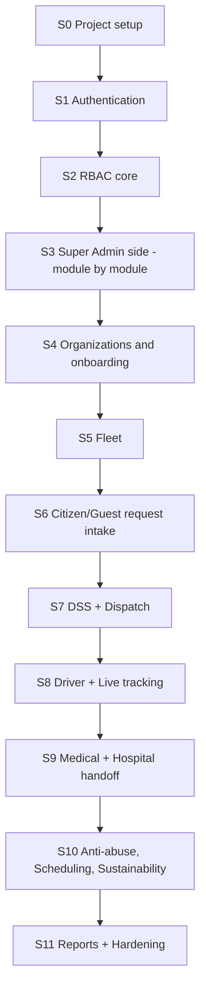

# Development Build Guide (Step-by-Step)

*An ordered, module-by-module implementation sequence for the Laravel MVC build. Build in
this order; finish and test one step before starting the next. **Do not build a whole side
(e.g. all of admin) in one shot — one module at a time.** Each step lists the database
tables and relationships to wire up. Generated 2026-06-25.*

> **Golden rules**
> - One module per step. Ship it, test it, then move on.
> - **Migrate as you go** — create only the tables a module needs, when that module needs them.
> - Apply the relevant changes from `DATABASE REVISIONS.md` (R1–R13) the moment a step
>   touches that table — don't build legacy then patch.
> - Every write path gets validation + a permission check (see `SECURITY IMPROVEMENTS.md`).
>
> **Numbering:** steps here are **S0–S11** (fine-grained build order). These are *not* the
> same as the **P0–P6 phases** in `TECHNICAL ROADMAP.md` / `MIGRATION/01_MIGRATION_PLAN.md`
> (higher-level delivery phases). Rough mapping: P0→S0–S2, P1→S3–S5, P2→S6–S7, P3→S8,
> P4→S9, P5→S10, P6→S11.

---

## Build Order at a Glance

---

## S0 — Project Setup (do once)

**Goal:** an empty Laravel app that connects to MySQL and renders a base layout.

**Steps**
1. Configure `.env` (DB, mail, app URL). Set `APP_DEBUG=false` for any shared environment.
2. Install packages you'll need early: `spatie/laravel-permission`, `laravel/socialite`,
   `laravel/sanctum`. (Realtime/Reverb later, in S8.)
3. Create a base Blade layout (`layouts/app.blade.php`) + a simple home route.
4. Set up the migration workflow (`php artisan migrate`).

**Database relations:** none yet.

**Done when:** app boots, connects to DB, shows the base layout.

---

## S1 — Authentication Page (first real feature)

**Goal:** users can register, verify by email OTP, log in/out, reset password, and (option)
log in with Google.

**Build in this sub-order:**
1. **Register page** → create user as `account_status = pending_otp`.
2. **Email OTP verify page** → verify code → mark `email_verified_at`.
3. **Login / logout** (session for web consoles).
4. **Password reset** (request → emailed code/link → set new password).
5. **Google login** (Socialite) — optional, after the above works.
6. **Terms acceptance** on register.

**Database tables & relations**
| Table | Key relations |
|-------|---------------|
| `users` | hub table; `email` UNIQUE; `organization_id`→organizations (nullable), `hospital_id`→hospitals (nullable), `approved_by`→users (self, nullable). Rename `password_hash`→`password` (R13). |
| `email_verification_codes` | `user_id`→users (CASCADE) |
| `password_reset_codes` | by email/user |
| `user_sessions` | `user_id`→users; `token_hash` UNIQUE |
| `user_google_identities` | `user_id`→users UNIQUE (1:1); `google_sub` UNIQUE |
| `terms_acceptance_logs` | `user_id`→users |

**Done when:** a new account can register → verify → log in → reset password.

---

## S2 — RBAC Core (before any admin side)

**Goal:** roles and permissions exist and gate access. This must come before admin so every
admin action can be permission-checked.

**Steps**
1. Create roles/permissions tables. **Apply R1 now:** `roles.organization_id` (nullable =
   platform role) + uniqueness `(organization_id, name)`.
2. Seed platform roles (super_admin, LGU/platform_executive) and base permissions.
3. Wire Policies/Gates (or spatie) + middleware: `auth`, `account-active`, permission gates.
4. Build the role→permission assignment logic (used later by Org Admin for dynamic roles).

**Database tables & relations**
| Table | Key relations |
|-------|---------------|
| `roles` | +`organization_id`→organizations (R1); UNIQUE `(organization_id, name)` |
| `permissions` | `code` UNIQUE |
| `role_permissions` | `role_id`→roles, `permission_id`→permissions; UNIQUE `(role_id, permission_id)` (CASCADE) |
| `user_roles` | `user_id`→users, `role_id`→roles, `organization_id`→organizations; UNIQUE `(user_id, role_id, organization_id)` |
| `user_extra_permissions` | `user_id`→users, `organization_id`→organizations; **change `permission_code`→FK `permission_id` (R5)**; UNIQUE `(user_id, organization_id, permission_id)` |

**Done when:** a user's role/permissions are enforced on a protected test route.

---

## S3 — Super Admin Side (build module by module)

**Goal:** the dev-team root console. **Do NOT build all of it at once.** Build each module,
test, then the next.

**Module order:**
1. **Admin shell** — layout, nav, dashboard landing (no data yet).
2. **User management module** — list/search users, view, activate/deactivate, archive.
   - Tables: `users` (+ `archived_by`→users self). 
3. **Account review / approvals module** — approve/reject pending personnel & accounts.
   - Tables: `approval_records` (`user_id`→users, `reviewed_by`→users); `account_flags`
     (`user_id`→users).
4. **Audit & system logs module** — read-only log views.
   - Tables: `audit_logs` (`user_id`→users, nullable), `system_logs`.
5. **System configuration module** — global settings.
   - Tables: `system_configurations` (UNIQUE `(scope, organization_id, config_key)`),
     `system_settings`.
6. **Archive registry module** — view/restore archived records.
   - Tables: `archival_logs` (`archived_by`→users).

**Done when:** each module works on its own before the next is started.

---

## S4 — Organizations & Onboarding (multi-tenant)

**Goal:** partner orgs register → pending → upload docs → LGU approves → activated.

**Module order:**
1. **Org registration** (public wizard) → `organization_status = PENDING_REVIEW`.
2. **Document upload module** — private storage.
3. **LGU approval module** (Platform Executive) — review docs, approve/reject.
4. **Subscription/plan limits** — max drivers/ambulances/members.
5. **Org Admin: dynamic role builder** — org creates its own roles (uses S2 + R1).
6. **Org Admin: member management** — invite/add members within plan limits.

**Database tables & relations**
| Table | Key relations |
|-------|---------------|
| `organizations` | `admin_user_id`→users, `subscription_plan_id`→plans, `approved_by`→users; consider splitting wide table (R11) |
| `organization_documents` | `organization_id`→organizations |
| `organization_coverage_areas` | `organization_id`→organizations |
| `org_subscriptions` | `organization_id`→organizations UNIQUE (1:1) |
| `plans` | `code` UNIQUE; referenced by organizations/subscriptions |
| `subscription_payments` | `organization_id`→organizations (+ plan) |
| `geo_aor_layers` | `slug` UNIQUE; coverage geometry |

**Done when:** an org can be onboarded, approved by LGU, and staffed with custom roles.

---

## S5 — Fleet Module

**Goal:** orgs register and manage ambulances (with tier + equipment).

**Module order:**
1. **Ambulance registry** — CRUD. **Apply R3:** `tier` (BLS/ALS), `doh_credential_ref`,
   equipment flags.
2. **Driver duty status** — on/off duty.
3. **Readiness checks** — daily unit readiness.
4. **Fuel & maintenance logs.**

**Database tables & relations**
| Table | Key relations |
|-------|---------------|
| `ambulances` | `organization_id`→organizations, `current_driver_user_id`→users; UNIQUE `(organization_id, plate_no)`; +tier/equipment (R3) |
| `driver_duty_states` | `driver_user_id`→users UNIQUE (1:1) |
| `unit_readiness_checks` | `ambulance_id`→ambulances, `driver_user_id`→users; UNIQUE `(ambulance_id, driver_user_id, check_date)` |
| `fuel_logs` / `maintenance_logs` | `ambulance_id`→ambulances |
| `ambulance_location_history` / `ambulance_status_logs` | `ambulance_id`→ambulances |

**Done when:** an org can register a tiered, equipped ambulance and a driver can go on duty.

---

## S6 — Citizen / Guest Request Intake

**Goal:** citizens and guests can submit requests (4 types).

**Module order:**
1. **Guest session** — anonymous identity for no-login requests.
2. **One-Tap & Detailed request** — create incident with GPS. **Apply R8** (`request_type`,
   `scheduled_for`) and **R2** (`master_incident_id`).
3. **Citizen profile / medical history** (registered users; minors via guardian).
4. **Incident history & tracking placeholder** (live tracking lands in S8).

**Database tables & relations**
| Table | Key relations |
|-------|---------------|
| `incidents` | `user_id`→users **OR** `guest_id`→guest_sessions (R6: exactly one); `organization_id`→organizations, `destination_hospital_id`→hospitals, `coverage_area_id`→coverage_areas; +`master_incident_id` self-FK (R2); +`request_type`/`scheduled_for` (R8); `request_code` UNIQUE |
| `guest_sessions` | `guest_key` UNIQUE |
| `citizen_profiles` | `user_id`→users UNIQUE (1:1) |
| `user_medical_history` | `user_id`→users UNIQUE |
| `guardian_links` | `minor_user_id`→users UNIQUE, `guardian_user_id`→users |
| `patients` | `incident_id`→incidents UNIQUE (1:1) |

**Done when:** a registered user and a guest can each submit a request that lands as an
incident (merging nearby ones into a master ticket).

---

## S7 — DSS + Dispatch

**Goal:** the system scores ambulances and auto-offers the job with a countdown.

**Module order:**
1. **Heatmap aggregation service** — merge reports within 50–150m (uses R2).
2. **DSS scoring service** — rank Idle ambulances (urgency + tier + traffic-adjusted time).
3. **Automatic Throw** — queued job offers to top org, 30–90s countdown.
4. **Timeout reassignment** — re-offer to next-ranked org.
5. **Dispatcher console** — incoming queue, accept, manual assign.

**Database tables & relations**
| Table | Key relations |
|-------|---------------|
| `dispatch_assignments` | `incident_id`→incidents, `organization_id`→organizations, `ambulance_id`→ambulances, `driver_user_id`→users, `dispatcher_user_id`→users, `hospital_id`→hospitals (nullable), `forwarded_from_assignment_id`→dispatch_assignments (self). Uses existing `dss_rank`, `alert_attempts`, `response_deadline_at`. Drop duplicate timestamps (R10). |
| `incidents` | uses `dispatch_routing_state`, `dss_org_queue_json` (already present) |
| `incident_updates` | `incident_id`→incidents, `dispatch_assignment_id`→dispatch_assignments |

**Done when:** a new incident is scored, auto-offered, accepted (or auto-reassigned on timeout).

---

## S8 — Driver + Live Tracking (realtime)

**Goal:** the driver responds and the citizen watches live.

**Module order:**
1. **Realtime setup** — install/configure Reverb (broadcasting).
2. **Driver assignment flow** — accept/reject, status transitions, Mapbox route, `geo:` nav.
3. **Location ingest** — driver app pushes location.
4. **Unified tracking screen** — citizen/guest live view + native `tel:` call.

**Database tables & relations**
| Table | Key relations |
|-------|---------------|
| `dispatch_assignments` | status transitions (en_route → arrived_on_scene → …) |
| `ambulance_location_history` | `ambulance_id`→ambulances (live pings) |
| `incidents` | `public_tracking_enabled`, `eta_minutes` (already present) |

**Done when:** acceptance → live location → citizen tracking works end to end.

---

## S9 — Medical + Hospital Handoff

**Goal:** record care and hand the patient to a hospital.

**Module order:**
1. **Hospital registry & capacity** module.
2. **Pre-hospital care** — vitals, treatments, notes.
3. **Endorsement** — driver/dispatcher endorses hospital (`handoff_status = pending`).
4. **Hospital response & handoff completion** — accept/decline → arrived → completed.

**Database tables & relations**
| Table | Key relations |
|-------|---------------|
| `hospitals` | `organization_id`→organizations (nullable), `created_by`→users |
| `hospital_endorsements` | `incident_id`→incidents, `hospital_id`→hospitals |
| `handoff_summaries` | `incident_id`→incidents UNIQUE (1:1) |
| `vitals_entries` | `incident_id`→incidents (+ recorded_by→users) |
| `treatment_records` | `incident_id`→incidents |
| `prehospital_notes` | `incident_id`→incidents |

**Done when:** a case runs scene → care → endorsement → hospital accept → handoff complete.

---

## S10 — Anti-abuse, Scheduling, Sustainability

**Module order:**
1. **Device-UUID strikes** (R4) — 3 false alarms / 30 days rule.
2. **Verified cancellation** — cancellation = Pending until field-verified.
3. **Scheduled / non-emergency** workflows — **[TBD: confirm rules with panel first]**.
4. **Sustainability** — non-obstructive ads / donation hooks (R9).

**Database tables & relations**
| Table | Key relations |
|-------|---------------|
| `device_tokens` (new, R4) | `device_uuid` UNIQUE, `user_id`→users (nullable) |
| `account_flags` | `user_id`→users |
| `incidents` | cancellation status; `flagged_for_abuse` (already present) |
| `ad_placements` (new, R9) | standalone; `emergency_safe` flag |

**Done when:** misuse controls work; extra service types behave (once rules confirmed).

---

## S11 — Reports + Hardening

**Module order:**
1. **LGU performance metrics / reports.**
2. **Notifications module** (cross-cutting; can be wired earlier if needed).
   - `notifications` (`user_id`→users).
3. **Security pass** — run the `SECURITY IMPROVEMENTS.md` checklist on every module.
4. **Status casing/terminology normalization** (R12) and final cleanup (R10, R11, R13).

**Done when:** the system is presentable, consistent, and passes the security checklist.

---

## How to Use This With the Other Docs

- **What/why per phase:** `TECHNICAL ROADMAP.md`.
- **Schema changes referenced as R1–R13:** `DATABASE REVISIONS.md`.
- **Per-module flow diagrams:** `PROCESS AND FLOW.md`.
- **Security checklist per step:** `SECURITY IMPROVEMENTS.md`.
- **Plain-language version:** `NON-TECHNICAL ROADMAP.md`.

> Reminder: a phase isn't "done" because the code exists — it's done when its happy path +
> key failure paths work and a quick test/seed proves it. Then, and only then, start the
> next module.
