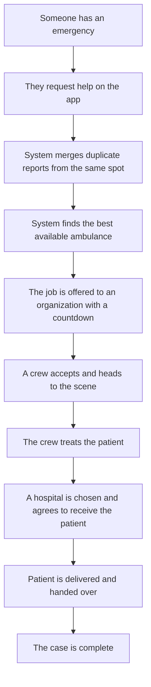
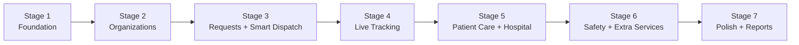

# Non-Technical Roadmap

*Plain-language plan for building the Ambulance Rescue Platform on Laravel MVC.
For stakeholders, the panel, and the team. Generated 2026-06-25.*

**Project:** Web-Based Ambulance Rescue Platform with Decision Support System and Mobile App — Dasmariñas City, Cavite
**Starting point:** A fresh, empty Laravel project (no features yet).
**Goal:** Build the revised, post-defense version of the system, step by step.

---

## 1. What We Are Building (in one paragraph)

An online emergency ambulance service for Dasmariñas City — like a "ride-hailing app for
ambulances" combined with a control room and a hospital coordination tool. Citizens (or
even non-registered guests) request an ambulance from a phone; the system automatically
finds the best available unit, offers the job to a responding organization, and lets the
citizen watch the ambulance arrive in real time. Behind the scenes, city officials (LGU)
oversee the partner organizations, and each organization manages its own crews and
vehicles.

---

## 2. Who Will Use It

| Person | What they do |
|--------|--------------|
| **Citizen / Guest** | Requests an ambulance and tracks it live. |
| **Field crew (Driver / Medic / Dispatcher)** | Receives the job, responds, treats, transports, hands off to a hospital. |
| **Organization Admin** | Runs a partner station — manages its own crews, vehicles, and custom roles. |
| **Platform Executive (LGU)** | City authority — approves organizations, sets city-wide rules, watches performance. |
| **Super Admin (dev team)** | Keeps the whole system running; root/technical oversight. |

---

## 3. The Journey, in Plain Terms

---

## 4. How We Will Build It — Phases

We build in stages. Each stage produces something we can show and test before moving on.

| Stage | What gets done | What you'll be able to see |
|-------|----------------|----------------------------|
| **1. Foundation** | Accounts, login, sign-up with email code, the 4 levels of users | People can register and log in safely |
| **2. Organizations** | Partner stations sign up, upload documents, get approved by the LGU; each sets up its own crews and vehicles | An organization can be onboarded and approved |
| **3. Requests + Smart Dispatch** | The four request types; the system merges nearby reports and auto-picks the best ambulance with a countdown offer | A request turns into a dispatched ambulance automatically |
| **4. Live Tracking** | Real-time map updates; the crew gets directions; the citizen watches the ambulance | Citizen sees the ambulance moving live |
| **5. Patient Care + Hospital** | Crew records the patient's condition; a hospital is chosen and confirms it can receive the patient | A full case from scene to hospital handoff |
| **6. Safety + Extra Services** | Anti-prank protection; scheduled and non-emergency bookings; optional non-intrusive ads/donations | Misuse is controlled; extra service types work |
| **7. Polish + Reports** | Performance reports for the LGU, clean-up, final security check | Ready-to-present, dependable system |

---

## 5. What the System Will and Won't Do

**It will:**
- Let anyone request an ambulance quickly, even without an account.
- Automatically find and offer the best ambulance.
- Show the ambulance live on a map.
- Help crews record patient care and coordinate with hospitals.
- Let the city oversee all partner organizations.

**It will not (by design):**
- Diagnose illnesses or manage hospital beds.
- Connect to police or fire departments.
- Work without internet.

---

## 6. Things Still to Confirm

A few items from the panel need a clear answer before the related stage is finished. These
are tracked so nothing is guessed:

- What "remove conditions" refers to.
- How location is captured during sign-up now that manual coordinates are removed.
- The exact steps for scheduled and non-emergency bookings.
- The role of DILG in the system.
- Any wording/terminology the panel wants corrected.
- Confirming the exact documents needed to verify an organization (needs facility
  interviews).
- Confirming the real-world ambulance transport steps (needs driver interviews).

---

## 7. What "Done" Looks Like

- A citizen can request and track an ambulance end to end.
- The system picks and offers ambulances automatically, with countdown and reassignment.
- Organizations can be onboarded and approved by the LGU.
- Crews can record care and hand patients to hospitals.
- Basic, sensible security is in place.
- The LGU has performance reports.

---

*Companion documents: `TECHNICAL ROADMAP.md`, `PROCESS AND FLOW.md`,
`EXISTING FEATURES + NEW FEATURES.md`, `SECURITY IMPROVEMENTS.md`.*
