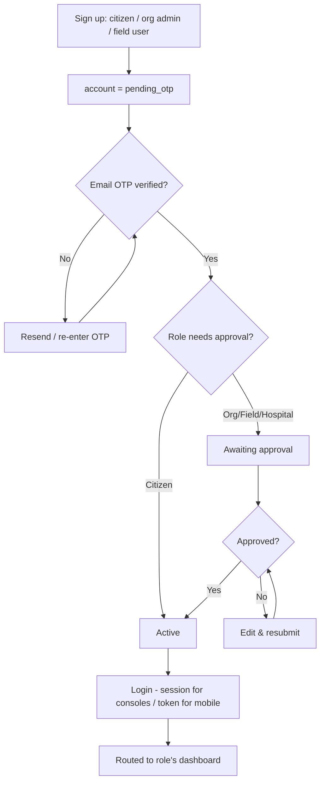
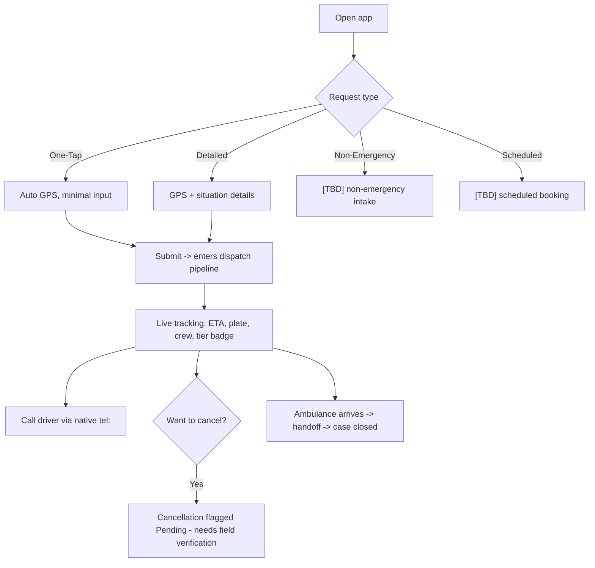
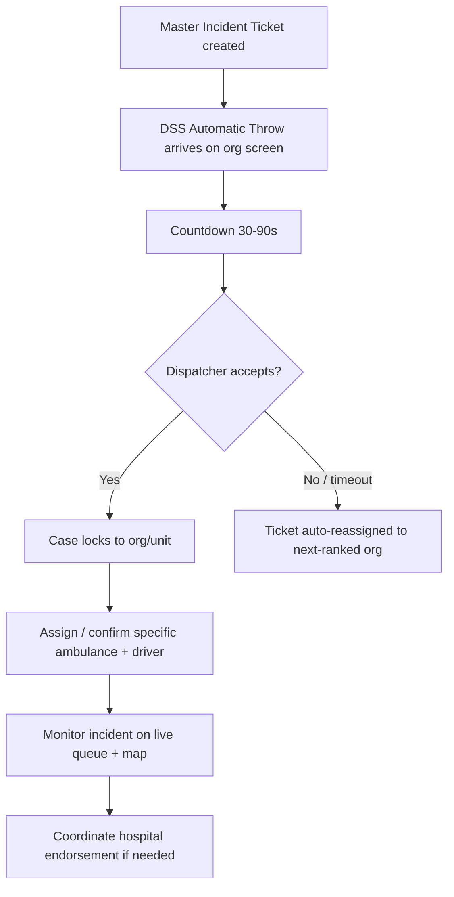
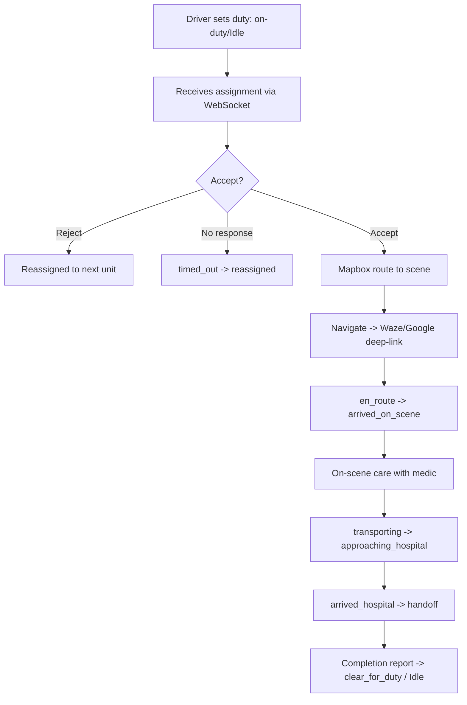
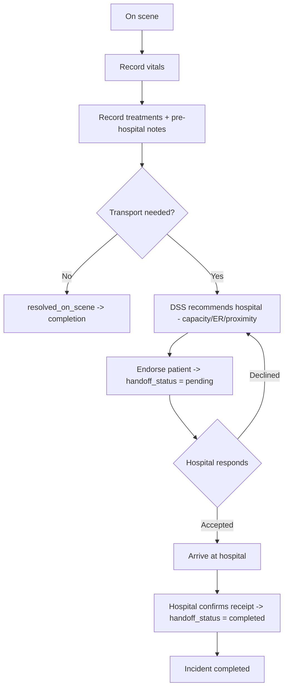
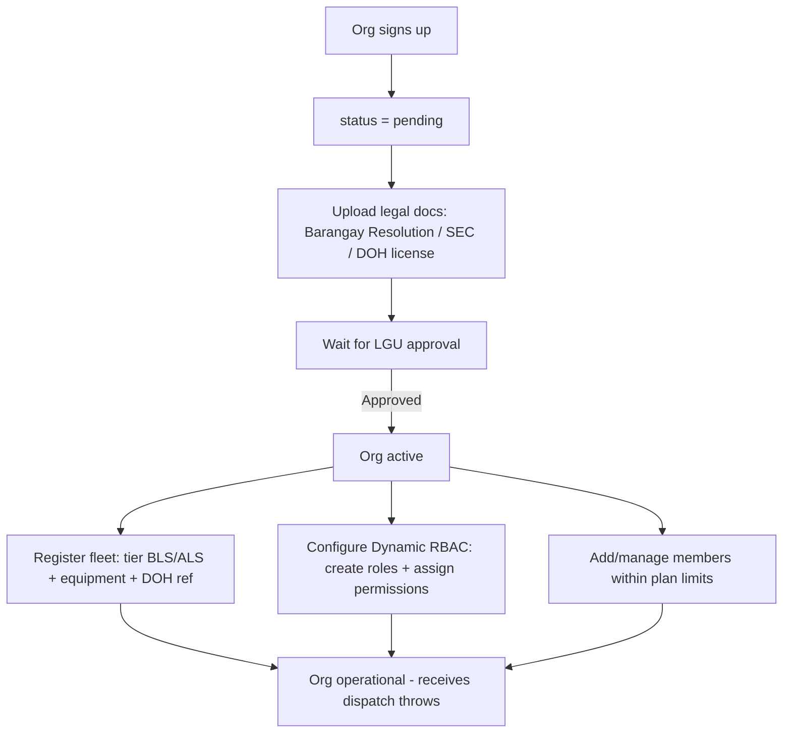
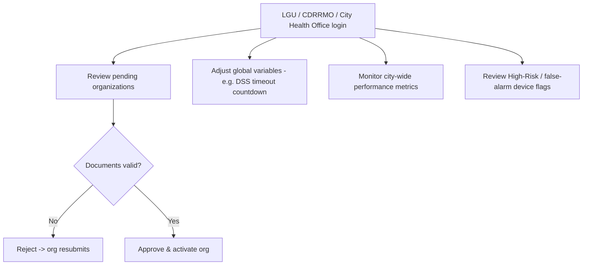
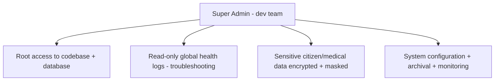
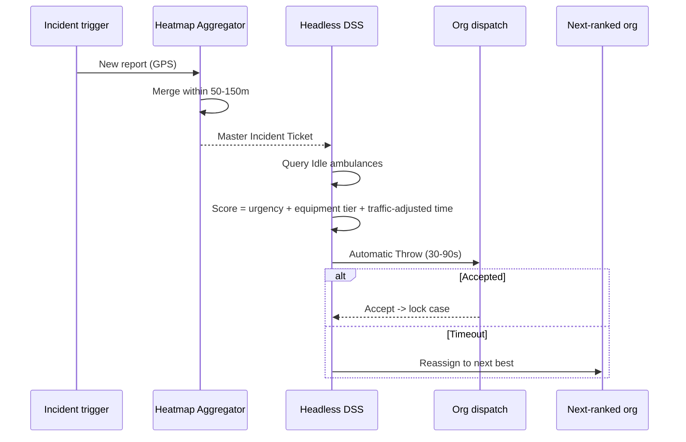

# Process and Flow (Per Module)

*Process and flow for every module/role of the revised system. Flowcharts reflect the
post-defense capstone spec on Laravel MVC. Branches the sources leave undefined are marked
**[TBD]**. Generated 2026-06-25.*

---

## Module Index

1. [Authentication & Account](#1-authentication--account-module-all-users)
2. [Citizen / Guest](#2-citizen--guest-module)
3. [Field Crew — Dispatcher](#3-field-crew--dispatcher-module)
4. [Field Crew — Driver](#4-field-crew--driver-module)
5. [Field Crew — Medic + Hospital Handoff](#5-medic--hospital-handoff-module)
6. [Organization Admin](#6-organization-admin-module)
7. [Platform Executive (LGU)](#7-platform-executive-lgu-module)
8. [Super Admin](#8-super-admin-module)
9. [Decision Support System (cross-cutting)](#9-decision-support-system-cross-cutting)

---

## 1. Authentication & Account Module (all users)

Alternate entry: **Google login (Socialite)**. Password reset via expiring signed code.

---

## 2. Citizen / Guest Module

Guests get the same tracking screen; reduced features otherwise (incentive to register).
Minors register with **guardian consent/linkage**.

---

## 3. Field Crew — Dispatcher Module

---

## 4. Field Crew — Driver Module

---

## 5. Medic + Hospital Handoff Module

---

## 6. Organization Admin Module

> Pre-req: org must own ≥1 ambulance. **[TBD]** exact verification docs (pending interviews).

---

## 7. Platform Executive (LGU) Module

> **[TBD]** DILG's specific touchpoint (oversight vs verification) — confirm with panel.

---

## 8. Super Admin Module

Super Admin is infrastructure/oversight only; day-to-day city operations belong to the LGU
tier.

---

## 9. Decision Support System (cross-cutting)

---

## TBD Register (flows not yet fully defined in the sources)

> *Module-flow view of the open items. Canonical list: `MIGRATION/01_MIGRATION_PLAN.md` §8;
> recommended resolutions: `MIGRATION/03_RECOMMENDATIONS.md` §2.*

| Flow | Status |
|------|--------|
| Non-emergency request handling | Named, not designed |
| Scheduled rescue (booking/approval/reminders) | Named, not designed |
| lat/lng registration replacement | Removal confirmed; replacement open |
| "Remove conditions" | Meaning undefined |
| DILG touchpoint | Role unclear |

---

*Companion documents: `TECHNICAL ROADMAP.md`, `NON-TECHNICAL ROADMAP.md`,
`EXISTING FEATURES + NEW FEATURES.md`, `SECURITY IMPROVEMENTS.md`.*
