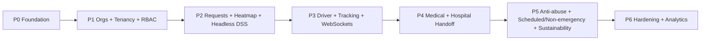

# Technical Roadmap

*Build plan for the Ambulance Rescue Platform on a fresh Laravel MVC project (Blade — no
Inertia/Vue). Targets the post-defense revised capstone spec. Generated 2026-06-25.*

---

## 1. Target Stack

> *Canonical target-stack reference. Other docs (`MIGRATION/04_SYSTEM_ARCHITECTURE.md`,
> `MIGRATION/01_MIGRATION_PLAN.md`) describe how the stack is applied; the authoritative
> list of stack choices lives here.*

| Concern | Choice |
|---------|--------|
| Framework | Laravel (MVC, server-rendered **Blade**) |
| Language / runtime | PHP + Composer |
| Database | MySQL (relational) |
| ORM / schema | Eloquent + Laravel migrations |
| Web console UI | Blade + minimal JS (Alpine.js) |
| Realtime | Laravel broadcasting via **Reverb** (WebSockets) |
| Background work | Queues + Jobs + Scheduler (cron) |
| RBAC | `spatie/laravel-permission`, scoped per organization |
| Mobile/API auth | Sanctum tokens; Blade consoles use session auth |
| Social login | Socialite (Google) |
| Email OTP | Laravel Notifications + Mail |
| Maps / nav | Mapbox (route geometry) + `geo:` deep-link to Waze/Google Maps |
| File storage | Private disk (org documents, IDs) |

---

## 2. Build Phases (each ends in a testable slice)



### P0 — Foundation
- Laravel skeleton, `.env`, MySQL connection, base layout.
- Auth: registration, login, logout, **email OTP** verification, password reset.
- Google login (Socialite).
- Account states (`pending_otp`, `active`, etc.) as enum casts.
- 4-tier user model scaffolding; audit logging via model observers.
- **Deliver:** users can register, verify, and log in by tier.

### P1 — Organizations, Tenancy & Dynamic RBAC
- `Organization` onboarding: web sign-up → `pending` → document upload → LGU approval.
- Org classification + subscription/plan limits.
- Fleet registration: `Ambulance` with tier (BLS/ALS) + equipment flags + DOH ref.
- **Dynamic RBAC:** org-defined roles with atomized permissions (`accept-incident`,
  `manage-fleet`) via spatie, scoped by `organization_id`.
- Global query scope enforcing tenant isolation.
- **Deliver:** an org can be onboarded, approved, and staffed with custom roles.

### P2 — Requests, Heatmap & Headless DSS
- Four request types: One-Tap, Detailed, Non-Emergency, Scheduled (last two: intake only,
  workflow TBD).
- `HeatmapAggregator` service: merge reports within 50–150m into a Master Incident Ticket.
- `DssService`: score Idle ambulances by urgency + equipment tier + traffic-adjusted time.
- **Automatic Throw:** `AutomaticThrowJob` (queued) offers to top org with 30–90s countdown;
  on timeout, `ReassignJob` passes to next-ranked unit.
- **Deliver:** a request becomes a scored, auto-offered, auto-reassigning assignment.

### P3 — Driver, Tracking & Realtime
- WebSocket channels (Reverb): assignment offered/accepted, location, status.
- Driver mobilization payload (destination + Mapbox route); `geo:` deep-link nav.
- Live location ingest + unified citizen/guest tracking screen; native `tel:` call.
- **Deliver:** end-to-end live tracking from acceptance to scene.

### P4 — Medical & Hospital Handoff
- Pre-hospital care: vitals, treatments, notes.
- Hospital endorsement → accept/decline → arrival → handoff complete (state machine).
- **Deliver:** a case runs scene → care → hospital handoff → completion.

### P5 — Anti-abuse, Scheduling & Sustainability
- `DeviceToken` UUID strike tracking; cancellation = Pending until field-verified.
- Scheduled rescue + non-emergency workflows (once rules confirmed) via Scheduler + jobs.
- Non-obstructive ad placement + donation/funding hooks (never on emergency screens).
- **Deliver:** misuse controls + extra service types + sustainability hooks.

### P6 — Hardening & Analytics
- LGU performance metrics, archival, monitoring.
- Security pass (see `SECURITY IMPROVEMENTS.md`), test coverage, final review.
- **Deliver:** presentable, dependable system.

---

## 3. Suggested Laravel Structure

```
app/
  Models/            User, Organization, Ambulance, Incident, DispatchAssignment,
                     Hospital, HospitalEndorsement, Vitals, TreatmentRecord,
                     DeviceToken, Plan, ... (Eloquent)
  Http/Controllers/  Auth/, Org/, Incident/, Dispatch/, Dss/, Driver/, Fleet/,
                     Hospital/, Medical/, Admin/, Safety/
  Http/Middleware/   EnsureTenantScope, EnsureAccountActive, role/permission gates
  Services/          DssService, HeatmapAggregator, OnboardingService, StrikeService
  Jobs/              AutomaticThrowJob, ReassignJob, ScheduledDispatchJob
  Events/ Listeners/ assignment + location + status broadcasts
  Policies/          per-domain authorization
database/migrations/ schema (identity, orgs, fleet, incidents, dispatch, medical, audit)
resources/views/     Blade consoles: superadmin/, lgu/, org/, field/  + components
routes/              web.php (Blade consoles), api.php (mobile), channels.php (WS)
```

---

## 4. Data Model (high level)

| Domain | Core tables |
|--------|-------------|
| Identity & access | users, roles, permissions, pivots, organizations |
| Fleet | ambulances (tier + equipment), ambulance_locations, maintenance_logs, fuel_logs, unit_readiness_checks |
| Requests/incidents | emergency_requests (4 types), incidents (Master Ticket), incident_updates, guest_sessions |
| Dispatch + DSS | dispatch_assignments, driver_duty_states |
| Hospital/medical | hospitals, hospital_endorsements, handoff_summaries, vitals_entries, treatment_records, prehospital_notes |
| Safety | device_tokens, account_flags |
| Audit/admin | audit_logs, system_logs, notifications, archival_logs |
| Sustainability | ad_placements, plans, subscription_payments |

Status lifecycles (incident / assignment / handoff) implemented as Eloquent enum casts.

---

## 5. Cross-Cutting Concerns

- **Tenancy:** every org-scoped query filtered by `organization_id` (global scope).
- **Authorization:** Policies/Gates + spatie permissions; deny cross-org access.
- **Realtime:** broadcasting replaces polling.
- **Async/time:** queues for auto-throw/reassign; scheduler for timeouts + scheduled rescues.
- **Auditability:** model observers write to `audit_logs`.

---

## 6. Dependencies & Open Items

- **Interview-dependent (finish before the phase):** org verification docs (P1); ambulance
  transport protocol (P4).
- **Panel TBDs (resolve before affected phase):** "remove conditions", lat/lng replacement,
  scheduled/non-emergency rules, DILG role, terminology fixes, org↔field role mapping.

---

## 7. Definition of Done (per phase)

A phase is done when: its routes/controllers/models exist, authorization is enforced, the
happy path plus key failure paths work, and a runnable check exists (feature test or seed +
manual walkthrough). No phase ships without basic security from `SECURITY IMPROVEMENTS.md`.

---

*Companion documents: `NON-TECHNICAL ROADMAP.md`, `PROCESS AND FLOW.md`,
`EXISTING FEATURES + NEW FEATURES.md`, `SECURITY IMPROVEMENTS.md`.*
