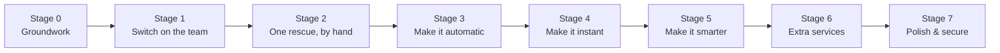

# Forward Build Roadmap — Non-Technical

*A plain-language plan for finishing the system, in clean, ordered stages. It picks up from
where the build **actually is today** and lays out the remaining work so each stage is
finished before the next begins — no jumping around. Generated 2026-06-28.*

**Companion:** `ROADMAP (TECHNICAL).md` (same stages, for developers)
**Starting point:** `SYSTEM DOCUMENTATION (NON-TECHNICAL).md` (what works today)

---

## The one rule that keeps the build clean

**Finish one stage before starting the next.** Each stage below depends on the one before it.
We don't dabble ahead, and we don't leave a stage half-done to start another. A stage counts
as "finished" only when it actually works and has been tested — not just when the screens
exist.

The order is deliberate: we **switch on the response team first**, then **run a full rescue by
hand** to prove it works, then **make it automatic**, then **make it instant**, then **make it
smarter**, then **add the extra services**, and finally **polish and secure it**.

---

## Stage 0 — Groundwork & Confirmations

**What happens:** before building anything new, we get clear answers to the open questions
that would otherwise block later stages. No new features yet — just decisions.

**We confirm:**
- How a person's location is captured at sign-up (now that typing in coordinates was removed).
- The exact steps for scheduled and non-emergency bookings (needed for Stage 6).
- The role of DILG, what "remove conditions" means, and any wording to fix.
- The documents required to verify an organization (needs facility interviews — needed for Stage 1).
- The real-world ambulance transport steps (needs driver interviews — needed for Stage 2).

**Finished when:** every question above has a written answer (or is clearly set aside for later).

---

## Stage 1 — Switch On the Response Team

**What happens:** today the screens for drivers, medics, dispatchers, hospital staff, and fleet
managers are **built but locked** — no one can log in as them yet. This stage unlocks them by
letting each organization create its own roles and assign them to its people.

**You'll be able to see:** an organization admin creating a "Dispatcher", "Driver", and
"Medic" for their station, and those people logging in to their own screens — while never
seeing another organization's data.

**Why it's first:** nothing on the "respond to emergencies" side can happen until real people
can actually log in as the response team.

**Finished when:** a test organization can create those roles, the people can open their
screens, and one organization can't peek at another's information.

---

## Stage 2 — One Full Rescue, Done by Hand

**What happens:** with the team switched on, we run a single emergency all the way through —
request, dispatch, drive to scene, record care, hand off at the hospital, complete — with
**people doing every step manually**. We fix any rough edges where one step passes to the next.

**You'll be able to see:** one real rescue go from a citizen's request to a completed hospital
handoff, start to finish, without anyone touching the database directly.

**Why it's second:** we make sure the whole chain works with humans **before** we try to
automate it. Automating a broken process just hides the breaks.

**Finished when:** a full rescue runs cleanly end-to-end and a test proves it.

---

## Stage 3 — Make the Dispatch Automatic

**What happens:** right now a dispatcher picks the ambulance by hand from a suggested list.
This stage makes the system **offer the job automatically** to the best crew with a countdown,
and **re-offer it to the next crew** if no one answers in time.

**You'll be able to see:** an emergency that, on its own, gets offered to a crew with a timer —
and if they don't respond, it jumps to the next-best crew without anyone intervening.

**Why it's third:** we only automate the rescue process **after** Stage 2 proved it works by
hand.

**Finished when:** a test emergency is auto-offered, locked in when accepted, and
automatically passed on when a crew doesn't answer in time.

---

## Stage 4 — Make Updates Instant

**What happens:** today the tracking screen refreshes every few seconds. This stage makes
updates **instant** — the moment something changes (a crew accepts, the ambulance moves, the
status updates), everyone watching sees it immediately. The old refresh stays as a backup.

**You'll be able to see:** the ambulance and its status update live, with no waiting and no
page refresh.

**Why it's fourth:** the live updates worth pushing instantly (offers, acceptances,
reassignments) only exist after Stage 3.

**Finished when:** a change shows up on the tracking screen with no refresh, and the backup
still works if needed.

---

## Stage 5 — Make the Matching Smarter

**What happens:** the system already suggests the best ambulance by distance, urgency, and
equipment. This stage adds **traffic awareness**, lets the **city fine-tune the rules**
without a developer, and shows the **route on a map inside the app** (alongside the existing
links to Waze and Google Maps).

**You'll be able to see:** smarter ambulance suggestions that account for traffic, a settings
screen where the city adjusts the matching, and an in-app route map for the driver.

**Why it's fifth:** the in-app live route relies on the instant-updates layer from Stage 4.

**Finished when:** suggestions reflect traffic, the city can re-tune them, and the driver sees
a route map.

---

## Stage 6 — Add the Extra Services

**What happens:** beyond emergencies, the system is meant to handle **non-emergency** requests
and **scheduled** bookings (booking a transport in advance, with reminders). These exist only
as placeholders today; this stage builds the actual steps.

**You'll be able to see:** someone booking a scheduled rescue that activates at the right time,
and non-emergency requests following their own, calmer path.

**Why it's sixth:** these are non-urgent, and their exact steps depend on the answers
confirmed back in Stage 0.

**Finished when:** a scheduled booking activates on time and enters the dispatch flow, and
non-emergency requests work on their own track.

---

## Stage 7 — Polish, Reports & Security

**What happens:** the final pass — run the security checklist on **every** part, deepen the
city's performance reports, tidy up wording for consistency, and do a full top-to-bottom test.

**You'll be able to see:** a clean, dependable, secure system ready to present and deploy,
with complete reports for the city.

**Why it's last:** there's no point hardening a system that's still gaining features.

**Finished when:** the security checklist passes everywhere, the reports are complete, and
everything still works in a full run-through.

---

## Why this exact order

| Stage | Needs first | Would go wrong if rushed |
|---|---|---|
| 1 Switch on the team | Stage 0 answers | Onboarding built on unconfirmed rules |
| 2 Rescue by hand | The team switched on | No one to perform the rescue steps |
| 3 Make it automatic | A proven rescue | Automating a process that doesn't yet work |
| 4 Make it instant | Automatic offers | Nothing meaningful to update instantly |
| 5 Make it smarter | Instant updates | The live map has no instant layer to ride on |
| 6 Extra services | Stage 0 rules confirmed | Building bookings on unconfirmed steps |
| 7 Polish & secure | Everything else done | Securing a system still changing |

---

## What "finished" looks like

- A citizen or guest can request and track an ambulance from start to finish.
- The system offers and reassigns ambulances **automatically**, with a countdown.
- Organizations are approved by the city and run their **own crews**.
- Crews record care and hand patients to hospitals, with **instant** live updates.
- Ambulance matching accounts for **traffic** and the city can fine-tune it.
- Scheduled and non-emergency services work.
- Security and anti-abuse protections are in place everywhere, and the city has full reports.

We're already past Stage 0's starting line on several fronts — the biggest single step
remaining is **Stage 1: switching on the response team.**

---

*For the developer version of this roadmap — with exact components, files, and tests per
stage — see `ROADMAP (TECHNICAL).md` in this folder.*
