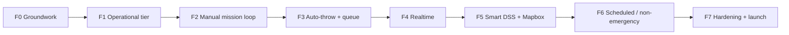

# Forward Build Roadmap — Technical

*The ordered, dependency-gated plan to take the system from its **current as-built state** to a
finished build. Continues from the implemented `S0–S11` base; phases are numbered **F0–F7**
(Forward) to avoid colliding with the old `S`/`P` numbering. Generated 2026-06-28.*

**Companion:** `ROADMAP (NON-TECHNICAL).md` (same phases, plain language)
**Baseline:** `SYSTEM DOCUMENTATION (TECHNICAL).md` (what exists today)

---

## How to read this roadmap

- **Strictly sequential.** Each phase has an **entry gate** — do not start it until the prior
  phase's **exit criteria** are green. No jumping ahead, no half-finishing a phase to dabble
  in the next.
- **Each phase ends in a testable slice.** A phase is "done" only when its happy path + key
  failure paths work *and* a feature test proves it — not when the code merely exists.
- **Build the dependency, not the wish-list.** The order is chosen so every phase stands on a
  proven foundation: you activate roles before you run a mission, run a mission manually
  before you automate it, automate it before you make it realtime.
- Each phase closes a specific gap from `SYSTEM DOCUMENTATION (TECHNICAL).md §7`.

---

## F0 — Groundwork & Confirmations

**Goal:** clear the blockers that would otherwise stall later phases, without writing feature
code yet. Cheap, fast, unblocks everything downstream.

**Entry gate:** none — start here.

**Steps (in order)**
1. **Resolve the panel open items** that gate later phases (canonical list:
   `docs/MIGRATION/01_MIGRATION_PLAN.md §8`):
   - lat/lng registration replacement method (gates F1 onboarding finalization),
   - scheduled / non-emergency workflow rules (gates **F6**),
   - DILG touchpoint, "remove conditions" meaning, terminology corrections.
2. **Confirm the two pending interviews** (`docs/DOCUMENTS/INFORMATION CONTEXT.md §7`):
   org verification documents (gates F1), ambulance transport protocol (gates F2 care steps).
3. **Terminology baseline** — agree one casing/naming convention for statuses and role labels;
   record a short glossary. (Status enums are already mostly lowercase snake_case.)

**Touches:** docs only.

**Done when:** every item above has a written decision or is explicitly deferred with a date;
the glossary exists.

**Blocked by:** nothing. **Blocks:** F1, F2, F6 (named above).

---

## F1 — Activate the Operational Tier (dynamic RBAC + field roles)

**Goal:** make the already-built response screens **reachable** by real users. This is the
single highest-value unlock — today every field controller exists but no seeded role can
reach it.

**Entry gate:** F0 done (org-verification docs confirmed).

**Steps (in order)**
1. **Org-scoped dynamic role builder** (the deferred `S4` builder): UI + controller for an Org
   Admin to create roles within their `organization_id` and assign permission codes. Schema
   already supports it — `roles.organization_id`, unique `(organization_id, name)` (R1),
   `user_roles`/`user_permissions` carry `organization_id`.
2. **Org Admin role + permission** — introduce the Org-Admin permission(s) and seed an
   `org_admin` role template; wire member invite/management within `plans` limits.
3. **Field role templates** — provide ready-made role templates (Dispatcher, Driver, Medic,
   Hospital Staff, Fleet) that map to the existing unassigned codes: `dispatch-incidents`,
   `drive-unit`, `record-care`, `manage-hospitals`, `manage-fleet`.
4. **Tenant-scope enforcement audit** — confirm every field controller query is fenced to the
   actor's `organization_id` (deny cross-org). Reuse the org-from-entity invariant already in
   `DispatchController::store` (org derived from the ambulance, R7).

**Touches:** `roles`, `user_roles`, `user_permissions`, `plans`; new `Org\RoleController`,
`Org\MemberController`; `RolePermissionSeeder` extension.

**Done when:** a seeded test organization can create a Dispatcher, Driver, and Medic; those
users log in and open `/admin/dispatch`, `/admin/driver/duty`, and a care screen — and cannot
see another org's data. Feature test covers role creation + a cross-org denial.

**Closes gap:** §7 #2 (field roles unseeded). **Blocks:** F2.

---

## F2 — End-to-End Manual Mission Loop

**Goal:** prove the full request → completion chain works with **humans** doing every step,
across the newly-activated roles, before any automation is added. You automate a working loop,
never a broken one.

**Entry gate:** F1 done (field roles reachable).

**Steps (in order)**
1. **Walk the chain** for one incident: citizen/guest request → dispatcher assigns from
   `DssService::rank()` → driver accepts + advances status → medic records vitals/treatment →
   hospital endorsement + handoff → completion.
2. **Fix module seams** — repair any gaps in status transitions between controllers
   (`DispatchController` → `DriverController` → `CareController` → `HospitalController`) so the
   `incidents` and `dispatch_assignments` lifecycles flow without manual DB edits.
3. **Validate transport-care steps** against the F0 driver-interview findings; adjust the care
   status vocabulary if needed.

**Touches:** no new tables; controller/status-transition fixes only.

**Done when:** a single incident runs end-to-end across roles with correct status transitions
and tenancy, proven by an end-to-end feature test (extend the existing `DispatchTest` /
`DriverTrackingTest` / `MedicalTest` into one happy-path walk).

**Closes gap:** confirms the documented lifecycle actually holds. **Blocks:** F3.

---

## F3 — Background Jobs + Automatic Throw

**Goal:** replace the manual dispatcher pick with the spec's automatic offer + countdown +
auto-reassign. Only now — because the loop it automates is proven (F2).

**Entry gate:** F2 done (manual loop green).

**Steps (in order)**
1. **Queue + scheduler infrastructure** — configure a queue connection + worker and the
   scheduler (none runs today; `app/Jobs/` does not yet exist).
2. **`AutomaticThrowJob`** (queued) — offers a Master Incident Ticket to the top-ranked org,
   using the existing `dss_timeout_seconds` config and writing `response_deadline_at`.
3. **`ReassignJob`** — on countdown expiry, re-offer to the next-ranked org; increment
   `alert_attempts`; follow `dss_org_queue_json` / `dispatch_routing_state` already on
   `incidents`.
4. **Dispatcher console fallback** — keep manual assign/reassign as an override path.

**Touches:** new `app/Jobs/AutomaticThrowJob.php`, `ReassignJob.php`; uses existing
`dispatch_assignments` (`response_deadline_at`, `alert_attempts`, `dss_rank`,
`forwarded_from_assignment_id`) and `system_configurations`.

**Done when:** an incident is auto-offered, locks on accept, and **auto-reassigns on timeout**
in a test that fast-forwards the clock. Feature test simulates a timeout → reassignment.

**Closes gap:** §7 #3 (Automatic Throw not built). **Blocks:** F4.

---

## F4 — Realtime (Reverb WebSockets)

**Goal:** replace the `~10s` polling with instant push. The events worth pushing
(offered / accepted / reassigned / location / status) only exist after F3.

**Entry gate:** F3 done (the broadcastable events exist).

**Steps (in order)**
1. **Install + configure Reverb** broadcasting; define channels (per-incident, per-driver,
   per-org console).
2. **Broadcast events** — assignment offered/accepted/reassigned, location update, status
   change.
3. **Client subscription** — driver app, citizen/guest tracking page, and dispatcher console
   subscribe; **keep polling as a graceful fallback** (don't delete `request.status`).

**Touches:** `routes/channels.php` (new), broadcast event classes; `ambulance_locations`
ingest already exists via `DriverController::pushLocation`.

**Done when:** a status/location change appears on the tracking page and console **without a
refresh**; polling still works if sockets are unavailable.

**Closes gap:** §7 #4 (polling vs WebSockets). **Blocks:** F5.

---

## F5 — Smarter DSS + Mapbox Geometry

**Goal:** upgrade ranking quality and in-app navigation. Mapbox route push rides on the F4
socket layer.

**Entry gate:** F4 done.

**Steps (in order)**
1. **Traffic-adjusted scoring** — extend `DssService::score()` beyond the flat 30 km/h ETA to
   a traffic-aware travel-time factor.
2. **LGU-tunable weights** — move scoring weights into `system_configurations` so the LGU
   adjusts them without code changes (today they are hardcoded constants).
3. **Mapbox route geometry** — render the route in the driver/tracking UI from the assignment
   payload, alongside the existing `geo:` deep-link to Waze/Google Maps.

**Touches:** `DssService`, `system_configurations`; front-end map integration.

**Done when:** ranking reflects a traffic factor and is re-weightable from City Settings; the
driver sees a rendered route. Unit test covers the new scoring inputs.

**Closes gap:** §7 #5, #6 (DSS not traffic-aware, no Mapbox). **Blocks:** F6.

---

## F6 — Scheduled & Non-Emergency Services

**Goal:** build the two request types that currently exist only as columns/tab. Sequenced
late because they are non-urgent and depend on confirmed rules.

**Entry gate:** F5 done **and** F0 confirmed the scheduled/non-emergency rules.

**Steps (in order)**
1. **Non-emergency intake + routing** — define the queue/triage path distinct from emergency
   dispatch.
2. **Scheduled rescue** — booking with `scheduled_for`, org acceptance, and a reminder
   (scheduler job); route through the DSS only at activation time.
3. **Reminders** — scheduled-job notifications via the existing `Notifier`.

**Touches:** uses existing `incidents.request_type` / `scheduled_for` (R8); new scheduler job;
dispatcher "scheduled" tab already present in `DispatchController::index`.

**Done when:** a scheduled request activates at its time and enters the dispatch pipeline; a
non-emergency request follows its own routing. Feature test covers a scheduled activation.

**Closes gap:** §7 #8 (scheduled/non-emergency workflow). **Blocks:** F7.

---

## F7 — Hardening, Analytics & Launch Readiness

**Goal:** make it presentable, consistent, and secure for defense/deployment.

**Entry gate:** F6 done.

**Steps (in order)**
1. **Security pass** — run the `docs/ROADMAP/SECURITY IMPROVEMENTS.md` checklist on **every**
   module (CSRF, Form Request validation, permission check, tenant scoping, private uploads,
   rate limits).
2. **LGU analytics depth** — extend `ReportController` metrics (utilization, response times).
3. **Consistency & cleanup** — finish terminology normalization (F0 glossary), tidy any
   remaining `ponytail:` shortcuts that now warrant promotion.
4. **Full regression** — `php artisan test` green across all suites; manual walkthrough of the
   live simulation.

**Touches:** cross-cutting; `ReportController`, view/label cleanup.

**Done when:** the security checklist passes on every module, reports are complete, and the
full test suite is green.

**Closes gap:** remaining §7 items + launch polish. **Blocks:** nothing — this is the finish line.

---

## Dependency summary (why this order)

| Phase | Stands on | Would break if done early |
|-------|-----------|---------------------------|
| F1 | F0 confirmations | Onboarding built on unconfirmed verification docs |
| F2 | F1 roles | Can't walk a mission with no one to do the steps |
| F3 | F2 proven loop | Automating an unproven, possibly-broken loop |
| F4 | F3 events | Nothing meaningful to broadcast yet |
| F5 | F4 sockets | Mapbox route push has no realtime channel |
| F6 | F5 + F0 rules | Building booking flows on unconfirmed rules |
| F7 | F6 complete | Hardening a system still gaining features |

---

## Definition of done (whole roadmap)

A citizen/guest requests and tracks an ambulance end-to-end; the system **automatically**
offers and reassigns ambulances with a countdown; organizations are onboarded by the LGU and
run their own crews via dynamic roles; crews record care and hand off to hospitals in
**realtime**; the DSS is traffic-aware and LGU-tunable; scheduled/non-emergency services work;
and the security checklist passes on every module.

---

*Each phase maps to a gap in `SYSTEM DOCUMENTATION (TECHNICAL).md §7` and a next-step in §8.
Open-item resolutions: `docs/MIGRATION/03_RECOMMENDATIONS.md §2`.*
