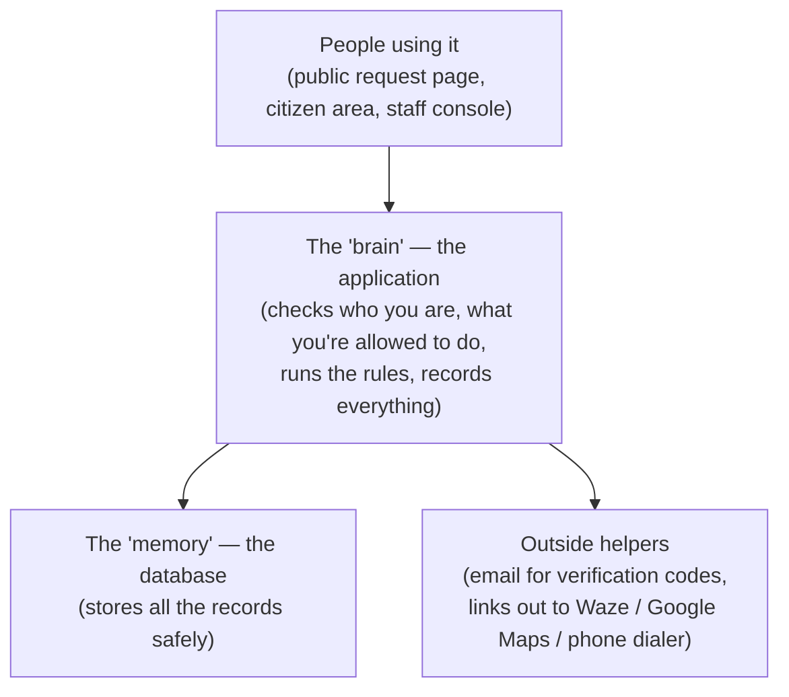
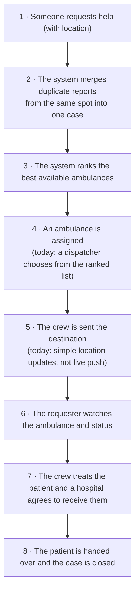

# System Documentation — Non-Technical (As-Built)

*A plain-language snapshot of what the system actually does **today**, written from the real
working software — not the proposal. Where the proposal and the built system differ, this
file follows the built system and lists the differences in §7. Generated 2026-06-28.*

**Project:** Web-Based Ambulance Rescue Platform — Dasmariñas City, Cavite
**Companion:** `SYSTEM DOCUMENTATION (TECHNICAL).md` (same content, for developers)

---

## Table of Contents

1. [Overview](#1-overview)
2. [How the System Is Put Together](#2-how-the-system-is-put-together)
3. [Users & Roles](#3-users--roles)
4. [What the System Can Do Today](#4-what-the-system-can-do-today)
5. [The Main Journey, Start to Finish](#5-the-main-journey-start-to-finish)
6. [What Information the System Stores](#6-what-information-the-system-stores)
7. [What's Done vs. What Differs / Still Needs Work](#7-whats-done-vs-what-differs--still-needs-work)
8. [What Comes Next](#8-what-comes-next)
9. [Things Still to Confirm](#9-things-still-to-confirm)

---

## 1. Overview

This is an **online emergency ambulance service for Dasmariñas City** — think of it as a
"ride-hailing app for ambulances" combined with a control room and a hospital coordination
tool. When someone has a medical emergency, the system helps get the **right ambulance** to
them and the **right hospital** ready to receive them.

It works as a **website** (and is built so it can later be wrapped as a phone app). There are
**three ways in**:

- **Public request page** — anyone, even without an account, can ask for an ambulance.
- **Citizen area** — registered users get their own private space (profile, medical info,
  request history).
- **Staff console** — the control-room screens for the city and partner organizations, where
  what you can see and do depends on your role.

It is limited to **Dasmariñas City only**, and it does **not** diagnose illness, manage
hospital beds, or connect to police/fire.

---

## 2. How the System Is Put Together

You can picture it as three layers:

- **People** interact through web pages.
- The **application** is the brain: it confirms your identity, checks your permissions, runs
  the emergency logic, and writes a record of every important action.
- The **database** is the memory: every user, organization, ambulance, request, and log is
  stored here.
- A few **outside helpers** are used — email to send verification codes, and links that hand
  off to Waze, Google Maps, or the phone dialer.

**Security in plain terms:** you must verify your email with a one-time code; staff accounts
must be approved before they can act; each role only sees what it should; and every important
action is written to a log.

---

## 3. Users & Roles

There are three groups of users. Two groups are **fully live today**; one group is **built
but not switched on yet**.

| User | What they do | Status today |
|---|---|---|
| **Super Admin** (dev team) | Keeps the system healthy. Manages user accounts, approvals, settings, audit logs, and archives. **Does not** handle emergencies. | ✅ Live |
| **LGU / City Authority** | Approves partner organizations, reviews their documents, sets city-wide rules, controls anti-abuse and ads, views reports. **Decides who may respond**, but does not respond. | ✅ Live |
| **Citizen** (registered) | Requests an ambulance, tracks it, and manages their own profile, medical info, and history. | ✅ Live |
| **Guest** (no account) | Requests help in a real emergency without signing up, and tracks it by link. Fewer features; limited to prevent misuse. | ✅ Live |
| **Organization Admin** | Runs one partner station — its crews, vehicles, and custom roles. | 🟡 Built, not switched on |
| **Dispatcher** | The control-room operator who chooses which ambulance to send. | 🟡 Built, not switched on |
| **Driver** | Accepts the job, drives to the scene, updates status, hands off at the hospital. | 🟡 Built, not switched on |
| **Medic** | Records the patient's condition (vitals, treatment) on scene. | 🟡 Built, not switched on |
| **Hospital Staff** | Confirms the hospital can take the patient and accepts the handoff. | 🟡 Built, not switched on |
| **Fleet Manager** | Registers and maintains the ambulances. | 🟡 Built, not switched on |

**Why "built but not switched on"?** All the screens and rules for the response team (driver,
medic, dispatcher, hospital, etc.) are written and protected — but no actual role has been
created yet that lets a person log in *as* one of them. These roles are meant to be created
**by each organization for itself**, which is the next major step. So today the people who
**oversee** the system and the people who **ask for help** are working; the people who
**respond** are the next group to bring online.

---

## 4. What the System Can Do Today

**Accounts & sign-in (everyone)**
- Register, verify email with a one-time code, log in/out, reset a forgotten password.
- Staff accounts wait for approval before they can be used.

**Super Admin can:**
- Manage user accounts (view, activate/deactivate, archive, restore).
- Approve or reject pending staff accounts.
- Read audit and system logs.
- Edit city-wide settings.
- View and restore archived records.

**LGU / City Authority can:**
- Add, edit, and manage partner organizations.
- Review an organization's uploaded documents and approve or reject them.
- Handle anti-abuse: flag suspicious requests, block or unblock a misused device, manage ads.
- View performance reports.

**The response side (built, waiting to be switched on):**
- Register and maintain ambulances, with fuel and maintenance logs.
- See incoming requests and assign an ambulance (with a smart ranked suggestion).
- Driver duty status, accepting a job, updating progress, and sending live location.
- Recording patient vitals, treatments, and notes on scene.
- Endorsing a patient to a hospital and confirming the handoff.

**Citizens can:**
- Request an ambulance and track it.
- Manage their own profile and medical information.
- See their own past requests.

**Guests can:**
- Request help with no account and track it by link (with sensible limits to prevent pranks).

**For everyone signed in:** a personal notifications area.

---

## 5. The Main Journey, Start to Finish

This is the intended journey. Notes show where the current build does a **simpler version**
of a step.

**What's smart about it:** the system automatically merges duplicate reports so five callers
don't summon five ambulances, and it suggests the best-matched ambulance (by distance,
urgency, and equipment) rather than leaving it to guesswork. The hospital is also asked
**before** arrival, so an ambulance never shows up to a hospital with no room.

**What's simpler today than the plan:** the plan wanted the system to **automatically** offer
the job to a crew with a countdown and re-offer it if no one answers. Right now a person (a
dispatcher) makes that choice from the suggested list. Tracking also refreshes every few
seconds rather than updating instantly. These are the next improvements (see §8).

**Safety touch:** a requester can't silently cancel mid-trip — a cancellation is held until a
responder verifies the scene, so a real emergency is never dropped by mistake.

---

## 6. What Information the System Stores

The "memory" is organized into related groups of records:

| Group | What it holds |
|---|---|
| **People & access** | User accounts, roles, permissions, login sessions, email codes, terms acceptance, device records for anti-abuse |
| **Citizen details** | Profiles, medical history, ID documents, guardian links for minors, guest sessions |
| **Organizations** | Partner organizations, their plans/subscriptions, coverage areas, and uploaded documents |
| **Ambulances (fleet)** | Each ambulance with its type and equipment, live location, fuel logs, maintenance logs, readiness checks, driver duty status |
| **Requests & dispatch** | The emergency requests, their timeline of updates, the assignments to ambulances, and completion reports |
| **Hospital & patient care** | Hospitals, the endorsement/handoff records, patient details, vitals, treatments, and notes |
| **System & oversight** | Approval records, audit logs, archives, settings, notifications, and ad placements |

In total the system keeps about **50 kinds of records**, all linked together so, for example,
one emergency connects to its patient, the ambulance sent, the crew, the hospital, and the
full timeline.

Sensitive details (like medical and ID information) are stored with the ability to be kept
private and shown only to the roles that need them.

---

## 7. What's Done vs. What Differs / Still Needs Work

The proposal and the actual build differ in a few important places. This is normal for a
project still in progress — here is an honest summary:

| Area | What the plan said | What's actually built | What's needed |
|---|---|---|---|
| **Super Admin** | In charge of everything | Oversight only — it does not run emergencies | Keep as is; update the proposal wording |
| **Response team roles** | Driver, medic, dispatcher, etc. ready to use | All built, but **no one can log in as them yet** | Switch them on (let organizations create them) |
| **Auto-assign with countdown** | System offers the job automatically and re-offers if ignored | A dispatcher assigns by hand for now | Add the automatic offer + countdown |
| **Live updates** | Instant, push-style updates | Refreshes every few seconds instead | Add instant updates |
| **Smart matching** | Considers live traffic | Considers distance, urgency, equipment (not traffic) | Add traffic awareness |
| **In-app maps** | Built-in route map | Uses links out to Waze / Google Maps | Add the in-app map later |
| **Scheduled & non-emergency bookings** | A separate booking service | The request type exists, but the booking steps aren't built | Design the booking steps once confirmed |

**The bottom line:** the **core of the system works** — accounts, organizations, requests,
the smart ambulance suggestion, tracking, patient-care records, hospital handoff, oversight,
and anti-abuse are all built. What remains is mostly **switching on the response team** and
**adding the "automatic" and "instant" polish** that turns a manual control room into a
hands-off one.

---

## 8. What Comes Next

In order of priority:

1. **Switch on the response team** — let organizations create their own driver, medic,
   dispatcher, hospital, and fleet roles so real people can finally handle emergencies. This
   unlocks the whole "respond" side of the journey.
2. **Automatic ambulance offers** — the system offers the job to the best crew with a
   countdown and re-offers it automatically if no one answers.
3. **Instant live updates** — replace the few-seconds refresh with real-time updates.
4. **Smarter matching** — factor in traffic, and let the city fine-tune the rules.
5. **In-app maps** — show the route inside the app, alongside the existing map links.
6. **Scheduled & non-emergency bookings** — build the booking, approval, and reminder steps.
7. **Confirm the remaining questions** with the panel (see §9).

---

## 9. Things Still to Confirm

A few items from the panel still need a clear answer before the related part is finished. They
are tracked so nothing is guessed:

- What "remove conditions" specifically refers to.
- How location is captured at sign-up now that manual coordinates were removed.
- The exact steps for scheduled and non-emergency bookings.
- The role of DILG in the system.
- Any wording the panel wants corrected.
- The exact documents required to verify an organization (needs facility interviews).
- The real-world ambulance transport steps (needs driver interviews).

*(The full master list lives in `docs/MIGRATION/01_MIGRATION_PLAN.md`.)*

---

## 10. What "Done" Will Look Like

- A citizen or guest can request and track an ambulance from start to finish.
- The system picks and offers ambulances automatically, with a countdown and re-offer.
- Organizations can be onboarded and approved by the city, and can run their own crews.
- Crews can record care and hand patients over to hospitals.
- Sensible security and anti-abuse protections are in place.
- The city has performance reports.

Most of these are already working; the remaining gaps are listed in §7 and §8.

---

*This is an accurate snapshot of the system as built today. For the developer version of this
same document — with database tables, routes, and exact technical detail — see
`SYSTEM DOCUMENTATION (TECHNICAL).md` in this folder.*
