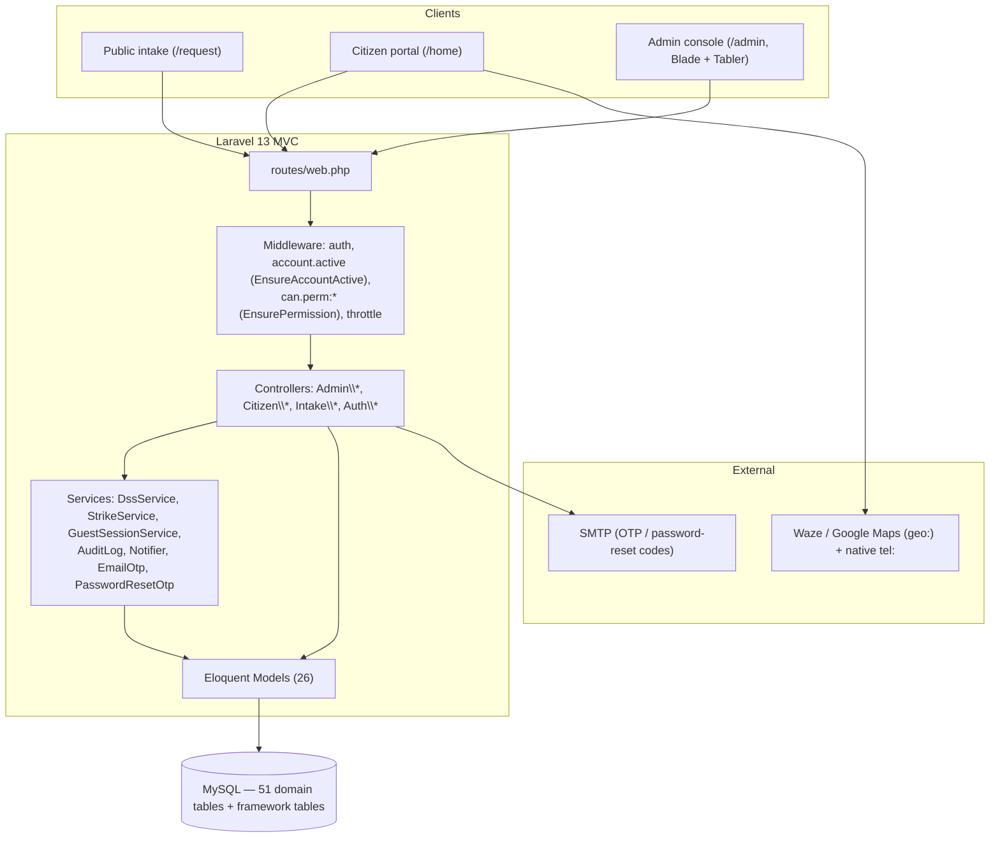
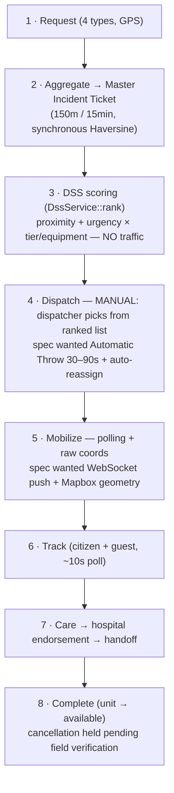
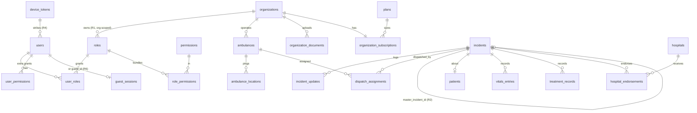

# System Documentation — Technical (As-Built)

*Compiled directly from the codebase, not the planning docs. Where the planning docs
(`docs/DOCUMENTS`, `docs/MIGRATION`, `docs/ROADMAP`) and the code disagree, the **code is
authoritative** and the gap is recorded in §7. Generated 2026-06-28.*

**Project:** Web-Based Ambulance Rescue Platform — Dasmariñas City, Cavite
**Companion:** `SYSTEM DOCUMENTATION (NON-TECHNICAL).md` (same scope, plain language)

---

## Table of Contents

1. [Overview](#1-overview)
2. [System Architecture](#2-system-architecture)
3. [Users & Roles](#3-users--roles)
4. [Implemented Functionality (module by module)](#4-implemented-functionality-module-by-module)
5. [Main Process Flow](#5-main-process-flow)
6. [Database Structure](#6-database-structure)
7. [Implemented vs. Mismatched / Changes Needed](#7-implemented-vs-mismatched--changes-needed)
8. [Next Steps / Roadmap to "Done"](#8-next-steps--roadmap-to-done)
9. [Open Items](#9-open-items)

---

## 1. Overview

A city-scoped emergency ambulance dispatch platform ("ride-hailing for ambulances" + a
control room + hospital coordination) for **Dasmariñas, Cavite only**. It covers the full
chain: request → triage → dispatch → on-scene care → hospital endorsement → handoff →
completion, with a Decision Support System (DSS) ranking ambulances.

**Stack**

| Layer | Technology |
|-------|-----------|
| Framework | Laravel 13 (MVC, server-rendered **Blade**) |
| UI | Tabler (Bootstrap 5), Tabler Icons webfont, ApexCharts |
| Database | MySQL (relational, InnoDB) — Eloquent + migrations |
| Auth | Session-based; email OTP verification; approval gate; (Google OAuth documented, not wired in this tree) |
| Realtime | **HTTP polling** (`~10s`), no WebSockets/Reverb yet |
| Maps | External `geo:` / `tel:` deep-links; no in-app Mapbox geometry yet |

**Three front doors**

- Public **intake** — `/request*`, no auth, rate-limited (guest + citizen emergency requests).
- **Citizen portal** — `/home*`, authed registered citizens, everything self-scoped.
- **Admin console** — `/dashboard` + `/admin/*`, permission-gated; every page extends
  `layout/admin/app.blade.php`. Role differences are by permission, not separate layouts.

---

## 2. System Architecture

Classic 3-tier Laravel MVC: Blade/HTTP clients → routing → middleware → controllers →
services → Eloquent models → MySQL. Cross-cutting concerns (audit, notifications, RBAC)
are services/middleware.

**Request access pipeline**

1. `middleware('guest')` group — login, register, verify-email, password reset (all
   rate-limited via `throttle:*`).
2. `middleware(['auth','account.active'])` group — everything authed. `account.active` =
   `App\Http\Middleware\EnsureAccountActive`.
3. Per-module gate `can.perm:<code>` = `App\Http\Middleware\EnsurePermission`, resolved via
   `User::hasPermission()`. The permission string matches the `@can('<code>')` directive in
   views — same string in both places.
4. Public intake routes sit outside auth entirely, protected only by `throttle:*`.

---

## 3. Users & Roles

Three stacked concepts: **`account_type`** (coarse label on the user row) → **role**
(seeded, grants permissions) → **permission code** (what route middleware checks).

**Critical reality:** `super_admin` is **oversight-only** — the `Gate::before` wildcard was
removed (commit `e842f7e`), so its reach is exactly the permissions synced to it. Only **two
roles are seeded**; the operational permission codes are bound to **no seeded role**, so the
field/ops tier is fully coded and route-gated but currently **unreachable** until per-org
dynamic roles are minted.

### Seeded permission → role matrix (`database/seeders/RolePermissionSeeder.php`)

| Permission code | `super_admin` | `platform_executive` (LGU) | Field/ops roles |
|---|:--:|:--:|:--:|
| `access-admin` | ✅ | ✅ | — |
| `manage-users` | ✅ | — | — |
| `review-approvals` | ✅ | ✅ | — |
| `view-audit-logs` | ✅ | ✅ | — |
| `manage-config` | ✅ | ✅ | — |
| `manage-archive` | ✅ | — | — |
| `manage-organizations` | — | ✅ | — |
| `review-org-approvals` | ✅ | ✅ | — |
| `view-incidents` | ✅ | ✅ | — |
| `view-reports` | ✅ | ✅ | — |
| `manage-safety` | — | ✅ | — |
| `dispatch-incidents` | — | — | ⬜ unassigned |
| `manage-fleet` | — | — | ⬜ unassigned |
| `drive-unit` | — | — | ⬜ unassigned |
| `record-care` | — | — | ⬜ unassigned |
| `manage-hospitals` | — | — | ⬜ unassigned |

`⬜ unassigned` = route + permission + controller exist, but no seeded role holds the code.

### Role inventory

| Role / type | Tier | Status | Identity / binding |
|---|---|---|---|
| `super_admin` | Governance (dev/root, oversight only) | **Live, seeded** | `account_type=super_admin`, role `super_admin` |
| `platform_executive` | Governance (LGU / city authority) | **Live, seeded** | `account_type=personnel`, role `platform_executive` |
| Org Admin (tenant) | Operational | Coded, **not seeded** | per-org dynamic role (R1, S4 builder) |
| Dispatcher | Operational | Coded, **not seeded** | needs `dispatch-incidents` |
| Driver | Operational | Coded, **not seeded** | needs `drive-unit` |
| Medic | Operational | Coded, **not seeded** | needs `record-care` |
| Hospital Staff | Operational | Coded, **not seeded** | needs `manage-hospitals` |
| Fleet Manager | Operational | Coded, **not seeded** | needs `manage-fleet` |
| Citizen | Consumer | **Live, seeded** | `account_type=citizen`, no role, self-scoped |
| Guest | Consumer | **Live, no login** | `guest_sessions` + `device_uuid`, request quota |

Schema supports the dynamic tier already: `roles.organization_id` (NULL = platform/global),
unique `(organization_id, name)` (R1); `user_roles` and `user_permissions` carry
`organization_id` for org-scoped grants.

---

## 4. Implemented Functionality (module by module)

All admin routes live in `routes/web.php` under `['auth','account.active']` + a `can.perm`
gate. Notation: **gate** = permission code, **controller** = handling class.

### 4.1 Authentication & account (Auth\\*)
- **Register** → user `account_status=pending_otp`; terms acceptance logged.
- **Email OTP** verify/resend (`VerifyEmailController`), throttled.
- **Login/logout** (`LoginController`), session auth, `throttle:6,1`.
- **Password reset** (`PasswordResetController`) — emailed expiring code.
- Approval gate: personnel land in `awaiting_approval` until approved.

### 4.2 Super Admin modules
| Module | Gate | Controller | Actions |
|---|---|---|---|
| Users | `manage-users` | `UserController` | index, show, toggleActive, archive, restore |
| Account approvals | `review-approvals` | `ApprovalController` | index, approve, reject |
| Audit & system logs | `view-audit-logs` | `AuditController` | index (read-only) |
| City Settings / config | `manage-config` | `ConfigController` | edit, update (`system_configurations`) |
| Archive registry | `manage-archive` | `ArchiveController` | index (view/restore) |

### 4.3 LGU / Platform Executive modules
| Module | Gate | Controller | Actions |
|---|---|---|---|
| Organizations | `manage-organizations` | `OrganizationController` | full CRUD + archive/restore |
| Org approvals + docs | `review-org-approvals` | `OrgApprovalController` | index, show, approve, reject, updateDocumentStatus |
| Anti-abuse & ads | `manage-safety` | `SafetyController` | flag incident, block/unblock device, ads list + toggle |
| Reports | `view-reports` | `ReportController` | index (read-only metrics) |
| Account approvals / config / incident oversight | shared with Super Admin | — | — |

### 4.4 Operational / field modules (coded, route-gated, **role-unseeded**)
| Module | Gate | Controller | Actions |
|---|---|---|---|
| Fleet | `manage-fleet` | `AmbulanceController` | ambulance CRUD + archive/restore, fuel-logs, maintenance-logs |
| Incident triage (read-only) | `view-incidents` | `IncidentController` | index, show |
| DSS + Dispatch | `dispatch-incidents` | `DispatchController` | index (queue/scheduled/active), show (DSS rank), store (assign), reassign |
| Driver + live tracking | `drive-unit` | `DriverController` | duty, updateDuty, assignment, advance, pushLocation (`throttle:60,1`) |
| Medical care | `record-care` | `CareController` | vitals, treatments, notes, patient upsert, resolveOnScene |
| Hospitals + handoff | `manage-hospitals` | `HospitalController` | hospital CRUD, endorse, respond, confirmHandoff |

### 4.5 Cross-cutting
- **Notifications** (`NotificationController`) — any authed user, no extra permission:
  index, markRead, markAllRead.
- **Dashboard** (`DashboardController`) — governance counters computed **only** when the
  viewer holds the matching permission (e.g. blocked-devices count requires `manage-safety`).

### 4.6 Citizen portal (Citizen\\CitizenController, `/home`)
- home (bounces any `access-admin` holder to `/dashboard`), profile + update, medical +
  update (JSON `medical_info` on the user), history (own incidents only).

### 4.7 Public intake (Intake\\RequestIntakeController, `/request`)
- `create`, `store` (`throttle:10,1`), `track`, `status` JSON (polled `~10s`, `throttle:60,1`),
  `cancel`.
- On `store`: device-strike block check (R4), guest-quota check (R6), **Master Incident
  Ticket** grouping (`findMasterTicket`, 150m / 15-min window), audit + tracking cookie.
- On `cancel`: never hard-cancels — sets `needs_field_verification`, keeps status `pending`.

### 4.8 Services (`app/Services/`)
- `DssService::rank()` — synchronous Haversine scoring; `score = proximity + urgency × (ALS
  tier bonus + equipment count)`; flat 30 km/h ETA, **no traffic awareness**.
- `StrikeService` — 3 false alarms / 30 days → device block.
- `GuestSessionService` — guest identity + request quota.
- `AuditLog::record()`, `Notifier::send()`, `EmailOtp`, `PasswordResetOtp`.
- **No `app/Jobs/`** — Automatic Throw / queued reassignment not built; reassignment is a
  manual dispatcher action.

---

## 5. Main Process Flow

The documented spec; annotations mark where the **code simplifies** the intended automation.

**Status lifecycles (enum-backed)**

- `incidents.status`: `pending → dispatched → ongoing → on_scene → transporting →
  arrived_at_hospital → completed`; terminals `cancelled`, `resolved_on_scene`.
- `dispatch_assignments.status`: `assigned → accepted → acknowledged → en_route →
  approaching_scene → arrived_on_scene → departing_scene → approaching_hospital →
  arrived_hospital → clear_for_duty → completed`; exceptions `timed_out`, `rejected`,
  `reassigned`, `cancelled`, `unassigned`.
- `hospital_endorsements.handoff_status`: `pending → accepted/declined → completed`.

The DSS countdown value (`dss_timeout_seconds`, default 60) is read from
`system_configurations` and stored on `dispatch_assignments.response_deadline_at`, but **no
job enforces the timeout** — it is recorded, not acted on.

---

## 6. Database Structure

**51 domain tables** across 7 migrations (`2026_06_26_000010`–`000070`) plus a
foreign-keys migration (`2026_06_26_000099_add_foreign_keys`) and a later column add
(`2026_06_27_000100_add_medical_info_to_users`), in addition to framework tables
(`users`, `cache`, `jobs`). InnoDB. Per-domain table counts: identity/access 12, profile 5,
organizations 7, fleet 7, incidents/dispatch 5, hospital/medical 7, system/audit 8.

### 6.1 ERD (domain-grouped, key relations)

### 6.2 Full data dictionary

> Common archival columns (`is_archived`, `archived_at`, `archived_by`, `archive_reason`)
> appear on most domain tables and are omitted below for brevity; archive = soft-state, no
> Eloquent SoftDeletes. Standard `created_at/updated_at` omitted unless meaningful.

#### Domain: Identity & access (`...000010`)
| Table | Key columns | Notes |
|---|---|---|
| `roles` | `organization_id` (NULL=global), `name`, `scope`(platform/organization/citizen), `is_active` | **R1** org-owned; unique `(organization_id,name)` |
| `permissions` | `code` UNIQUE, `name`, `module` | 16 codes seeded |
| `role_permissions` | `role_id`, `permission_id` | unique `(role_id,permission_id)` |
| `user_roles` | `user_id`, `role_id`, `organization_id`, `assigned_by`, `assigned_at` | unique scope key |
| `user_permissions` | `user_id`, `organization_id`, `permission_id`, `granted_by` | **R5** FK not loose string |
| `user_sessions` | `user_id`, `token_hash` UNIQUE, `expires_at`, `last_used_at` | |
| `user_google_identities` | `user_id` UNIQUE, `google_sub` UNIQUE | OAuth link (not wired in tree) |
| `email_verification_codes` | `user_id`, `code_hash`, `attempt_count`, `expires_at`, `verified_at` | OTP |
| `password_reset_codes` | `user_id`, `code_hash`, `expires_at`, `used_at` | |
| `terms_acceptance_logs` | `user_id`, `terms_version`, `accepted_at`, `ip_address` | |
| `device_tokens` | `device_uuid` UNIQUE, `user_id`, `false_alarm_count`, `is_blocked`, `blocked_at` | **R4** anti-abuse |
| `account_flags` | `user_id`, `flag_type`(enum), `reason`, `is_resolved`, `resolved_by` | |

#### Domain: Profile / citizen (`...000020`)
| Table | Key columns | Notes |
|---|---|---|
| `citizen_profiles` | `user_id` UNIQUE, `birth_date`, `is_minor`, address fields, `id_*`, `encrypted_sensitive_json` | 1:1 user |
| `user_medical_histories` | `user_id` UNIQUE, `blood_type`, `allergies`, `chronic_conditions`, `medications`, `encrypted_payload` | 1:1 user |
| `user_identity_documents` | `user_id`, `document_type`, `file_path`, `document_hash`, `validation_status` | ID uploads |
| `guardian_links` | `minor_user_id` UNIQUE, `guardian_user_id`, `guardian_*`, `is_verified` | minors |
| `guest_sessions` | `guest_key` UNIQUE, `phone`, `requests_limit`(2), `requests_used`, `upgraded_user_id` | guest quota |

#### Domain: Organizations / plans (`...000030`)
| Table | Key columns | Notes |
|---|---|---|
| `plans` | `code` UNIQUE, `price`, `billing_cycle`, `max_dispatchers/drivers/ambulances/hospitals/members/roles_assignable`, `is_unlimited` | plan limits live here (**R11**) |
| `organizations` | `org_type`, `name`, `organization_status`(pending_review…), `admin_user_id`, `is_approved`, `is_active`, coverage/HQ geo, `auto_progression_radius_m`, `response_target_minutes` | tenant root |
| `organization_subscriptions` | `organization_id` UNIQUE, `plan_id`, `status`(trialing/active/…) | 1:1 org |
| `subscription_payments` | `organization_id`, `plan_id`, `provider`(mock), `amount`, `status` | mock payments |
| `organization_coverage_areas` | `organization_id`, `barangay_name`, `polygon_json`, `priority_rank` | AOR |
| `organization_documents` | `organization_id`, `document_type`, `file_path`, `validation_status`, `validated_by` | onboarding docs |
| `geo_layers` | `slug` UNIQUE, `label`, `geojson` | map layers |

#### Domain: Fleet (`...000040`)
| Table | Key columns | Notes |
|---|---|---|
| `ambulances` | `organization_id`, `plate_no`, `tier`(bls/als), `doh_credential_ref`, `has_ventilator/oxygen/aed/spine_board/ob_kit/stretcher`, `status`, `is_serviceable`, `last_lat/lng/seen_at` | **R3** tier+equipment; unique `(organization_id,plate_no)` |
| `ambulance_locations` | `ambulance_id`, `dispatch_assignment_id`, `lat`, `lng`, `recorded_at` | live pings |
| `ambulance_status_logs` | `ambulance_id`, `old_status`, `new_status`, `changed_by` | audit of status |
| `fuel_logs` | `ambulance_id`, `log_date`, `liters`, `total_cost`, `odometer_km`, `fuel_type` | |
| `maintenance_logs` | `ambulance_id`, `maintenance_type`(enum), `description`, `status`, `next_due_date/km` | |
| `unit_readiness_checks` | `ambulance_id`, `driver_user_id`, `check_date`, `checks`(json), `is_all_passed` | unique daily |
| `driver_duty_states` | `driver_user_id` UNIQUE, `ambulance_id`, `status`(on_duty/off_duty/break) | 1:1 driver |

#### Domain: Incidents & dispatch (`...000050`)
| Table | Key columns | Notes |
|---|---|---|
| `incidents` | `request_code` UNIQUE, `request_type`(one_tap/detailed/non_emergency/scheduled, **R8**), `scheduled_for`, `master_incident_id`(self-FK, **R2**), `user_id`/`guest_id`(**R6** either-or), `organization_id`, `severity`, `pickup_lat/lng/address`, `status`(enum), `dispatch_routing_state`, `dss_org_queue_json`, `is_flagged_for_abuse`, `eta_minutes` | central table |
| `incident_updates` | `incident_id`, `dispatch_assignment_id`, `status`, `care_status`, `update_type`, `visibility`(private/org/public) | timeline |
| `dispatch_assignments` | `incident_id`, `organization_id`, `ambulance_id`, `driver_user_id`, `dispatcher_user_id`, `status`(16-state enum), `response_deadline_at`, `dss_rank`, `alert_attempts`, `forwarded_from_assignment_id`(self), per-phase timestamps | **R10** deduped timestamps |
| `driver_completion_reports` | `assignment_id`, `incident_id`, `ambulance_id`, `driver_user_id`, summaries, `patient_status`, `review_status` | post-mission |
| `request_outcome_logs` | `incident_id`, `tag`, `severity`, `action_taken`, `offense_level` | outcome tagging |

#### Domain: Hospital & medical (`...000060`)
| Table | Key columns | Notes |
|---|---|---|
| `hospitals` | `organization_id`, `name`, `facility_type`, `capacity_status`, `available_beds`, `is_er_open`, `lat/lng` | |
| `hospital_endorsements` | `dispatch_assignment_id`, `incident_id`, `hospital_id`, `status`, `handoff_status`(pending→accepted/declined→completed), `responded_by`, `handoff_confirmed_at` | endorsement state machine |
| `handoff_summaries` | `incident_id` UNIQUE, `summary`, `outcome`, `handoff_to`, `handoff_at` | 1:1 incident |
| `patients` | `incident_id` UNIQUE, `full_name`, `sex`, `birth_date`, `address` | 1:1 incident |
| `vitals_entries` | `incident_id`, `bp_systolic/diastolic`, `pulse_rate`, `respiratory_rate`, `temperature_c`, `oxygen_saturation`, `gcs_score` | time-series |
| `treatment_records` | `incident_id`, `treatment_type`, `details`, `performed_at` | time-series |
| `prehospital_notes` | `incident_id`, `note_type`, `content` | |

#### Domain: System / audit / config (`...000070`)
| Table | Key columns | Notes |
|---|---|---|
| `approval_records` | `target_type`(user/org/…), `target_id`, `status`, `requested_by`, `reviewed_by` | polymorphic approvals |
| `audit_logs` | `user_id`, `role`, `organization_id`, `action`, `model_type`, `model_id`, `new_values`, `ip_address` | written by `AuditLog::record` |
| `archival_logs` | `table_name`, `record_id`, `archived_by`, `snapshot_json` | archive snapshots |
| `system_logs` | `level`, `category`, `message`, `context` | |
| `system_configurations` | `scope`(global/org), `organization_id`, `config_key`, `config_value`, `config_type` | unique `(scope,org,key)`; holds `dss_timeout_seconds` |
| `system_settings` | singleton `id=1`, `settings_json` | |
| `notifications` | `user_id`, `type`, `title`, `message`, `is_read` | in-app notifications |
| `ad_placements` | `slot`, `title`, `content`, `is_active`, `is_emergency_safe` | **R9** sustainability |

#### Added later (`...000100`)
| Table | Change |
|---|---|
| `users` | `medical_info` JSON column added (citizen portal medical screen) |

---

## 7. Implemented vs. Mismatched / Changes Needed

> "Spec" = the planning docs / panel revisions. "Code" = this tree. Action = what to do to
> reconcile.

| # | Area | Spec said | Code does | Action |
|---|------|-----------|-----------|--------|
| 1 | Super Admin scope | Root over everything | **Oversight-only**; `Gate::before` wildcard removed; cannot dispatch/care/hospital/fleet/safety | Intentional. Update planning docs to match; keep daily-ops out of super_admin. |
| 2 | Field/ops roles | 4-tier hierarchy incl. Org Admin + field crews | Permission codes + routes + controllers exist, **bound to no seeded role** → unreachable | **Seed + assign** these via the per-org dynamic role builder (S4). Highest-priority unlock. |
| 3 | Automatic Throw | Queued 30–90s offer, auto-reassign on timeout | `response_deadline_at` stored but **no job**; dispatcher assigns + reassigns **manually**. No `app/Jobs/`. | Build `AutomaticThrowJob` + `ReassignJob` (queue + scheduler). |
| 4 | Realtime | WebSocket push (Reverb) | **Polling** (`status` JSON, `~10s`) | Add Reverb broadcasting; keep polling as fallback. |
| 5 | DSS | Urgency + tier + **traffic-adjusted** time | Distance-dominant; flat 30 km/h ETA, **no traffic** | Add traffic factor; consider config-tunable weights. |
| 6 | Maps | Mapbox route geometry | External `geo:`/`tel:` deep-links only; raw coords in tracking | Wire Mapbox geometry when realtime lands. |
| 7 | Registration geo | Remove manual lat/lng; pick replacement | Intake captures `pickup_lat/lng`; registration replacement **[TBD]** | Confirm method (pin-drop vs reverse-geocode) with panel. |
| 8 | Request types | 4 types incl. non-emergency + scheduled workflows | `request_type`/`scheduled_for` columns + a "scheduled" dispatch tab exist; **non-emergency/scheduled workflows not designed** | Design booking/approval/reminder flow after panel confirms rules. |
| 9 | R6 single-requester | DB CHECK (one of user/guest) | Enforced in **app layer** (model/controller), not DB CHECK — MySQL 8 err 3823 with SET NULL FK | Acceptable; document the invariant. |
| 10 | Google OAuth | Socialite login | `user_google_identities` table present; login flow **not wired** in this tree | Add Socialite when needed. |

---

## 8. Next Steps / Roadmap to "Done"

Prioritized; each ends in a testable slice.

1. **Seed & wire the field/ops tier** *(unblocks the whole response side)* — mint org-scoped
   roles (Org Admin, Dispatcher, Driver, Medic, Hospital Staff, Fleet) and assign the
   unassigned permission codes; build the S4 dynamic role builder so orgs define their own.
   Makes the dispatch → driver → medic → hospital chain reachable.
2. **Automatic Throw** — `AutomaticThrowJob` (queued, reads `dss_timeout_seconds`) offers to
   the top-ranked org with a countdown; `ReassignJob` re-offers to next-ranked on timeout.
   Requires queue worker + scheduler.
3. **Realtime via Reverb** — replace the `~10s` polling with broadcast events (assignment
   offered/accepted, location, status) to citizen/driver/console.
4. **Smarter DSS** — traffic-adjusted travel time + LGU-tunable weights; optionally
   auto-derive severity.
5. **Mapbox geometry** — in-app route rendering for the driver, paired with the existing
   deep-link nav.
6. **Scheduled / non-emergency workflows** — design + build once panel confirms rules
   (booking, approval, reminders).
7. **Confirm open panel items** — "remove conditions", DILG touchpoint, lat/lng replacement,
   terminology pass (see §9).

---

## 9. Open Items

Canonical list lives in `docs/MIGRATION/01_MIGRATION_PLAN.md §8`; recommended resolutions in
`docs/MIGRATION/03_RECOMMENDATIONS.md §2`. Current code status:

| Open item | Code status |
|---|---|
| "Remove conditions" (meaning) | Unresolved — no code impact yet |
| Lat/long registration replacement | Intake uses GPS; registration method **[TBD]** |
| Scheduled / non-emergency workflow | Columns + tab exist; workflow **not built** |
| DILG role | Not represented in roles/permissions |
| Terminology pass | Status casing largely normalized to lowercase enums; not fully audited |
| Org↔field role remapping | Resolved in code as Governance (super_admin/LGU) + unseeded field tier |

---

*This file documents the system **as built** on branch `feat/citizen-portal`. Verification
baseline: 16 feature test files under `tests/Feature/` (Auth/RBAC, Intake, Dispatch,
DriverTracking, Medical, Fleet, Organization, AntiAbuse, Reports, Notification, Citizen/LGU/
SuperAdmin portals, SmokeViews). Run `php artisan test` to confirm.*
