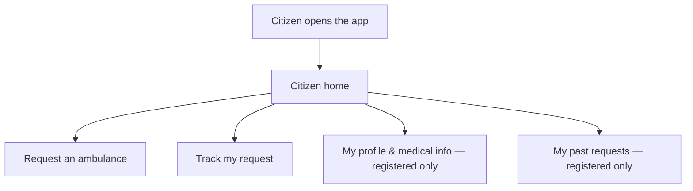
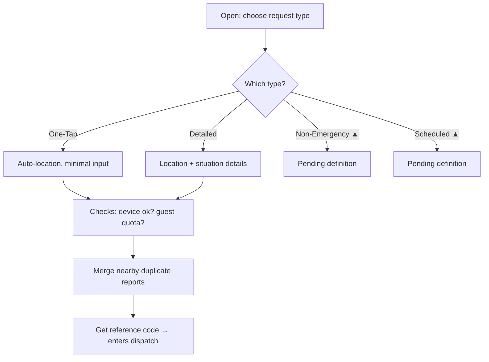
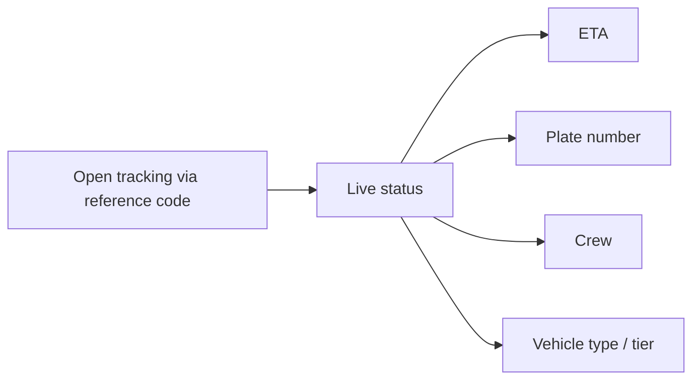
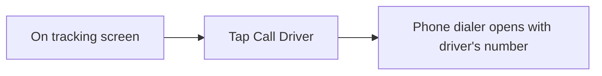
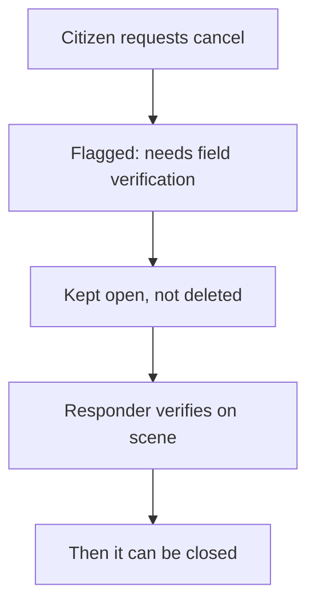
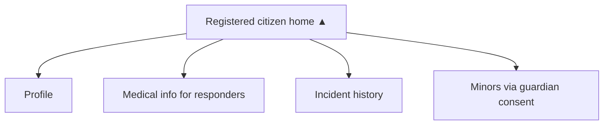
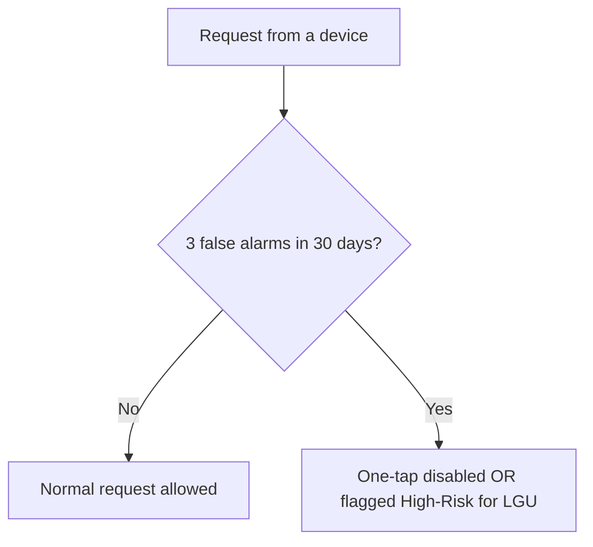
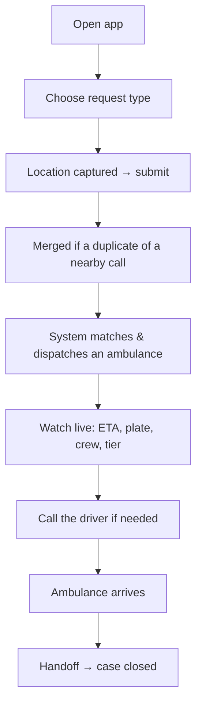

# Citizen / User Portal — Plan (Non-Technical)

> Ambulance Rescue Platform — Dasmariñas City.
> Per-user portal plan. This one covers the **Citizen / User** (the public who needs an ambulance).
> Audience: students, panel, stakeholders. Plain language, with flowcharts. Based on the project documentation.

---

## 1. Who the Citizen / User is

The Citizen is the **person who actually needs an ambulance** — the public this whole platform exists to serve. They sit **outside** the staff hierarchy (Super Admin → LGU → Organization → Field crews); they are the **consumer side**. There are two kinds:

- **Guest** — uses the app **without an account** (fast, but limited).
- **Registered citizen** — has signed up (email + a one-time code) and gets extra features like saved medical info and request history.

Either way, the citizen's whole world is simple: **ask for help, then watch it come.** They never touch the admin screens — those belong to staff.

---

## 2. The Citizen's job at a glance

1. **Ask for an ambulance** — send an emergency request (location captured automatically).
2. **Track it live** — see the ambulance's ETA, plate number, crew, and vehicle type.
3. **Call the driver** — one tap to phone the responding driver.
4. **Cancel if needed** — but a cancel is **held for a responder to verify**, never silently dropped.
5. **(Registered only)** — manage their **profile**, **medical info**, and **past requests**.

---

## 3. Where the Citizen lands (the portal idea)

**Important:** the citizen's "portal" is the **request + tracking experience** — *not* the staff admin console.

**Current gap:** right now, if a citizen logs in, the system sends them to the staff dashboard and **blocks them** (they have no business there). That's the wrong home. The plan is a **citizen home** that opens straight to "Request help," "Track my request," and — if registered — "My history & profile."



```text
citizen opens app ─> citizen home ─┬─> Request an ambulance
                                   ├─> Track my request
                                   ├─> My profile & medical info  (registered only)
                                   └─> My past requests           (registered only)
```

---

## 4. Module by module — jobs, process & flow

Each area: what it's for, the steps in plain words, and a flowchart. A tag shows **built today** or **▲ planned/TBD**.

### 4.1 Ask for an ambulance — *One-Tap & Detailed built; Non-Emergency & Scheduled ▲TBD*

**For:** sending an emergency request. The citizen picks **how** they want to ask:

- **One-Tap** — the fastest: tap once, location is grabbed automatically, minimal input. *(built)*
- **Detailed** — location **plus** situation details (what happened, who's hurt). *(built)*
- **Non-Emergency** — for non-urgent transport. *(▲TBD — the documents leave the exact rules to be defined)*
- **Scheduled** — booked ahead of time. *(▲TBD — rules pending)*

**Process:**
1. Choose a request type.
2. The app captures your location.
3. Behind the scenes, the system checks the device isn't blocked for past false alarms, and (for guests) that they still have requests left.
4. If others reported the **same spot just now**, your request is **merged** with theirs so one ambulance isn't sent twice.
5. You get a **reference code** and your request enters the dispatch pipeline.



```text
choose type > One-Tap (auto-location) | Detailed (location+details)
              | Non-Emergency ▲TBD | Scheduled ▲TBD
   > checks (device ok? guest quota?) > merge nearby duplicates > reference code > enters dispatch
```

### 4.2 Track the ambulance live — *built*

**For:** watching help arrive. **Guests and registered citizens see the exact same tracking screen.**

**Process:**
1. Open the tracking page (via your reference code).
2. Watch the live status: **ETA, plate number, crew, and vehicle type (tier badge)**.
3. The screen keeps refreshing until the ambulance arrives.



```text
open tracking (reference code) > live status: ETA + plate + crew + vehicle tier (auto-refreshes)
```

### 4.3 Call the driver — *built*

**For:** reaching the responding driver directly.

**Process:** tap **Call Driver** → your phone's normal dialer opens with the driver's number. (No in-app chat or calling is built — it uses your phone's own dialer.)



```text
tracking screen > tap Call Driver > phone dialer opens (driver's number)
```

### 4.4 Cancel — held, not deleted — *built (anti-abuse)*

**For:** letting a citizen call off a request — **safely**. A citizen **cannot silently "ghost"** an ambulance mid-route.

**Process:**
1. Request a cancel.
2. The request is **flagged "needs field verification"** and **kept open**.
3. A responder checks the scene before it's actually closed (because a "cancelled" call might still be a real emergency).



```text
request cancel > flagged 'needs field verification' (kept open) > responder verifies on scene > then closed
```

### 4.5 Registered-citizen extras — *▲ planned / deferred*

**For:** giving registered citizens more than a guest gets.

Per the documents, a registered citizen's account is meant to include:
- **Profile** — their personal details.
- **Medical info** — stored so responding paramedics know key facts in advance.
- **Incident history** — a list of their past requests.
- **Minors** register through a **guardian's consent/linkage**.

**Status:** these are **planned** but **not built yet** — today the app focuses on the shared request + tracking flow. Building the citizen home and these registered screens is part of making a true citizen portal.



```text
registered home ▲ > Profile | Medical info (for responders) | Incident history | Minors via guardian consent
   (planned — not built yet)
```

---

## 5. Guest vs Registered

| Guest (no account) | Registering adds |
|---|---|
| Send a request (One-Tap / Detailed) | Saved **profile** |
| Same **live tracking** screen | Stored **medical info** for responders |
| **Call the driver** | **History** of past requests |
| **Limited number** of requests | Higher trust / no per-session request limit |

Per the documents, guests deliberately get **fewer features** — it's an **incentive to register**.

---

## 6. Safety & fairness (why some things are restricted)

Two rules keep the system honest and protect real emergencies:

1. **Cancellations are verified, not trusted blindly** (see 4.4) — a cancel is held until a responder confirms on scene.
2. **False-alarm device rule** — the system tracks each device. **3 false alarms within 30 days** → that device's one-tap is **disabled**, or it's **flagged High-Risk** for the LGU to review.



```text
request from device > 3 false alarms in 30 days? no>allowed / yes>one-tap disabled OR High-Risk for LGU review
```

---

## 7. One emergency, end to end (citizen's view)



```text
open app > choose type > location + submit > (merged if duplicate)
   > matched & dispatched > watch live (ETA/plate/crew/tier) > call driver
   > ambulance arrives > handoff > case closed
```

---

## 8. What's working now vs. what makes it a true citizen portal

| Working today | Still needed for a dedicated citizen portal |
|---|---|
| Send a request (One-Tap / Detailed) | A **citizen home/landing** so a logged-in citizen lands here — not the staff dashboard (which blocks them today) |
| Live tracking (ETA, plate, crew, tier) | **Registered screens:** Profile, Medical info, Incident history |
| Call the driver (phone dialer) | **Non-Emergency** and **Scheduled** request types (rules still to be defined) |
| Cancel held for verification | **Guardian consent/linkage** for minors |
| Guest request limit + device-strike safety | — |

*No code has been changed by this document — it is a plan. The "still needed" column is the work that turns the citizen experience into a portal genuinely built for the public.*

---

## 9. The bigger picture

Per-user portal plans continue. Still to come, each in its own plan: **Dispatcher, Driver, Medic, Hospital staff, and Organization Admin.** The LGU and the Citizen are done.
