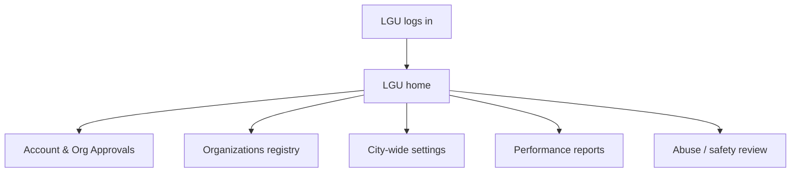
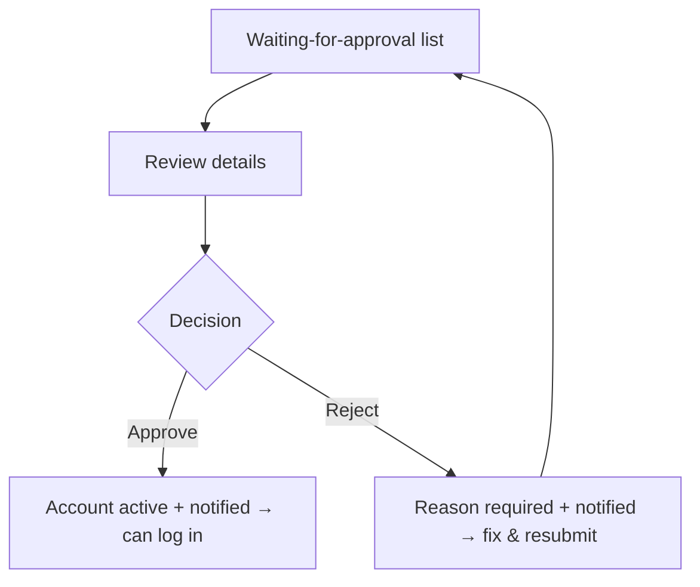
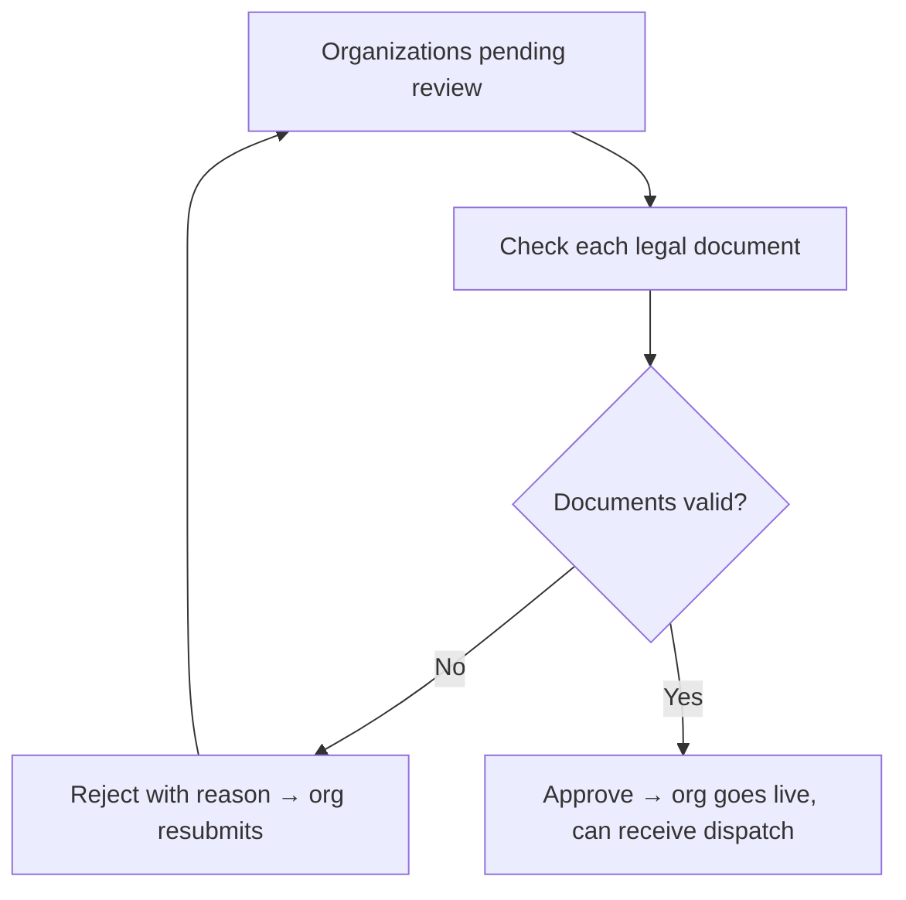
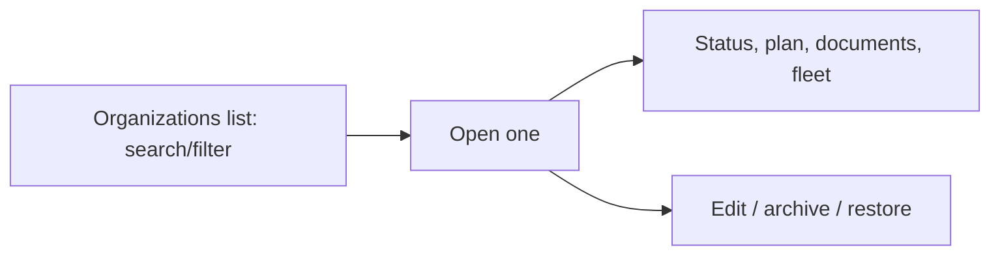
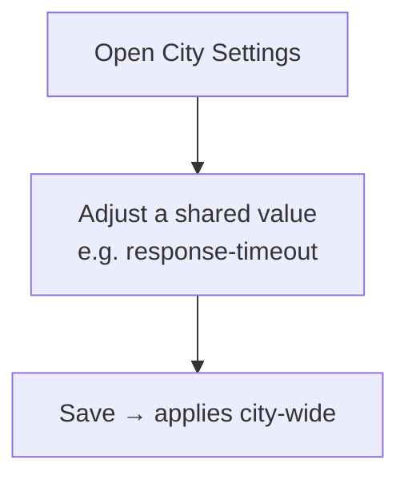
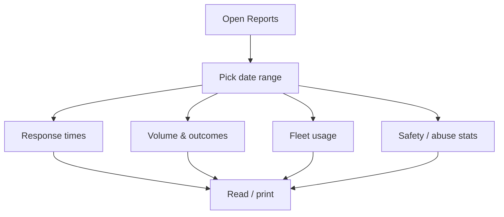
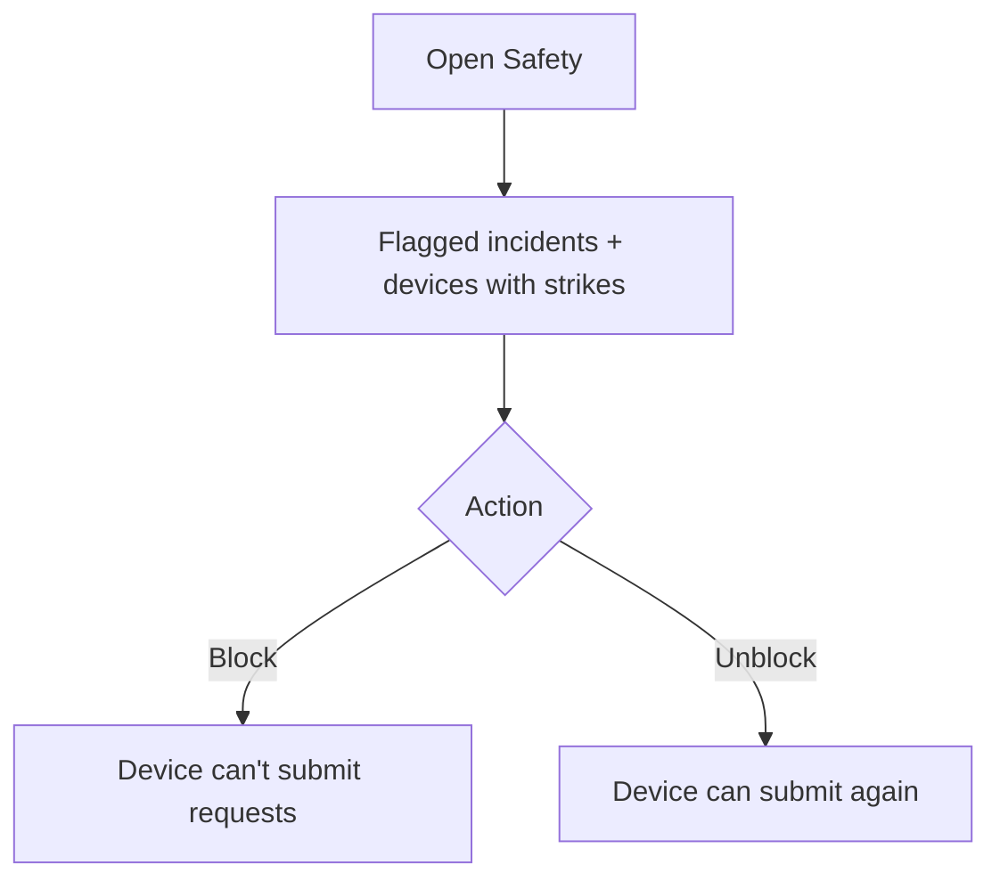

# LGU Executive Portal — Plan (Non-Technical)

> Ambulance Rescue Platform — Dasmariñas City.
> The first of the per-user portal plans. This one covers the **LGU Executive (Platform Executive)** only.
> Audience: students, panel, stakeholders. Plain language, with flowcharts.

---

## 1. Who the LGU Executive is

The LGU Executive is the **city authority** — the LGU of Dasmariñas (CDRRMO / City Health Office). They are the people who decide **which organizations are allowed to operate**, **set the city-wide rules**, and **watch how the whole system is performing**. They are not the platform's technical owner (that's the Super Admin, who only handles the behind-the-scenes infrastructure) — the LGU runs the **day-to-day operations of the city**.

---

## 2. The LGU's job at a glance

The LGU Executive is responsible for five things:

1. **Approve new staff accounts** — let verified personnel into the system (or reject them with a reason).
2. **Approve organizations** — review a partner's legal documents, then let the organization go live (or reject it).
3. **Keep the organization registry** — see every organization, its status, plan, and fleet.
4. **Set city-wide rules** — adjust shared settings, such as the dispatch response-timeout countdown.
5. **Monitor performance & handle abuse** — read city-wide reports, and review false-alarm/abuse flags.

---

## 3. Where the LGU lands (the portal idea)

**Today:** the LGU logs in and lands on the shared admin console, where the menu only shows the items they're allowed to use. It works, but it isn't a *home built for the LGU* — it's the same screen everyone with console access sees.

**The idea:** an **LGU home page** that opens straight to their five areas — Approvals, Organizations, City Settings, Reports, and Safety — so the LGU sees their job laid out, not a generic dashboard.



```text
LGU logs in ─> LGU home ─┬─> Approvals (accounts + orgs)
                         ├─> Organizations registry
                         ├─> City-wide settings
                         ├─> Performance reports
                         └─> Abuse / safety review
```

---

## 4. Module by module — jobs, process & flow

Each area below: what it's for, the steps in plain words, and a flowchart. A tag shows whether it **works today** or is **partly to-do**.

### 4.1 Account Approvals — *works today*

**For:** letting verified staff into the system. New personnel/organization/hospital accounts must wait for the LGU before they can log in.

**Process:**
1. Open the list of accounts **waiting for approval** (oldest first).
2. Review the person's details.
3. **Approve** → the account becomes active, the person is notified, and they can now log in.
4. Or **Reject** → a **reason is required**; the person is notified and can fix their details and resubmit.



```text
waiting list > review > approve > active (notified, can log in)
                      > reject  > reason required (notified) > fix & resubmit
```

### 4.2 Organization Approvals — *works today*

**For:** vetting partner organizations (barangay rescue units, hospitals, private ambulance services) before they can operate.

**Process:**
1. Open the list of organizations **pending review**.
2. Open one and **check each uploaded legal document** (e.g. Barangay Resolution, SEC registration, DOH license) — mark each as validated, rejected, or still pending.
3. **Approve** → the organization goes live and can start receiving dispatches.
4. Or **Reject** → a **reason is required**; the organization can fix and resubmit.



```text
pending orgs > check each document > valid?
   no  > reject (reason) > org resubmits
   yes > approve > org live (can receive dispatch)
```

### 4.3 Organizations Registry — *works today*

**For:** seeing the whole city's organizations at a glance.

**Process:**
1. Open the organizations list; **search and filter** by name, type, or status.
2. Open one to see its **status, plan, documents, coverage area, and registered ambulances**.
3. (Housekeeping) edit details, or archive an organization that should no longer operate (archiving never deletes — it can be restored).



```text
list (search/filter) > open org > status + plan + documents + fleet
                                 > edit / archive / restore
```

### 4.4 City-wide Settings — *partly to-do*

**For:** tuning shared rules without touching code — most importantly the **dispatch response-timeout countdown** (how long a unit has to respond before the system moves on).

**Status:** the value is already used by the system and can be changed in the data, but there is **no dedicated LGU screen** for it yet. Building that simple settings page is part of making this a real LGU portal.

**Process (intended):**
1. Open **City Settings**.
2. Adjust a shared value (e.g. the response-timeout seconds).
3. Save → the new rule applies city-wide from then on.



```text
open city settings > adjust shared value (e.g. timeout) > save > applies city-wide
   (note: value works today; the dedicated screen is still to be built)
```

### 4.5 Performance Monitoring (Reports) — *works today*

**For:** watching how the city is performing.

**Process:**
1. Open **Reports** and pick a **date range** (defaults to the last 30 days).
2. Read the headline numbers: **response times**, **request volume & outcomes**, **how busy each ambulance is**, and **safety/abuse stats**.
3. **Print** the report for meetings or records.



```text
open reports > pick date range > response times + volume/outcomes + fleet use + safety
   > read / print
```

### 4.6 Abuse / Safety Review — *works today*

**For:** keeping the system honest — catching prank or false-alarm requests.

**Process:**
1. Open **Safety** to see **flagged incidents** and **devices with false-alarm strikes**.
2. The system already tracks strikes automatically (3 false alarms within 30 days → a device gets blocked).
3. The LGU can **block** a device manually, or **unblock** one (e.g. after an appeal). A blocked device can no longer submit requests.



```text
open safety > flagged incidents + strike devices
   > block (device can't submit) / unblock (device allowed again)
   (system auto-blocks at 3 false alarms in 30 days)
```

---

## 5. The LGU's day, end to end

How the five areas connect in a normal day:

```mermaid
flowchart TD
    A[New staff & organizations appear] --> B[Approve staff accounts]
    B --> C[Review org documents]
    C --> D{Org approved?}
    D -- No --> E[Reject with reason → resubmit]
    D -- Yes --> F[Org goes live & can receive dispatch]
    F --> G[Watch city-wide reports]
    G --> H{Abuse flags?}
    H -- Yes --> I[Review & block devices]
    H -- No --> G
    A2[City settings] -. tune timeout etc. .-> F
```

```text
new staff/orgs appear > approve staff > review org documents
   org approved? no>reject(reason)>resubmit / yes>org live (receives dispatch)
   > watch reports > abuse flags? yes>review & block devices / no>keep watching
   (city settings tune shared rules like the response timeout)
```

---

## 6. What's working now vs. what makes it a true portal

| Working today (reachable via the shared console) | Still needed for a dedicated LGU portal |
|---|---|
| Approve / reject staff accounts | A **role-aware landing** so the LGU goes to their own home after login (not a generic dashboard) |
| Approve / reject organizations + review documents | An **LGU home dashboard** that opens to the five areas with quick counts (pending approvals, flags, etc.) |
| Organizations registry (search, status, plan, fleet) | A **City Settings screen** to adjust shared rules (e.g. response-timeout) without touching data directly |
| Performance reports (date range, KPIs, print) | A **role cleanup** so the LGU portal is governance-only (see note below) |
| Abuse / safety review (flags, strikes, block/unblock) | — |

### Important: the LGU should not do the field jobs

By design, the LGU **governs** — it monitors and does minimal management (approvals, settings, reports, oversight). It is **not** supposed to dispatch ambulances, record patient care, or run hospital handoffs — those are the **field users'** jobs (dispatcher, driver, medic, hospital staff).

**Current mismatch:** today the LGU account is *also* allowed onto the dispatch, care, and hospital screens. That's broader than the LGU's real role. When the LGU portal is built, we will **tighten the LGU role to governance-only** and move those operational abilities to the field roles (where they belong) as each of those portals gets built. So the LGU portal will contain **only** the five governance areas above — nothing operational.

*No code has been changed by this document — it is a plan. The "still needed" column (including the role cleanup) is the work that turns the LGU's access into a portal that is genuinely built for governance.*

---

## 7. The bigger picture

This is the **first** of the per-user portal plans. The other users — **Dispatcher, Driver, Medic, Hospital staff, Organization Admin, and Citizen/Guest** — will each get their own plan later, one at a time, the same way. We focus on the LGU first.
