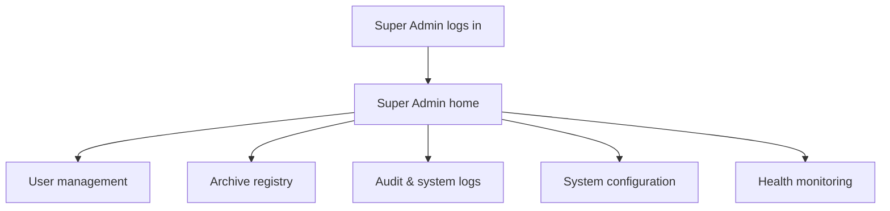
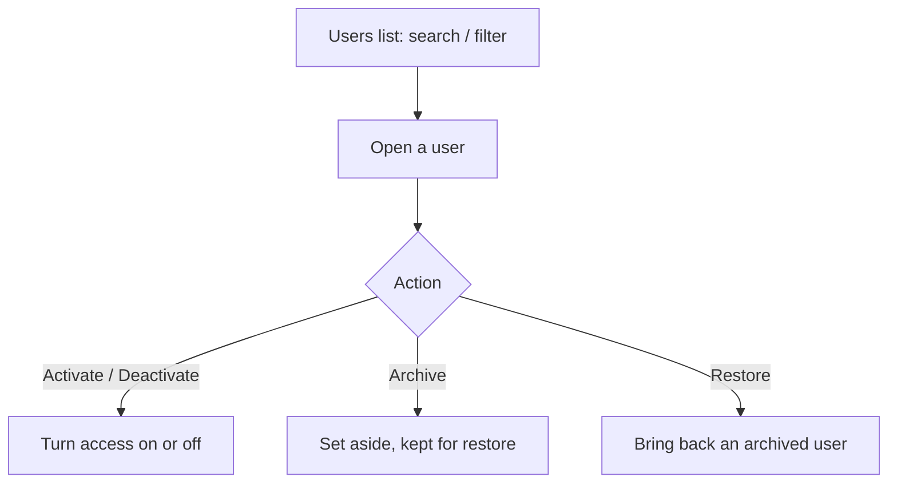
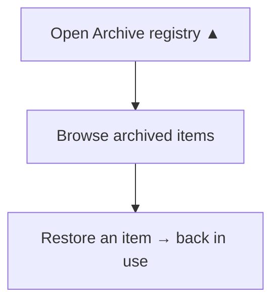
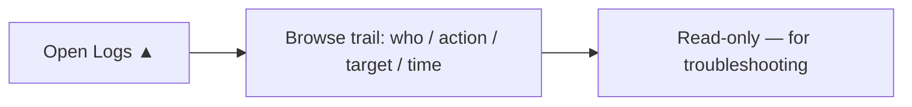
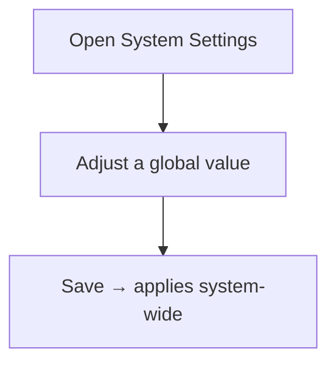
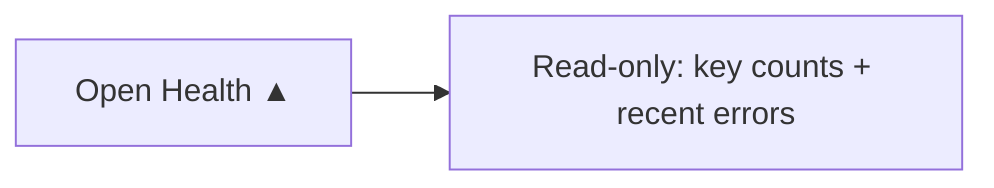
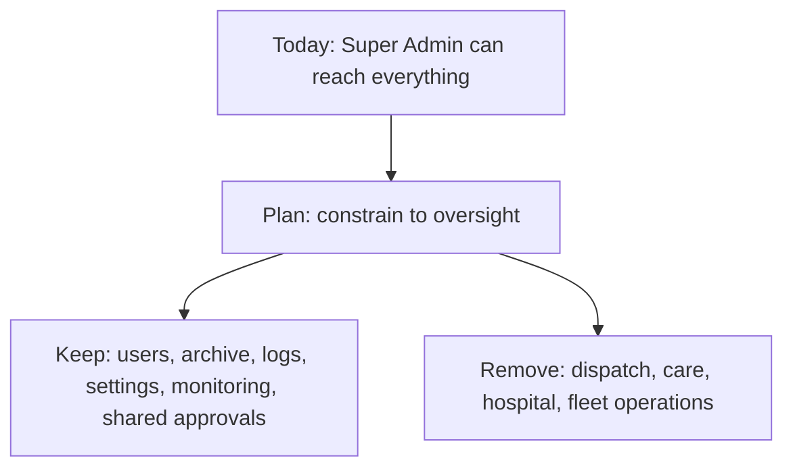

# Super Admin Portal — Plan (Non-Technical)

> Ambulance Rescue Platform — Dasmariñas City.
> Per-user portal plan. This one covers the **Super Admin** (the platform's dev team / technical owner).
> Audience: students, panel, stakeholders. Plain language, with flowcharts. Based on the project documentation.

---

## 1. Who the Super Admin is

The Super Admin is the **dev team** — the people who build and maintain the platform itself. Per the documents, their job is **infrastructure and oversight**, *not* running emergencies. They keep the system healthy, manage the user accounts, keep the audit trail, and make sure sensitive medical data stays protected.

The key contrast: the **Super Admin watches and maintains the platform**; the **LGU governs the city's operations**; and the **field crews actually run emergencies**. The Super Admin sits above all of it technically, but is **not** supposed to do the day-to-day operational work.

---

## 2. The Super Admin's job at a glance

1. **Manage user accounts** — view, search, activate/deactivate, archive/restore any user.
2. **Archive registry** — see and restore anything that's been archived (users, organizations, ambulances, hospitals).
3. **Audit & system logs** — read the trail of who did what, for troubleshooting and accountability.
4. **System configuration** — manage global settings (shared with the LGU's City Settings).
5. **Health monitoring** — keep a read-only eye on system health.

*(Account and organization approvals are **shared** with the LGU — both can do them.)*

---

## 3. Where the Super Admin lands (the portal idea)

The Super Admin's home should open straight to **their five areas** — Users, Archive, Logs, Settings, and Health — so the technical owner sees their job laid out, not a generic dashboard.



```text
Super Admin logs in ─> SA home ─┬─> User management
                                ├─> Archive registry
                                ├─> Audit & system logs
                                ├─> System configuration
                                └─> Health monitoring
```

---

## 4. Module by module — jobs, process & flow

Each area: what it's for, the steps in plain words, and a flowchart. A tag shows **works today** or **▲ to-do**.

### 4.1 User management — *works today*

**For:** managing every account on the platform.

**Process:**
1. Open the **Users** list; **search and filter** by name, type, or status.
2. Open a user to see their details.
3. **Activate / deactivate**, or **archive** (archiving never deletes — it can be restored).



```text
users list (search/filter) > open user > activate/deactivate | archive | restore
```

### 4.2 Archive registry — *▲ to-do (UI)*

**For:** one place to see everything that's been archived and bring it back if needed.

**Status:** archiving already works inside each area (users, organizations, ambulances, hospitals), and nothing is ever truly deleted. What's missing is **one combined screen** to browse and restore all of it. Building that screen is part of the Super Admin portal.

**Process (intended):**
1. Open the **Archive registry**.
2. Browse archived items across the system.
3. **Restore** any item to bring it back into use.



```text
open archive registry ▲ > browse archived (users/orgs/ambulances/hospitals) > restore > back in use
   (archiving works today; the combined screen is still to be built)
```

### 4.3 Audit & system logs — *▲ to-do (UI)*

**For:** accountability and troubleshooting — a record of **who did what, and when**.

**Status:** the system **already records** every important action behind the scenes. What's missing is a **screen to read** that trail. Building the read-only log viewer is part of the portal.

**Process (intended):**
1. Open **Logs**.
2. Browse the trail (who, what action, on what, when).
3. Use it to investigate issues — read-only, nothing can be changed here.



```text
open logs ▲ > browse: who did what, on what, when > read-only (troubleshooting)
```

### 4.4 System configuration — *partly (shared with LGU)*

**For:** global settings that shape how the system behaves (e.g. the dispatch response-timeout).

**Status:** these settings are the **same City Settings screen** described in the LGU plan — both the Super Admin and the LGU can reach it. One screen, no duplication.



```text
open settings > adjust a global value > save > applies system-wide  (same screen as the LGU's)
```

### 4.5 Health monitoring — *▲ to-do (lightweight)*

**For:** a quick, **read-only** view of how the system is doing.

**Status:** the documents describe the Super Admin watching read-only health logs. A small health summary (key counts, recent errors) is planned; deeper monitoring comes later.



```text
open health ▲ > read-only summary (counts + recent errors)  (lightweight; deeper monitoring later)
```

---

## 5. What the Super Admin does NOT do

This is the important part. By design, the Super Admin is **infrastructure and oversight** — it does **not** do operational work:

- ❌ **Dispatch ambulances** — that's the Dispatcher's job.
- ❌ **Record patient care** — that's the Medic's job.
- ❌ **Run hospital handoffs** — that's the Hospital staff's job.
- ❌ **Operate the fleet day-to-day** — that's the Organization Admin's job.

The Super Admin keeps the platform running and oversees it; the **LGU governs the city**, and the **field/organization roles do the actual emergency work**.

---

## 6. The "everything" power today vs. the intended oversight role

**Honest note:** today the Super Admin account can technically open **every** screen — it's wired as an all-access catch-all. That contradicts the documents, where the Super Admin is **oversight, not operations**.

**The plan:** **constrain the Super Admin to oversight-only** — keep its real jobs (users, archive, logs, settings, monitoring + shared approvals) and **remove its ability to operate** dispatch, care, hospital, and fleet screens. Those operational abilities belong to the field/organization roles.



```text
today: SA reaches everything > plan: constrain to oversight
   keep: users + archive + logs + settings + monitoring + shared approvals
   remove: dispatch + care + hospital + fleet operations
```

---

## 7. What's working now vs. what makes it a true Super Admin portal

| Working today | Still needed for a dedicated Super Admin portal |
|---|---|
| User management (search, activate, archive, restore) | A **Super Admin home/landing** opening to the five areas |
| Archiving works inside each module | An **Archive registry screen** (browse + restore in one place) |
| Every action is recorded behind the scenes | An **Audit & system logs viewer** (read-only) |
| Shared approvals (with the LGU) | A **health monitoring** summary |
| — | **Constrain the role to oversight-only** (remove operational access) |

*No code has been changed by this document — it is a plan. The "still needed" column is the work that turns the Super Admin's access into a portal that is genuinely oversight-focused.*

---

## 8. The bigger picture

Per-user portal plans so far: **Super Admin**, **LGU**, **Citizen**. Still to come, each in its own plan: **Dispatcher, Driver, Medic, Hospital staff, and Organization Admin** — the roles that do the actual emergency work the Super Admin and LGU oversee.
