# Tasks-06 — System Process & Flow (Non-Technical)

> Ambulance Rescue Platform — Dasmariñas City.
> Audience: students, panel, stakeholders. Plain language, no code. Companion: `summary-tasks-06-technical.md`.

---

## 1. What the system is

Think of it as **"ride-hailing for ambulances"** for **Dasmariñas City** — the same idea as booking a car, but for emergencies. It connects four groups in one workflow:

- **Citizens / guests** who need an ambulance,
- **Dispatchers** who receive the call and send the nearest right unit,
- **Ambulance crews** (drivers + medics) who respond, treat, and transport,
- **Hospitals** who receive and accept the patient,

…all overseen by **organization admins** (LGUs, hospitals, private providers) and a **super admin** who runs the platform. It works **only inside Dasmariñas** and only for **ambulance dispatch** — it is not a hospital records system, and it needs an internet connection.

---

## 2. Who uses it (and where they land)

There is **one website** for staff. After you log in you always land on the same **Dashboard**, and the system simply **shows you only the screens your role is allowed to use**. There is also a separate **public request page** that anyone can open without an account.

| User | What they are | Where they work |
|---|---|---|
| **Citizen / Guest** | The public asking for help | Public request page (no login needed) |
| **Driver** | Ambulance driver in the field | Driver screen (duty + assignment) |
| **Medic** | On-scene care provider | Patient care screen |
| **Dispatcher** | Sends ambulances | Dispatch console |
| **Hospital staff** | Receives patients | Hospital handoff screen |
| **Organization Admin** | Runs one partner station/fleet | Organization & fleet screens |
| **LGU Executive** | City authority oversight | Most admin screens + reports |
| **Super Admin** | Platform owner / dev team | Everything |

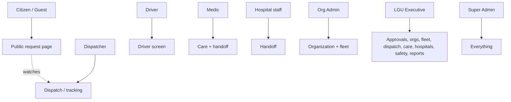

```text
Citizen/Guest ─> public request page (and tracking)
Dispatcher ───> dispatch console
Driver ───────> driver screen
Medic ────────> care + handoff
Hospital staff > handoff
Org Admin ────> organization + fleet
LGU Executive > most admin screens + reports
Super Admin ──> everything
```

---

## 3. Signing up & logging in

Plain steps:

1. **Make an account** (name, email, password).
2. The system **emails you a code** — type it in to prove the email is yours.
3. **What happens next depends on who you are:**
   - **Citizens** are let in **right away**.
   - **Staff, organizations, and hospitals** must **wait for an approval** from the LGU / super admin before they can log in.
4. Once approved (or right away, for citizens), you **log in** and land on your **Dashboard**, which only shows the buttons you're allowed to use.

Forgot your password? Ask for a reset code by email, type it in, and set a new password.

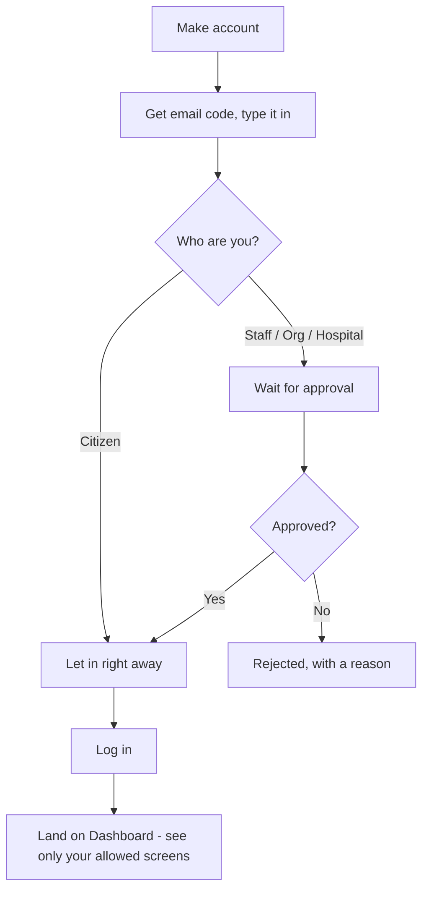

```text
make account ─> email code ─> citizen? ──yes──> let in ─┐
                                  │ no                   ├─> log in ─> Dashboard (your screens only)
                                  └─> wait approval ─yes─┘
                                              └─ no ─> rejected (+reason)
```

---

## 4. What each user does — step by step

This section lists, for each user, the actual things they do in the system (creating, approving, editing, etc.) and what happens at each step. Every action is recorded in a history log, and important actions ask you to confirm first.

### Citizen / Guest
- **Ask for an ambulance:** open the public page, tap to request; the system captures your location.
  - It first checks your device isn't blocked for repeated false alarms.
  - Guests get a limited number of free requests; after that, you're asked to register.
  - If others reported the **same spot just now**, your request is **merged** with theirs so one ambulance isn't sent twice.
  - You receive a **reference code** to track the ambulance.
- **Track:** watch the status update — and once a unit is sent, see its plate number, type, the driver's name, and call button.
- **Cancel:** the request is **not deleted** — it's held for a responder to verify on scene first (a "cancelled" call might still be a real emergency).

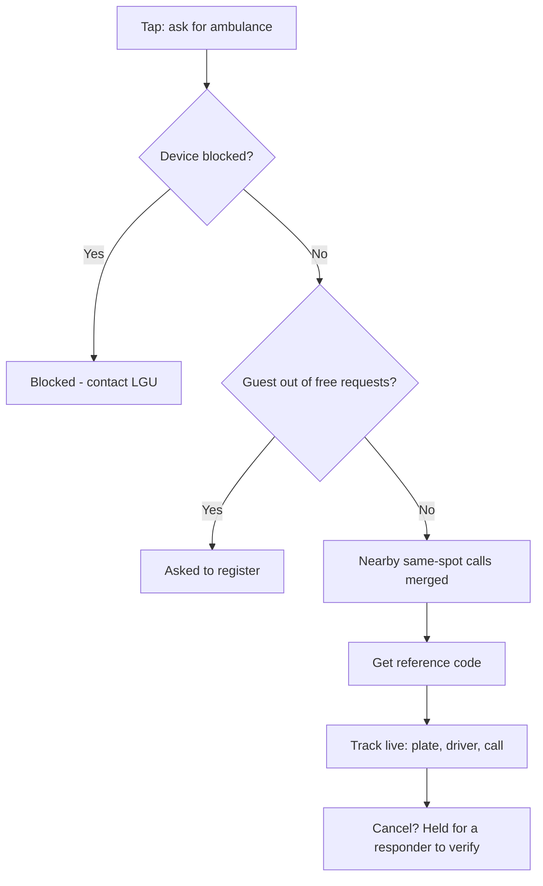

```text
ask > blocked? yes>stop / no > out of free requests? yes>register
    > merge nearby > reference code > track live > (cancel = held, not deleted)
```

### Dispatcher
- **Open the queue:** see waiting emergencies, most urgent first.
- **Pick the best ambulance:** the system **ranks** available units by closeness, equipment, and how urgent the case is.
- **Send a unit:** the system locks the unit to its own organization (they can't mismatch), starts a **response deadline countdown**, marks the emergency "dispatched," and notifies the public tracking page.
- **Release / reassign:** if needed, free the unit and put the emergency back in the queue.

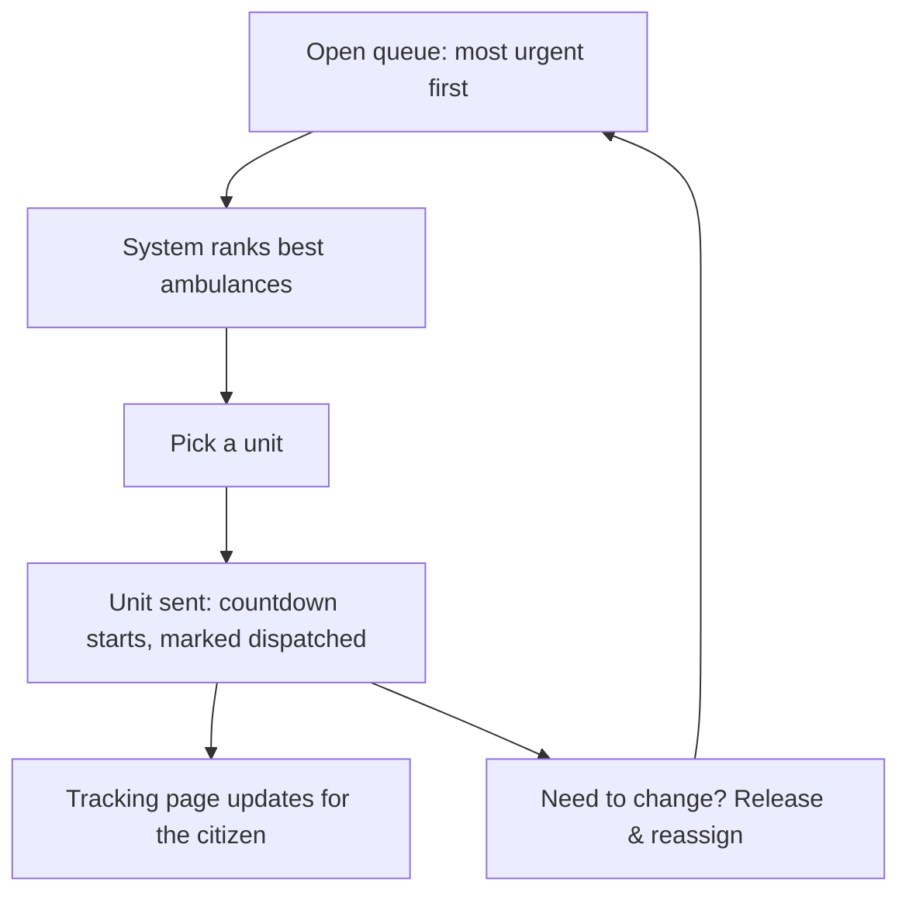

```text
queue (urgent first) > system ranks units > pick > send (countdown, dispatched)
   > tracking updates ; reassign sends it back to the queue
```

### Driver
- **Set duty:** mark yourself on duty, on break, or off duty (and which ambulance).
- **Move through the trip, one step at a time:** accepted → heading out → on scene → transporting → at the hospital → completed. Each step updates the citizen's tracking automatically, and you can only go **forward** (no skipping).
- **Share location:** your position is sent so the citizen sees the ambulance approaching. Finishing the trip frees the ambulance for the next call.

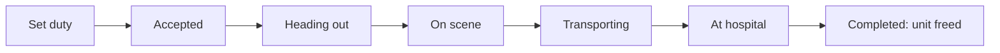

```text
set duty > accepted > heading out > on scene > transporting > at hospital > completed (unit freed)
   (forward only; location shared throughout for live tracking)
```

### Medic
- **Record care on scene:** add the patient's **vitals**, **treatments given**, and **notes**, and fill in **patient details**.
- **Decide:** if no transport is needed, mark **resolved on scene** (this closes the case and frees the unit). Otherwise, hand off to a hospital.

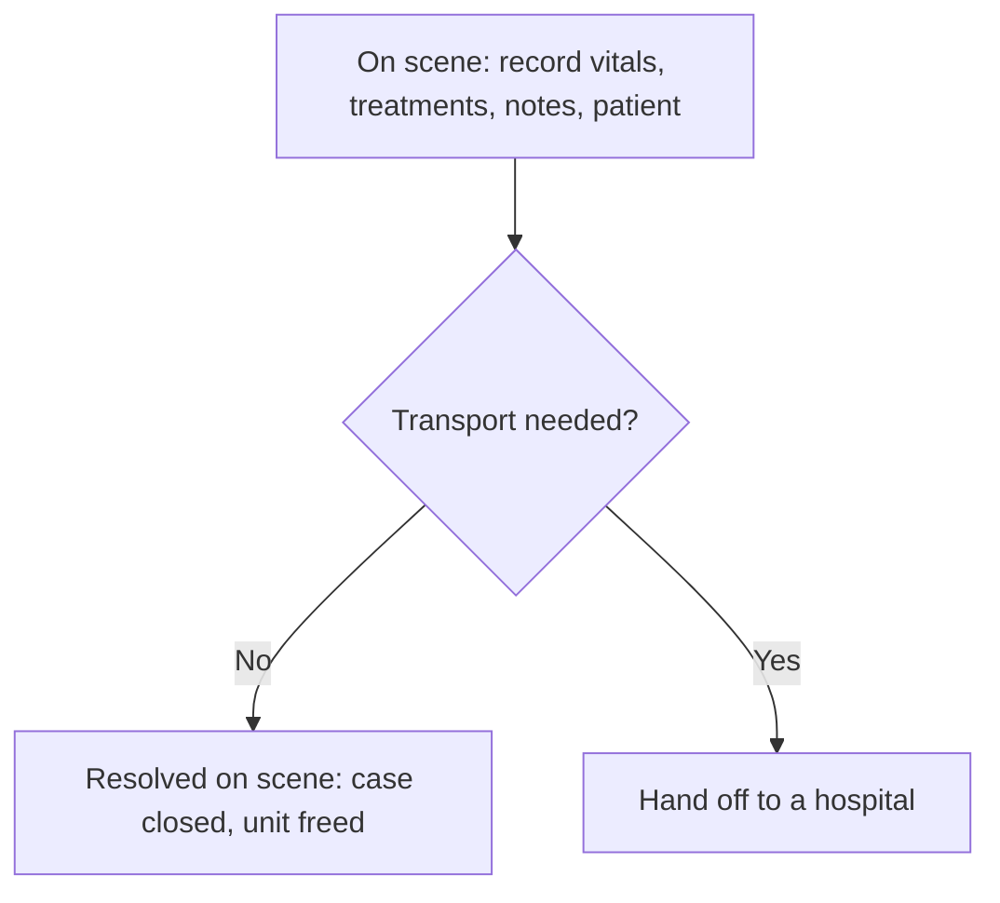

```text
record vitals/treatments/notes/patient > transport? no>resolved on scene (closed)
                                                     yes>hand off to hospital
```

### Hospital staff
- **Receive a handoff request** for an incoming patient.
- **Accept or decline:** declining sends the crew to choose another hospital.
- **Confirm arrival:** once the patient is physically received, confirm the handoff — this **closes the emergency** and frees the ambulance.

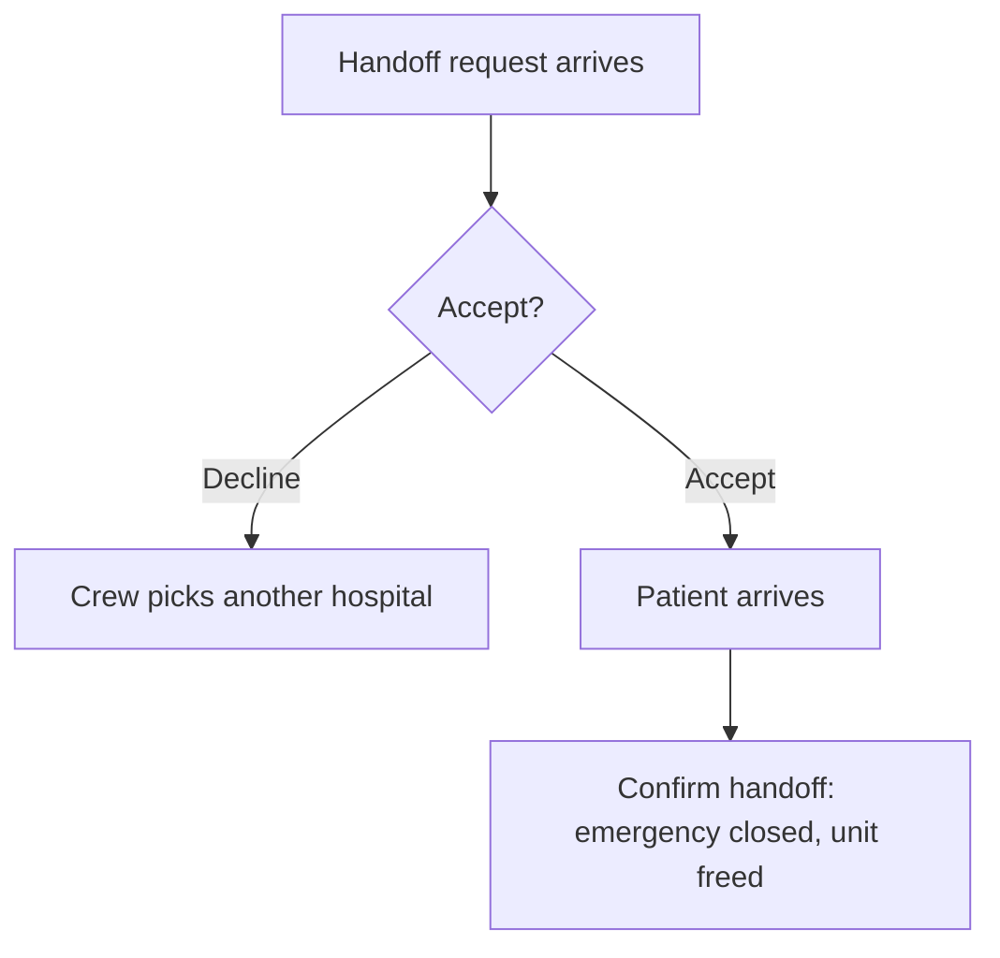

```text
handoff request > accept? decline>another hospital / accept > patient arrives
    > confirm handoff (emergency closed, unit freed)
```

### Organization Admin
- **Sign up the organization** and **upload legal documents.**
- **Wait for the LGU's approval** before going live.
- Once approved, **register ambulances** (type + equipment) — but only up to the **limit of the plan** — and keep **fuel/maintenance logs.**

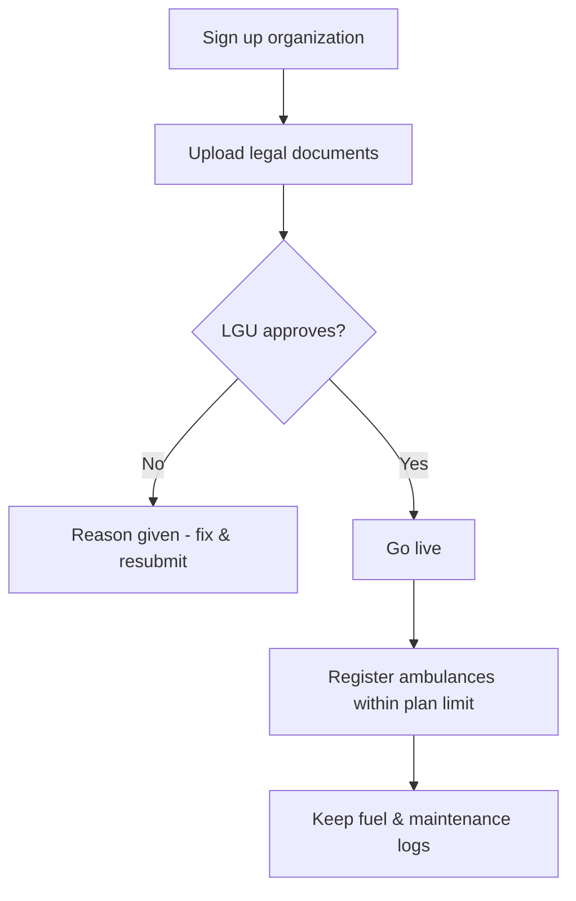

```text
sign up > upload documents > LGU approves? no>fix&resubmit / yes>go live
   > register ambulances (within plan limit) > keep fuel/maintenance logs
```

### LGU Executive
- **Approve or reject new staff accounts** (rejecting requires a reason; the person is notified and can fix and resubmit).
- **Review organizations:** check each uploaded document, then **approve** (the org goes live) or **reject** (with a reason).
- **Oversee** dispatch, hospitals, and safety; **read city-wide performance reports.**

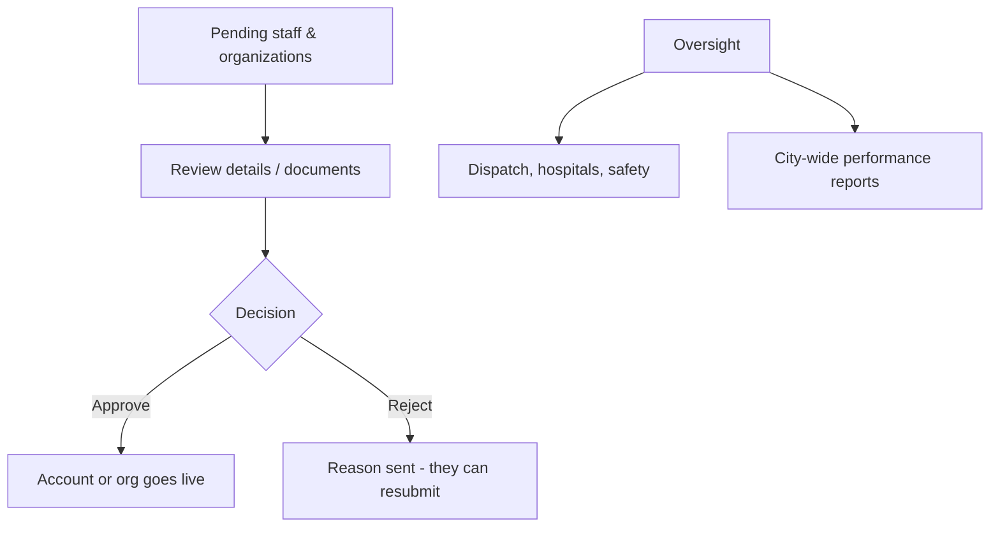

```text
pending staff/orgs > review > approve (go live) / reject (reason, resubmit)
oversight > dispatch + hospitals + safety + city-wide reports
```

### Super Admin
- **Full access** to everything above, plus running and maintaining the whole platform.

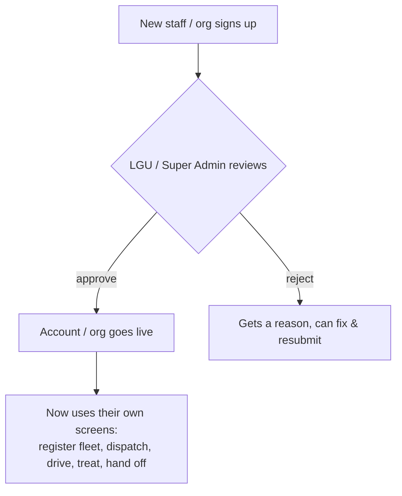

```text
sign up ─> review ──approve──> go live ──> do the work for your role
                  └─reject──> reason ──> fix & resubmit ──> review again
```

---

## 5. The journey of one emergency

1. A citizen (or guest) **asks for an ambulance**; their location is captured.
2. If several people report the **same scene nearby**, the system **merges them into one** so one ambulance isn't sent twice.
3. The system **finds the best ambulance** — closest, with the right equipment, for how urgent the case is — and offers it to a dispatcher.
4. A crew **accepts**; the **driver heads out**, and the citizen can **watch it live** and call the driver.
5. On scene, the **medic gives care** and records what was done.
6. If transport is needed, a **hospital is chosen and accepts** the patient.
7. The patient is **delivered and handed off**; the ambulance becomes **available again**.

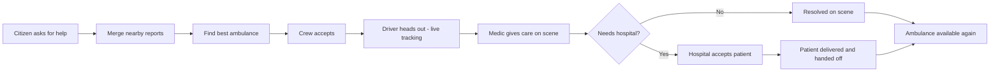

```text
ask for help ─> merge nearby calls ─> pick best ambulance ─> crew accepts
   ─> driver drives (live tracking) ─> medic gives care
       ─> on scene only? ─> done
       ─> needs hospital? ─> hospital accepts ─> patient delivered ─> done
   ─> ambulance free again
```

---

## 6. The build stages in plain words (S0–S11)

Each stage produced something you can **see and test** before moving on:

- **S0 — Setup:** the empty app skeleton and look-and-feel.
- **S1 — Login & accounts:** sign up, email code, log in, reset password.
- **S2 — Permissions:** the rules for who can see and do what.
- **S3 — Super Admin:** manage users and approve new accounts.
- **S4 — Organizations:** partners sign up, upload documents, get approved.
- **S5 — Fleet:** register ambulances with their equipment.
- **S6 — Request intake:** the public "call an ambulance" page + tracking.
- **S7 — Dispatch:** pick the best ambulance and send it.
- **S8 — Driver & tracking:** duty status, trip steps, live location.
- **S9 — Care & hospital:** record patient care and hand off to a hospital.
- **S10 — Safety:** stop abuse (false-alarm strikes), plus ads/funding.
- **S11 — Reports:** city performance reports and in-app notifications.

*(Note: the project documents also call these stages **P0–P6**; that's the same work grouped differently — this summary uses the S0–S11 names.)*
