# Tasks-06 — System Process & Flow (Technical)

> Ambulance Rescue Platform — Dasmariñas City emergency medical dispatch.
> Audience: developers. This is the literal, code-traced flow of the implemented system (S0–S11).
> Companion: `summary-tasks-06-nontechnical.md`. Source-of-truth files cited inline.

---

## 1. System overview

- **Domain:** city-scoped emergency ambulance dispatch for **Dasmariñas, Cavite, PH only**. "Ride-hailing for ambulances" + control-room + hospital coordination.
- **Stack:** Laravel 13 (MVC, Blade), Tabler/Bootstrap 5 UI, MySQL. Session auth for the web console.
- **Architecture:** **single admin console** — every authenticated screen extends `layout/admin/app.blade.php`. Role differentiation is by **permission**, not by separate layouts: sidebar items are wrapped in `@can('<perm>')` and every route group sits behind `can.perm:<perm>` middleware.
- **Real-time:** **polling, not WebSockets** this phase (public track page polls `request.status` every ~10s; driver pushes GPS via `request`-throttled POST). Reverb is the documented upgrade path.
- **Two front doors:** public **guest/citizen intake** (`/request*`, no auth) and the **authenticated console** (`/dashboard` + `/admin/*`).

**Phase vocabulary:** the `docs/` narrative names build phases **P0–P6**; the task files and code organize the same work as **S0–S11**. This document uses **S0–S11** (matching the code) — mapping: P0≈S0–S3, P1≈S4–S5, P2≈S6–S7, P3≈S8, P4≈S9, P5≈S10, P6≈S11.

### 1.1 Whole-system map (front doors → modules → users)

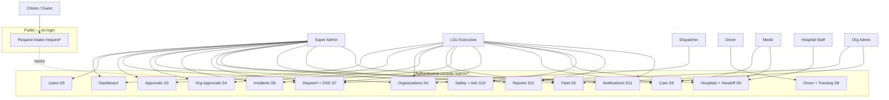

```text
PUBLIC (no login)         CONSOLE (login + permission per module)
  Citizen ─> /request  ──> Dispatch(track)
                           Dashboard
  Super Admin ───────────> every module
  LGU Executive ─────────> Approvals, Orgs, OrgApprovals, Fleet, Incidents,
                           Dispatch, Care, Hospitals, Safety, Reports, Notif.
  Dispatcher ────────────> Dispatch (+DSS)
  Driver ────────────────> Driver duty/assignment/tracking
  Medic ─────────────────> Care + Hospital handoff
  Hospital Staff ────────> Hospital handoff
  Org Admin ─────────────> Organizations + Fleet
```

---

## 2. S0–S11 verification

Re-checked against `tasks-02.md`…`tasks-05.md` and the live code. **All phases implemented**; deferrals below are the same ones recorded in `summary-tasks-04.md` / `summary-tasks-05.md`.

| Phase | Task file | Key code (verified) | Status | Deferred |
|---|---|---|---|---|
| **S0** Setup | — | Laravel app, Tabler assets, `layout/admin`, `layout/auth`, feedback modal | ✅ | — |
| **S1** Auth | tasks-02 | `Auth/LoginController`, `RegisterController`, `VerifyEmailController`, `PasswordResetController`; `EmailOtp`, `PasswordResetOtp` services | ✅ | Google OAuth/Socialite |
| **S2** RBAC | tasks-02 | `User::hasPermission()`, `Gate::before` (AppServiceProvider), `EnsureAccountActive`, `EnsurePermission`; `Role`/`Permission` models, `RolePermissionSeeder` | ✅ | Org self-service RBAC UI |
| **S3** Super Admin | tasks-02 | `DashboardController`, `UserController`, `ApprovalController` | ✅ | Audit/config/archive UIs |
| **S4** Orgs & onboarding | tasks-03 | `OrganizationController`, `OrgApprovalController`; `Organization*` models, `PlanSeeder` | ✅ | Billing/payments |
| **S5** Fleet | tasks-03 | `AmbulanceController` (+ fuel/maintenance logs, plan-cap guard); `Ambulance::EQUIPMENT` | ✅ | — |
| **S6** Citizen/guest intake | tasks-03 | `Intake/RequestIntakeController`, `IncidentController`; `GuestSession`, `GuestSessionService`, master-ticket Haversine grouping | ✅ | — |
| **S7** DSS + dispatch | tasks-04 | `DssService::rank()`, `DispatchController` | ✅ | Queued auto-throw + 30–90s countdown + auto-reassign |
| **S8** Driver + tracking | tasks-04 | `DriverController` (duty, `advance()`, `pushLocation()`); `DriverDutyState`, `AmbulanceLocation` | ✅ | Reverb WebSockets; Mapbox route geometry |
| **S9** Medical + handoff | tasks-04 | `CareController`, `HospitalController`; `Patient`/`VitalsEntry`/`TreatmentRecord`/`PrehospitalNote`/`HospitalEndorsement`/`HandoffSummary`, `HospitalSeeder` | ✅ | — |
| **S10** Anti-abuse/scheduling/sustainability | tasks-04 | `StrikeService`, `SafetyController` (devices/flags/ads); scheduled tab in dispatch | ✅ | Full scheduled-rescue workflow rules |
| **S11** Reports + hardening | tasks-05 | `ReportController`, `Notifier`, `NotificationController`; security pass | ✅ | CSV/PDF export, charts, broadcast notifications, Sanctum mobile API |

**Test coverage:** 42 tests / 145 assertions passing (auth/RBAC, smoke, org, fleet, intake, dispatch, driver, medical, anti-abuse, reports, notifications).

---

## 3. Authentication & account lifecycle

`routes/web.php:24-48` (guest group) → `routes/web.php:50-52` (logout) → `LoginController::authenticate` (`app/Http/Controllers/Auth/LoginController.php:20-53`).

**Lifecycle:** `register` → `account_status = pending_otp` → 6-digit OTP issued (`EmailOtp::issue`, code in `storage/logs/laravel.log` in dev) → `verify-email` consumes OTP, sets `email_verified_at` → **branch by account type**: citizen → `active` (auto-login); personnel/org/hospital → `awaiting_approval` (must be approved in S3/S4 before login). Login gate (`authenticate`) rejects unless `email_verified_at != null` **and** `is_active` **and** not `is_archived` **and** `account_status === 'active'`. Password reset is OTP-based via `PasswordResetOtp`.

```mermaid
flowchart TD
    R[POST /register] --> P[account_status = pending_otp<br/>EmailOtp::issue]
    P --> V{POST /verify-email<br/>OTP valid?}
    V -- no --> RE[resend / re-enter] --> V
    V -- yes --> T{account type?}
    T -- citizen --> A[account_status = active<br/>auto-login]
    T -- personnel/org/hospital --> W[account_status = awaiting_approval]
    W --> AP{S3/S4 approval?}
    AP -- reject --> RJ[account_status = rejected<br/>+ reason, Notifier::send]
    AP -- approve --> A
    A --> L[POST /login: Auth::attempt]
    L --> G{email_verified_at && is_active<br/>&& !is_archived && status=active?}
    G -- no --> X[logout + ValidationException]
    G -- yes --> D[redirect()->intended /dashboard]
```

```text
register ──> [pending_otp] ──verify OTP──> citizen? ──yes──> [active] ──> login ──> /dashboard
                                              │ no
                                              v
                                   [awaiting_approval] ──approve(S3/S4)──> [active]
                                              │ reject
                                              v
                                        [rejected]+reason

login gate: verified? & active? & !archived? & status==active?  ── no ─> logout+error
                                                                 ── yes ─> intended(/dashboard)
```

---

## 4. RBAC mechanism

- `AppServiceProvider::boot()` registers `Gate::before(fn($u,$ability) => $u->hasPermission($ability) ?: null)`.
- `User::hasPermission($code)` = `isSuperAdmin() || permissionCodes()->contains($code)`; `permissionCodes()` flattens **role permissions + direct grants**, unique.
- Two middleware: **`account.active`** (`EnsureAccountActive` — `is_active`, `!is_archived`, `account_status==active`) wraps the whole authed group; **`can.perm:<code>`** (`EnsurePermission`) wraps each module group.
- Views gate visibility with `@can('<code>')`; routes gate access with `can.perm:<code>`. Same code string both places.

**16 permissions** (seeded by `RolePermissionSeeder`):

| Code | Module (route group) | super_admin | platform_executive (LGU) |
|---|---|:--:|:--:|
| access-admin | dashboard | ✅ | ✅ |
| manage-users | S3 users | ✅ | — |
| review-approvals | S3 approvals | ✅ | ✅ |
| view-audit-logs / manage-config / manage-archive | system | ✅ | partial |
| manage-organizations / review-org-approvals | S4 | ✅ | ✅ |
| manage-fleet | S5 | ✅ | ✅ |
| view-incidents | S6 | ✅ | ✅ |
| dispatch-incidents | S7 | ✅ | ✅ |
| **drive-unit** | S8 driver | ✅ | **— (field role only)** |
| record-care | S9 care | ✅ | ✅ |
| manage-hospitals | S9 hospitals | ✅ | ✅ |
| manage-safety | S10 | ✅ | ✅ |
| view-reports | S11 reports | ✅ | ✅ |

Seeded roles: **`super_admin`** (all 16), **`platform_executive`** (all except `drive-unit`). `drive-unit` is granted to per-org field drivers.

---

## 5. Login → portal redirection

There is **no role-based redirect**. Every successful login lands on `route('dashboard')` via `redirect()->intended(route('dashboard'))` (`LoginController.php:52`). What the user *sees and can reach* is then decided by permissions (sidebar `@can` + route `can.perm`).

| Actor | After login lands on | Can reach |
|---|---|---|
| **super_admin** | /dashboard | everything |
| **platform_executive (LGU)** | /dashboard | S3 approvals, S4–S7, S9–S11 (not S8 driver) |
| **citizen** (no role) | /dashboard shows only basics; all `/admin/*` → 403 | public `/request*` only |
| **field driver** (`drive-unit`) | /dashboard | S8 driver duty/assignment screens |
| **awaiting_approval / archived / inactive** | cannot log in | login rejected at gate |
| **guest** (no account) | never logs in | `/request`, `/request/{code}` only |

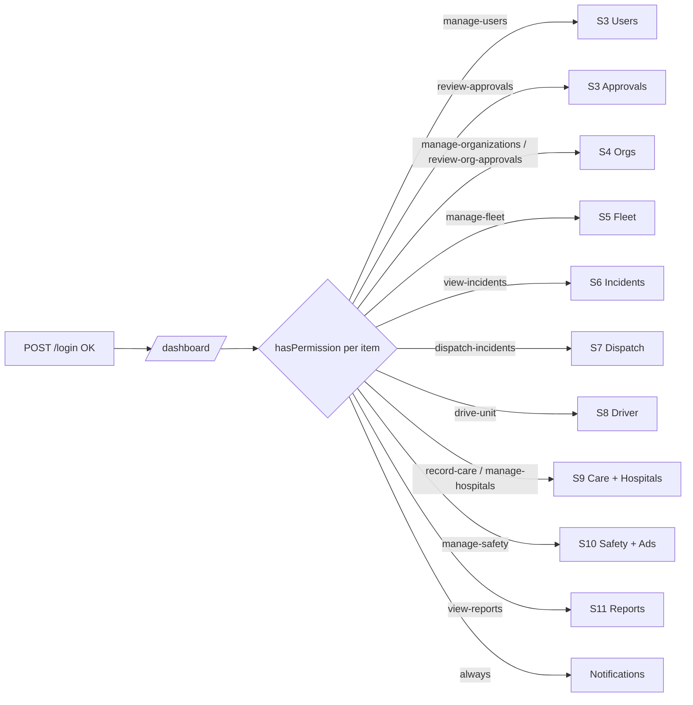

```text
login OK ─> /dashboard ─> sidebar/routes filtered by hasPermission():
   super_admin .......... all modules
   platform_executive ... S3 approvals, S4 S5 S6 S7, S9 S10 S11   (no S8)
   field driver ......... S8 driver only
   citizen .............. nothing under /admin (public /request only)
```

---

## 6. Process flows for every user & every module action

Each action below is the **literal, code-traced step sequence** (create, approve, reject, edit, archive, restore, dispatch, advance, endorse, handoff, etc.). Conventions used everywhere:

- Every state-changing action runs inside `DB::transaction()` and ends with `AuditLog::record('<event>', …)`.
- **Archive** (User/Org/Ambulance/Hospital) = set `is_archived/archived_at/archived_by/archive_reason`, `is_active=false`, **insert a JSON snapshot row into `archival_logs`**; **Restore** = clear those flags. No Eloquent SoftDeletes.
- **Approval-style** actions also `INSERT` an `approval_records` row and (for user accounts) call `Notifier::send()`.
- Routes/methods below are verbatim from `routes/web.php`; actor = the permission needed.

---

### 6.1 Auth & account (public) — no permission

**Register** (`POST /register` → `RegisterController::store`)
1. Validate (`LoginRequest`/register rules). 2. Create user `account_status=pending_otp`, `email_verified_at=null`. 3. `EmailOtp::issue()` → 6-digit code (logged to `storage/logs/laravel.log` in dev). 4. Redirect to `/verify-email`.

**Verify email** (`POST /verify-email` → `VerifyEmailController::verify`)
1. Validate code vs issued OTP (throttle 10/1). 2. On match → set `email_verified_at=now()`. 3. **Branch by account type:** citizen → `account_status=active`, auto-login → `/dashboard`; personnel/org/hospital → `account_status=awaiting_approval` (no login yet). 4. `resend` re-issues (throttle 3/1).

**Login** (`POST /login` → `LoginController::authenticate`)
1. `Auth::attempt(email,password)`; fail → `ValidationException`. 2. Gate: reject (and `Auth::logout()`) unless `email_verified_at != null` **and** `is_active` **and** `!is_archived` **and** `account_status==='active'` (awaiting_approval → "awaiting approval" message). 3. Set `last_login_at=now()`, `session()->regenerate()`. 4. `redirect()->intended(route('dashboard'))`.

**Password reset** (`POST /forgot-password` → `sendCode`; `POST /reset-password` → `reset`)
1. `sendCode`: issue single-use OTP via `PasswordResetOtp` (throttle 3/1). 2. `reset`: validate code + new password, consume code, update password (throttle 6/1) → redirect to `/login`.

**Logout** (`POST /logout`) — `Auth::logout()` → `session()->invalidate()` → `regenerateToken()` → `/login`.

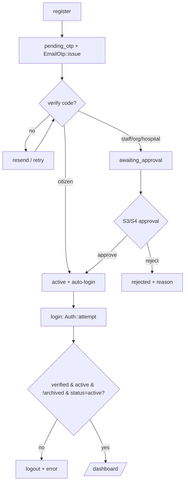

```text
register > pending_otp > verify > citizen? yes > active > login gate > /dashboard
                                   no > awaiting_approval > approve > active
                                                          > reject  > rejected
login gate fails (unverified/inactive/archived/not-active) > logout+error
```

---

### 6.2 Citizen / Guest intake (S6, `Intake/RequestIntakeController`) — no auth

**Submit request** (`POST /request`, throttle 10/1 → `store`) — verified order:
1. Validate (`StoreIncidentRequest`: `pickup_lat/lng` required; patient fields conditional on `request_type=detailed`).
2. **R4 strike block:** read `device_uuid` cookie (or mint one); if `StrikeService::isBlocked($uuid)` → reject with appeal message.
3. **R6 requester resolution:** if logged-in → user; else `GuestSessionService::resolveOrCreate()` and check `hasQuotaRemaining()` (2/session) — over quota → reject "register to continue".
4. **R2 grouping:** `findMasterTicket(lat,lng)` — O(n) Haversine over open incidents in the last **15 min**; within **150 m** → reuse that master id, else null.
5. Create `Incident`: `request_code='REQ-'+ULID`, `master_incident_id`, `user_id` XOR `guest_id`, `status=pending`, `severity` (one_tap→2, else 4 unless given), `is_public_tracking=true`.
6. Insert initial `IncidentUpdate` (`created`, public). 7. `GuestSessionService::consume()` if guest. 8. `AuditLog::record('incident.created')`. 9. Set `guest_key` + `device_uuid` cookies (1 yr). 10. Redirect to `/request/{code}` with reference.

**Track** (`GET /request/{code}` → `track`) — render public page; **Status poll** (`GET /request/{code}/status`, throttle 60/1 → `status`) — JSON: incident status/label, ETA, and (if assigned) plate, tier, driver name+phone, last lat/lng/seen — page polls ~10s.

**Cancel** (`PATCH /request/{code}/cancel`, throttle 10/1 → `cancel`) — **never hard-cancels**: if already `completed`/`resolved_on_scene` → error; else keep `status=pending`, append "needs field verification" note, insert `IncidentUpdate` (`care_status=needs_field_verification`, org-visibility). Anti-abuse: a "cancelled" call may still be real until a unit confirms.

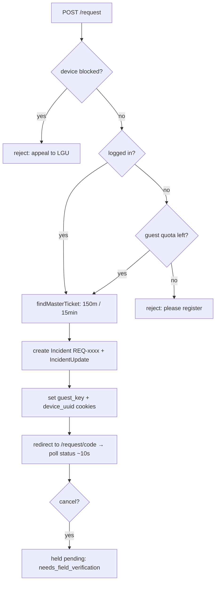

```text
/request > blocked? yes>reject
           no > logged in? no > quota? no>reject / yes >
                yes/quota-ok > group(150m,15min) > create Incident+update > cookies > track(poll 10s)
           cancel > NOT deleted > held pending (needs_field_verification)
```

---

### 6.3 Super Admin — Users (S3, `UserController`) — `manage-users`

- **List** (`GET /admin/users`): search name/email, filter type/status, paginate.
- **View** (`GET /admin/users/{user}`): profile detail.
- **Activate/Deactivate** (`PATCH …/active` → `toggleActive`): flip `is_active`, audit.
- **Archive** (`PATCH …/archive`): set archive flags + `is_active=false`, snapshot → `archival_logs`, audit.
- **Restore** (`PATCH …/restore`): clear archive flags, audit.

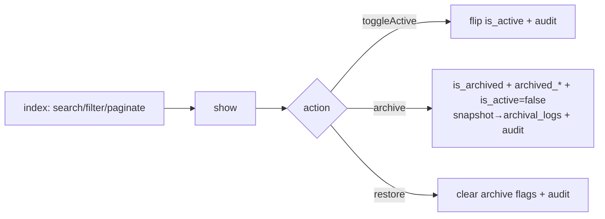

```text
list > show > toggleActive (flip is_active)
              archive (flags + archival_logs snapshot, is_active=false)
              restore (clear flags)
   (same pattern reused by Organizations & Hospitals)
```

### 6.4 Super Admin / LGU — Account Approvals (S3, `ApprovalController`) — `review-approvals`

**List** (`GET /admin/approvals`): users where `account_status=awaiting_approval`, oldest first.
**Approve** (`PATCH …/{user}/approve`): in txn → user `account_status=active, is_approved=true, is_active=true, approved_by, approved_at`; `INSERT approval_records('account_activation','approved')`; then `AuditLog::record('account.approved')` + `Notifier::send('Account approved')`. The user can now log in.
**Reject** (`PATCH …/{user}/reject`): validate **required `reason`** (max 500); user `account_status=rejected, is_approved=false, rejected_reason`, `rejection_count+1`; `INSERT approval_records('rejected', notes=reason)`; `AuditLog::record('account.rejected')` + `Notifier::send` with reason.

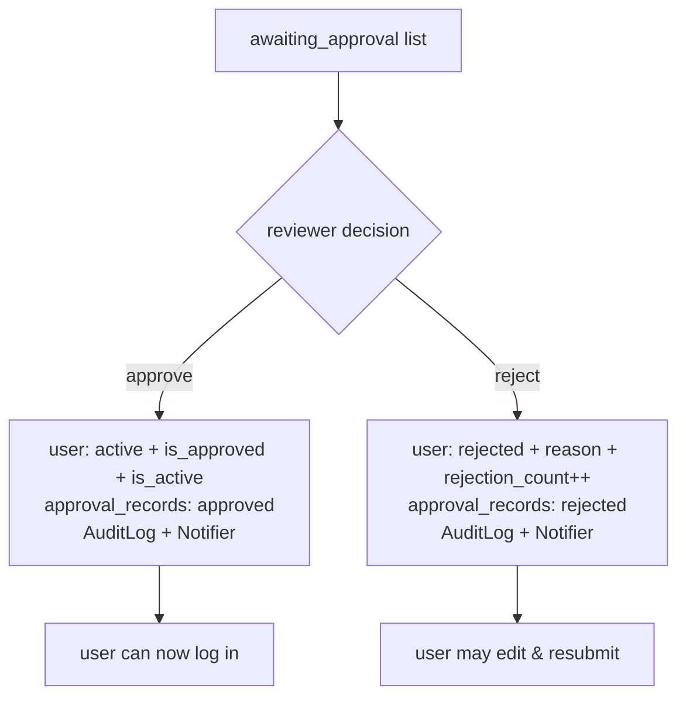

### 6.5 Organizations (S4, `OrganizationController`) — `manage-organizations`

- **Create** (`POST /admin/organizations` → `store`): validate (`StoreOrganizationRequest`); in txn → `Organization::create(... organization_status=pending_review, is_approved=false, is_active=false)` **+ create `subscription` row (`status=trialing`, chosen `plan_id`)**; audit `organization.created`. Lands on org show (pending).
- **Edit/Update** (`PUT …/{org}` → `update`): validate (`UpdateOrganizationRequest`); in txn → update fields + `subscription()->updateOrCreate(plan_id)`; audit.
- **Archive/Restore** (`PATCH …/archive|restore`): standard archive-flags + `archival_logs` snapshot / clear; audit.
- **List/View**: search name/code, filter `org_type`/`organization_status`, paginate; show loads subscription, documents, coverage areas, admin, ambulances.

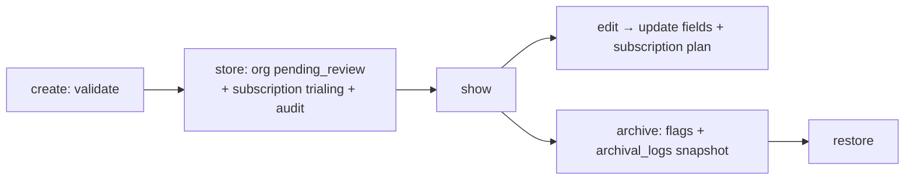

```text
create > store (pending_review + subscription) > show
   edit/update (fields + plan) | archive (snapshot) | restore
```

### 6.6 LGU — Organization Approvals (S4, `OrgApprovalController`) — `review-org-approvals`

**List** (`GET /admin/org-approvals`): orgs where `organization_status=pending_review`.
**Review** (`GET …/{org}` → `show`): loads documents, subscription, admin, coverage areas.
**Validate a document** (`PATCH …/{org}/documents/{doc}/status` → `updateDocumentStatus`): `abort_unless` doc belongs to org; validate `validation_status ∈ {validated,rejected,pending}`; update doc `validated_by/validated_at`; audit.
**Approve** (`PATCH …/{org}/approve`): in txn → org `organization_status=active, is_approved=true, is_active=true, approved_by, approved_at, rejected_reason=null`; `INSERT approval_records('org_onboarding','approved')`; audit. Org can now receive dispatch.
**Reject** (`PATCH …/{org}/reject`): validate **required `reason`**; org `organization_status=rejected, is_approved=false, is_active=false, rejected_reason`; `INSERT approval_records('rejected')`; audit.

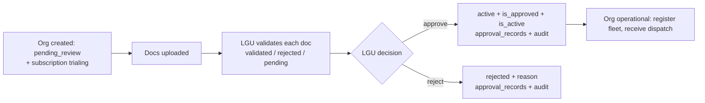

### 6.7 Fleet — Ambulances (S5, `AmbulanceController`) — `manage-fleet`

- **Create** (`POST /admin/ambulances` → `store`): validate (`Fleet/StoreAmbulanceRequest`, plate unique per org); **plan-cap guard** `planCapExceeded()` vs `plan->max_ambulances` → block if exceeded; create with tier (BLS/ALS) + 6 equipment booleans (`Ambulance::EQUIPMENT`); audit.
- **Edit/Update / Archive / Restore**: standard CRUD + archive-snapshot pattern; audit.
- **Add fuel log** (`POST …/{ambulance}/fuel-logs` → `storeFuelLog`) / **maintenance log** (`POST …/maintenance-logs` → `storeMaintenanceLog`): insert child log row; audit.
- **List/View**: filter org/tier/status, paginate; show = equipment grid + fuel/maintenance tables + inline forms.
- *Note:* ambulance **archive** sets `is_serviceable=false` and (unlike User/Org) does **not** write an `archival_logs` snapshot.

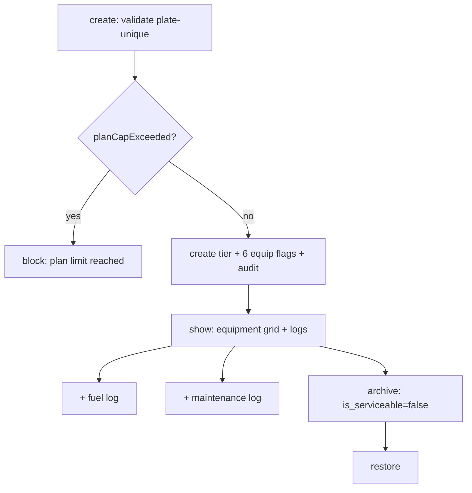

```text
create > plate unique? > plan cap ok? no>block / yes > create (tier+equipment)
   show > add fuel log | add maintenance log | archive(is_serviceable=false) | restore
```

### 6.8 Incidents — read-only triage (S6, `IncidentController`) — `view-incidents`
`index` (search/filter type/status/org, list.js sort) and `show` (requester, location, master/child grouping, update timeline). No writes.

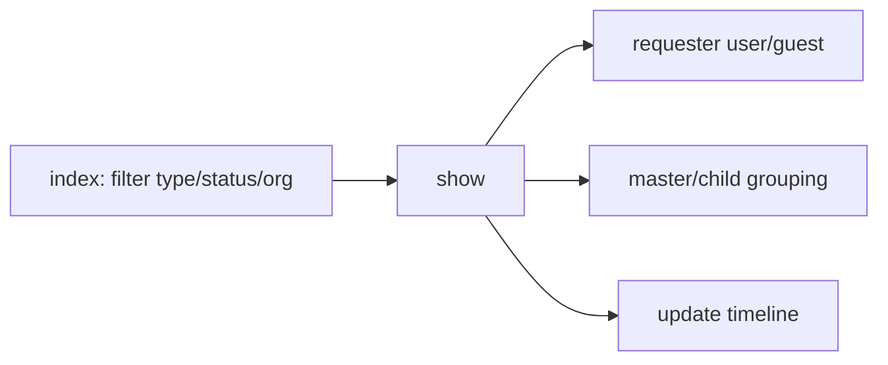

```text
index(filter) > show > requester + grouping + timeline   (read-only, no writes)
```

### 6.9 Dispatch + DSS (S7, `DispatchController` + `DssService`) — `dispatch-incidents`

**Queue/Show** (`GET /admin/dispatch?tab=queue|scheduled` , `GET …/{incident}`): pending incidents ordered by `severity` desc then age; `show` renders `DssService::rank($incident)`.
**DSS ranking** (`DssService::rank`, verified `DssService.php`): candidates = ambulances `status=available` & `is_serviceable` & `!is_archived` in an **active+approved+non-archived org**. Per unit: `distance_km` (Haversine pickup↔last_lat/lng), `eta_minutes = ceil(distance/30 km/h*60)`, `score = proximity + urgency*(tierBonus+equipBonus)` where `proximity=max(0,100-distance_km*10)`, `urgency=5-severity` (severity 1 most urgent), `tierBonus=10 if ALS`, `equipBonus=`count of equipment flags. Sort score desc → `dss_rank=i+1`.
**Dispatch / assign** (`POST …/{incident}` → `store`, `StoreAssignmentRequest`):
1. Guard incident still `pending`, ambulance still `available`/serviceable/non-archived.
2. **R7:** `orgId = ambulance.organization_id` (from the unit, never user input).
3. In txn → create `DispatchAssignment(status=assigned, dispatcher_user_id, ambulance_id, driver_user_id, dss_rank, assigned_at, response_deadline_at = now()+dssTimeoutSeconds())`.
4. Incident → `status=dispatched, organization_id=orgId`; ambulance → `status=dispatched`.
5. Insert public `IncidentUpdate('dispatched')`; audit `dispatch.assigned`.
*(timeout = `system_configurations.dss_timeout_seconds`, default 60s, LGU-tunable.)*
**Reassign / release** (`PATCH …/assignments/{assignment}/reassign` → `reassign`): assignment → `reassigned, ended_at`; ambulance → `available`; incident → back to `pending`; org-visibility `IncidentUpdate`; audit.

```mermaid
flowchart TD
    Q[queue: pending by severity] --> SH[show + DssService::rank]
    SH --> RANK[score = proximity + urgency*(ALS bonus + equip)]
    RANK --> PICK{dispatcher picks unit}
    PICK --> GUARD{incident pending & unit available?}
    GUARD -- no --> ERR[reject]
    GUARD -- yes --> ASN[create DispatchAssignment<br/>org from ambulance R7<br/>deadline=now+timeout]
    ASN --> FLIP[incident=dispatched, ambulance=dispatched + IncidentUpdate]
    FLIP --> RA{reassign?}
    RA -- yes --> REL[assignment=reassigned, unit=available, incident=pending]
```

```text
queue(by severity) > show(DSS rank) > pick unit > guard(pending & available)
   > create assignment (R7 org from unit, deadline) > incident+unit=dispatched
   reassign > release unit > incident back to pending
```

### 6.10 Driver + live tracking (S8, `DriverController`) — `drive-unit`

**Set duty** (`PATCH /admin/driver/duty` → `updateDuty`): validate `status ∈ {on_duty,off_duty,break}` + optional `ambulance_id`; `DriverDutyState::updateOrCreate(driver→status,ambulance,started_at)`; audit `driver.duty.<status>`.
**Advance assignment** (`PATCH …/assignments/{assignment}/advance` → `advance`):
1. `authorizeDriver` — only the assigned driver **or** a `dispatch-incidents` holder (else 403).
2. `next = nextStatus(current)` along `DispatchAssignment::FLOW`; null → "already complete".
3. `[$stamp,$incidentStatus] = MILESTONES[$next]`.
4. In txn → assignment `status=next, <stamp>=now()`; incident `status=incidentStatus` (+`completed_at` if completed); if `completed` → ambulance `status=available`; insert public `IncidentUpdate(next)`; audit `driver.advance.<next>`.
**Push location** (`POST …/location`, throttle 60/1 → `pushLocation`): `authorizeDriver`; validate lat/lng; insert `AmbulanceLocation`; update ambulance `last_lat/last_lng/last_seen_at`; returns JSON. (See §8 for the full state machine.)

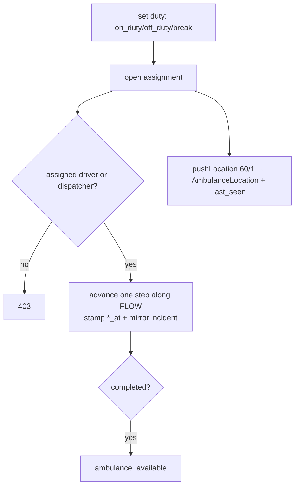

```text
set duty > open assignment > authorize(driver|dispatcher) > advance (forward only, stamp+mirror)
   completed > free ambulance ; pushLocation(60/1) updates last position for tracking
```

### 6.11 Medic — Care (S9, `CareController`) — `record-care`

- **Record vitals** (`POST …/care/vitals` → `storeVitals`, `StoreVitalsRequest` clinical bounds): create `vitals_entries` row (`recorded_at`, `created_by`); audit.
- **Record treatment** (`POST …/care/treatments` → `storeTreatment`): validate `treatment_type`+`details`; create `treatment_records`; audit.
- **Add note** (`POST …/care/notes` → `storeNote`): validate `note_type`+`content`; create `prehospital_notes`; audit.
- **Upsert patient** (`PUT …/care/patient` → `upsertPatient`): validate demographics; `Patient::updateOrCreate(incident_id, …)`; audit.
- **Resolve on scene** (`PATCH …/care/resolve` → `resolveOnScene`): incident → `resolved_on_scene` + `resolved_on_scene_at`; free ambulance; public `IncidentUpdate`; audit. (No-transport completion path.)

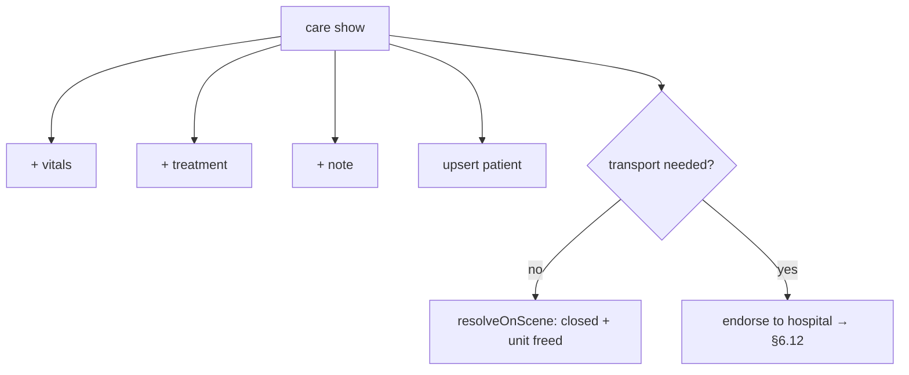

```text
care > add vitals / treatment / note / patient
     > transport? no > resolveOnScene (close + free unit)
                  yes > endorse to hospital (6.12)
```

### 6.12 Hospitals + handoff (S9, `HospitalController`) — `manage-hospitals`

- **Register hospital** (`POST /admin/hospitals` → `store`): validate name/type/location/capacity/`is_er_open`; create; audit `hospital.created`.
- **Endorse patient** (`POST /admin/incidents/{incident}/endorse` → `endorse`): validate `hospital_id`+notes; in txn → create `HospitalEndorsement(status=pending, handoff_status=pending)`; set incident `destination_hospital_id`; audit.
- **Hospital responds** (`PATCH /admin/endorsements/{endorsement}/respond` → `respond`): validate `decision ∈ {accepted,declined}`; update endorsement `status, responded_by/at, response_notes`; audit. Declined → reopens choice (endorse another).
- **Confirm handoff** (`PATCH …/endorsements/{endorsement}/handoff` → `confirmHandoff`): guard `status==accepted` only; in txn → endorsement `handoff_status=completed, handoff_confirmed_at, completed_at`; `HandoffSummary::updateOrCreate(incident_id,…)`; incident → `completed`+`completed_at`; assignment → `completed`+`handover_completed_at`; ambulance → `available`; public `IncidentUpdate('handoff_completed')`; audit.

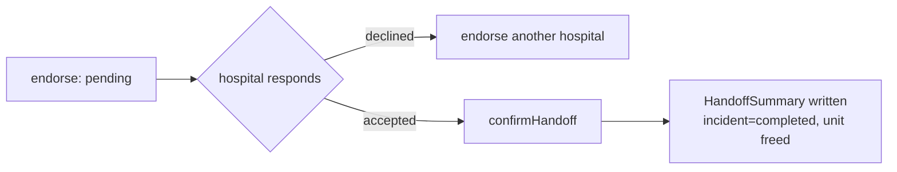

### 6.13 Safety / anti-abuse + sustainability (S10, `SafetyController`) — `manage-safety`

- **Overview** (`GET /admin/safety`): devices with strikes + flagged incidents.
- **Flag incident** (`PATCH …/incidents/{incident}/flag` → `flag`): mark false alarm; drives `StrikeService` (rolling **3 false alarms / 30 days → block**); audit.
- **Block / Unblock device** (`PATCH …/devices/{device}/block|unblock`): set/clear device block (a blocked `device_uuid` is rejected upfront in §6.2 step 2); audit.
- **Ads** (`GET /admin/ads`, `PATCH /admin/ads/{ad}/toggle` → `toggleAd`): toggle `ad_placements.is_active` — sustainability hooks, **never on emergency screens**.

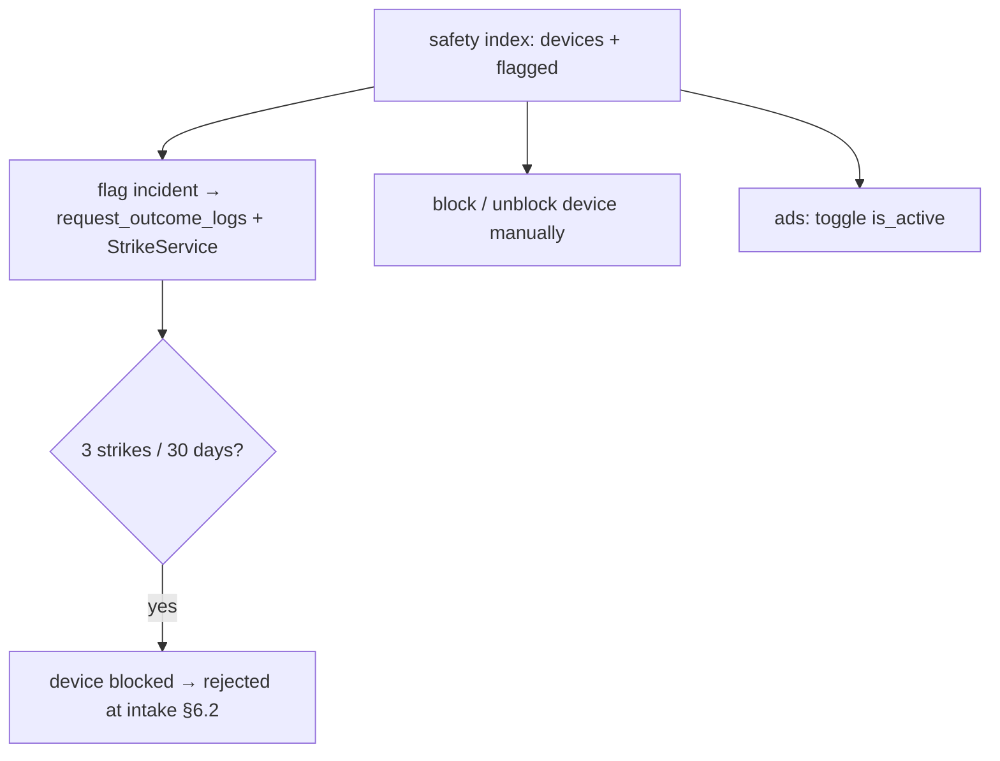

```text
safety > flag incident (strike device) > 3 in 30d? > block > intake rejected
       > block/unblock device manually
       > ads toggle (never on emergency screens)
```

### 6.14 Reports (S11, `ReportController`) — `view-reports`
`GET /admin/reports` → date-range (default 30d) KPI dashboard: `responseKpis` (avg+median per dispatch leg), `volumeOutcomes` (counts by status/type/severity), `fleetUtilization` (top units), `safetyAbuse` (flags, blocks, handoff acceptance rate). Read-only aggregation; no raw SQL with user input; print button.

### 6.15 Notifications (S11, `NotificationController`) — any authed user (no extra permission)
`GET /admin/notifications` (own rows, paginated); `PATCH …/{notification}/read` → `markRead` (403 unless owner); `PATCH …/read-all` → `markAllRead`. Rows written by `Notifier::send()` (e.g. from S3 approve/reject). Navbar bell shows unread count + 5 recent, queried inline on every admin page.

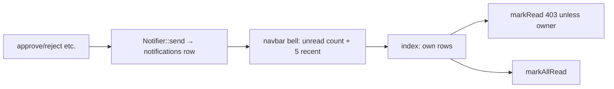

```text
event (e.g. approval) > Notifier::send > bell (unread + 5 recent) > list > markRead/markAllRead
```

### 6.16 Reports KPIs (data flow)

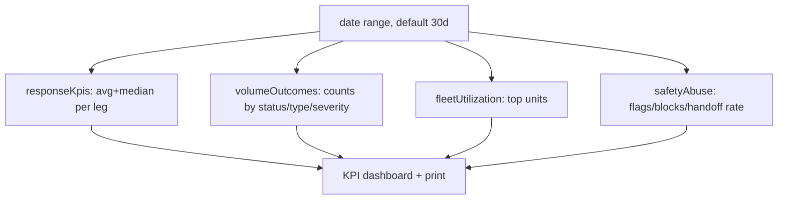

```text
date range > responseKpis + volumeOutcomes + fleetUtilization + safetyAbuse > dashboard (print)
```

---

## 7. End-to-end master flow (request → completion)

```mermaid
sequenceDiagram
    participant C as Citizen/Guest
    participant API as RequestIntakeController
    participant DSP as Dispatcher (S7)
    participant DSS as DssService
    participant DRV as Driver (S8)
    participant MED as Medic (S9)
    participant HOSP as Hospital (S9)

    C->>API: POST /request (lat/lng, type)
    API->>API: strike block? user XOR guest? quota? master-ticket (150m/15min)
    API-->>C: REQ-<ULID> + track link
    DSP->>DSS: rank(incident)
    DSS-->>DSP: ranked units (score, distance, ETA, dss_rank)
    DSP->>DSP: store() — R7 org from ambulance, deadline=now+timeout
    Note over DSP: incident=dispatched, ambulance=dispatched
    DRV->>DRV: advance: accepted→en_route→arrived_on_scene→transporting→arrived_at_hospital→completed
    DRV->>API: pushLocation (poll) ; C polls /request/{code}/status
    MED->>MED: vitals / treatments / notes ; resolveOnScene OR
    MED->>HOSP: endorse (pending)
    HOSP-->>MED: respond accept/decline
    HOSP->>HOSP: confirmHandoff → HandoffSummary, incident=completed, free unit
```

```text
[/request] -> strike? quota? group(150m/15min) -> Incident REQ-xxxx
     -> Dispatch: DssService.rank -> pick unit -> DispatchAssignment (deadline)
        -> Driver advance: assigned>accepted>en_route>arrived_on_scene>transporting>arrived_at_hospital>completed
        -> Care: vitals/treatments/notes -> resolveOnScene  OR  endorse->respond->confirmHandoff
     -> Incident completed, ambulance freed
```

---

## 8. Dispatch & driver state machine

`DispatchAssignment::FLOW` (linear) and `MILESTONES` (status → timestamp column → incident mirror), verified in `app/Models/DispatchAssignment.php:19-32`:

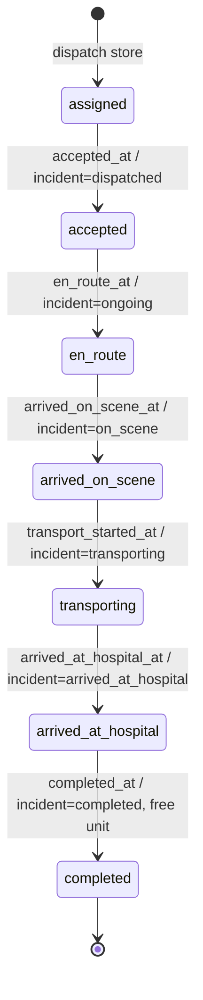

```text
assigned > accepted > en_route > arrived_on_scene > transporting > arrived_at_hospital > completed
   (each step: advance() stamps *_at column + mirrors incident status; completed frees the ambulance)
   reassign() (dispatcher) releases an active assignment -> ambulance available, incident pending
```

---

## 9. Seeded accounts (for walkthrough)

| Email | Password | Role | Status |
|---|---|---|---|
| superadmin@rescue.test | Password123! | super_admin | active |
| lgu@rescue.test | Password123! | platform_executive | active |
| citizen@rescue.test | Password123! | (none) | active |
| pending@rescue.test | Password123! | (none) | awaiting_approval (cannot log in) |

Plans: `lgu_free` (unlimited), `partner_basic` (3 ambulances), `partner_pro` (10). Hospitals: 3 Dasmariñas hospitals seeded.

**Run:** `php artisan migrate:fresh --seed` → `php artisan serve` → log in with the accounts above; guest flow at `/request`. OTP/reset codes appear in `storage/logs/laravel.log` in dev.
